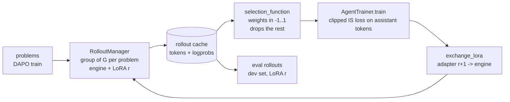

# Agent training, slice 2: from rollouts to a better policy

Version 3 (2026-09-07), approved; M0–M3 implementing. Slice 1 produces cached, scored, grouped rollouts. Slice 2 closes the loop: select rollouts, train a LoRA on them with one loss that covers RAFT, RAFT++, group-relative and weighted variants, hand the adapter to the serving engine, roll out again. Your stubs (`agent_training/`, the `ModuleManager` notes, the two test sketches, the DeepScaleR loader) are the skeleton. All eight decisions are settled below as accepted records; the token-segments one has its own explainer, `SLICE2_TOKENS_EXPLAINER.tressoir.md`. Slice 2 is implementation: interfaces and a loop that works on Qwen3.5-4B. Round counts, sample distribution and evaluation protocol stay parameters, not decisions.

## Executive Summary

### The loop

`perform_grouped_rollouts() → selection_function() → AgentTrainer.train() → exchange_lora() → perform_grouped_rollouts()`



One round = generate a batch from the current adapter, select, take a few gradient steps, exchange, roll out again. Synchronous on one node: the engine sleeps (weights to host RAM) while the trainer holds the GPU. The default selection is the group-mean advantage (weight = reward − group mean, uniform groups dropped, group size 8); RAFT++, Reinforce-Rej and the weighted variant are other `selection_function`s, not other trainers.

### One loss for all of them

`activation/agent_training/agent_trainer.py · the objective`

```
L(θ) = mean over selected items i of  (1/|a_i|) Σ_t  min( s_t · A_i ,  clip(s_t, 1-ε, 1+ε) · A_i )
s_t  = π_θ(a_t | prefix, a_<t) / π_old(a_t | prefix, a_<t)        ratio to the policy that sampled the token
A_i  = the item's weight from the selection function                 sign = direction, magnitude = strength
```

Tool-output tokens and prompts are masked; only assistant tokens carry loss. `π_old` comes from the engine's stored log-probs; for items with `ignore_logprobs` (teacher data) it is the current policy's own probabilities at the start of the round, so the ratio starts at 1 and the first step is weighted supervised fine-tuning by construction. With `A = reward − group mean` this is GRPO without the std division (the default here); `A ∈ {+1}` is RAFT++; `{+0.1, −1}` is W-REINFORCE; group-filtered `{+1, −1}` is Reinforce-Rej. The `min(·A, ·A)` form is the PPO one, correct for negative weights (the RAFT++ paper writes the positive-only special case).

### What is new, and where

| piece | file | role |
| --- | --- | --- |
| prompt segments: the agent appends sampled tokens verbatim and dialect-rendered wrappers; every step records its tokens, assistant steps their log-probs; `source`, `lora_name` on the run | `agent/agent_utils.py`, `agent/agent_config.py`, `agent/agent.py`, `harness/loaded_model.py` | one trajectory is one training sequence, exactly as the model saw it (decision 3) |
| `engine_to_device("cpu")` = vLLM sleep, back to GPU = wake | `harness/loaded_model.py`, `harness/vllm_wrapper.py` | engine and trainer alternate in seconds, not minutes |
| `enable_lora` on the engine, `engine_submit(lora_name=...)`, `exchange_lora`, `branch_lora`, checkpoints under the synced folder | `harness/vllm_wrapper.py`, `harness/loaded_model.py`, `harness/module_manager.py` | the adapter goes from trainer to engine without a restart |
| `AgentTrainingItem`, `AgentTrainer.select_agent_runs / train`, `AgentTrainingConfig`, `AgentTrainingStats`, reporter | `agent_training/` | selection, the loss, batching, checkpoints, curves |
| four selection functions | `agent_training/agent_training_selection.py` | group-mean advantage (default), RAFT++, weighted positive/negative, Reinforce-Rej |
| `DeepScalerPreviewDataset` | `dataset/loaders/deepscaler_preview.py` | AIME problems as a second task source (protocol left open) |
| the two tests, in full | `tests/test_basic_agent_training.py` | one round; two rounds with exchange |

### Sizing, from today's probe

Generation is the cost. Measured on one RTX PRO 6000 with 64 agents in flight, thinking off, 10 turns × 2048 tokens:

| | Qwen3.5-4B | Qwen3.5-9B |
| --- | --- | --- |
| engine output, tokens/s | ~1,150 | ~670 |
| output tokens per rollout (mean) | 4,150 | 3,620 |
| 200 rollouts, wall clock | 12 min | 18 min |
| 1024 rollouts (128 problems × 8), estimated | ~60 min | ~90 min |
| training on those 1024 with the group-mean rule (mixed groups only, one sequence per trajectory) | ~12 min | ~25 min |
| engine sleep + wake per round | seconds | seconds |

Slice 2 develops on the 4B (decision 8): a 1024-rollout round is about 1.5 hours on one GPU, and the tests use 16 × 8 = 128 rollouts per phase. The 9B column is for later sizing only.

### Boundaries

- LoRA only (your call); the base stays frozen. No full fine-tune, no KL term, no value model, no async pipeline.
- The activation-context model stays out (your `agent_ac_model.py` note: slice 3 or 4). The fields that carry AC data are untouched.
- Eval is the rollout manager on any task list; there is no separate evaluator and no fixed protocol in this slice (decision 6).
- No paper decisions: round counts, problem counts, sample distribution and dev sets are driver parameters (decisions 2, 6, 7).
- Everything heavy runs on Sky nodes; this container validates the trainer on a CPU with a tiny model and fake rollouts.

## Requested Decisions

All eight decisions are settled; green light given 2026-09-07 ("Ok this looks good to me"). Decision 3 was ticked as segments in the projection.

### Accepted decisions

| # | decision | accepted answer | consequence in the plan |
| --- | --- | --- | --- |
| 1 | default selection rule | **Group-mean advantage**: weight = reward − mean(group), uniform groups dropped | `group_mean_advantage` is the default in the tests and the M5 dev run; RAFT++, Reinforce-Rej, weighted ± remain as functions |
| 2 | round shape | **Group 8**; problem count per round and number of rounds are driver parameters ("up to debate", "some papers use groups of 8") | tests use 16 problems × 8; `raft_rounds.py` takes `--problems`, `--group`, `--rounds` |
| 3 | prompts between turns / training sequences | **Segments**: the agent owns the prompt as tokens; the dialect in `agent_utils.py` renders the wrappers; sampled tokens appended verbatim; one training sequence per trajectory; AC later as one more segment kind (explainer §7) | M0 as planned; `engine_submit_tokens`; template-equivalence unit test |
| 4 | GPU sharing | **vLLM sleep mode through the existing device API**: `engine_to_device("cpu")` = `sleep(level=1)` (weights to host RAM, KV cache freed), `engine_to_device(cuda)` = `wake_up()` | `enable_sleep_mode=True` in the engine args; the trainer calls the two moves around `train()`; no reload, no recompile |
| 5 | credit assignment | **Trajectory-level weight to all assistant tokens; subagents inherit the parent's weight** ("a fancy selection function can still do something custom") | `unroll()` + the shared `_items` helper; nothing else |
| 6 | evaluation protocol | **Not a slice 2 decision**; nothing here may hinder later choices | eval = the rollout manager on any task list, seeds and group size as arguments; DeepScaleR stays as a loader only; the `evaluate` helper is generic |
| 7 | paper claim | **None**; slice 2 is implementation: "it's about having the right interfaces" | M5 becomes a short end-to-end dev run on the 4B (a few rounds) whose purpose is to exercise the interfaces, not to produce a curve |
| 8 | model / teacher | **Qwen3.5-4B**; teacher trajectories supported (`ignore_logprobs`), their production is the outer loop, not in scope | tests and M5 on the 4B; no teacher run |

Extra point (green-light message): `agent_training_utils.py` is renamed `agent_training_utils.py`, in line with the `*_utils` convention for potentially messy logic that keeps the rest clean.

Free-form review, applied: `AgentTrainingItem` loses `agent_name` and `source` (both readable from `run_results.agent_config.agent_name` and `run_results.source`; `ignore_logprobs` is the only source-dependent bit the trainer needs); `group_key` stays with a cheap default (`uuid4().hex[:8]`, one per item) and `select_agent_runs` stamps one id per group on the items that group produced; `save_lora(path)` is now `save_lora(checkpoint_path)`.

## What to expect, for a harness designer

Plain statements about what a LoRA rejection-sampling run on a 4B/9B does, so the decisions above are taken with open eyes. Ask for an explainer on any of them.

- **On-policy rejection sampling moves behaviour, not knowledge.** RAFT, RAFT++ and GRPO train on the model's own samples, so the gradient can only shift probability among behaviours the model already produces. Today's failures are 4:1 budget exhaustion over wrong answers, so the first thing RAFT++ will learn is "finish inside the budget with a submit_answer": a harness-shaped skill and a legitimate finding. Early gains come from the never-finished 19–24% of rollouts, not from the 9–10 wrong answers. This limit is about the signal source, not about LoRA: full fine-tuning on self-samples has the same ceiling.
- **Teacher trajectories are the other regime.** Distillation from a stronger model injects procedures the student did not have (decomposition, verification, tool casework), and the effect can be large from little data (R1 distillation roughly quintupled a 7B's AIME score; s1 moved a 32B with 1,000 traces). Rank 64–128 is not the limit at our data volumes; LoRA trails full fine-tuning mainly for absorbing large volumes of facts, not for reasoning-style data. The trainer's `ignore_logprobs` path with weight +1 is exactly this; decision 8 chooses whether to run it in slice 2.
- **Retrieved or AC-injected content does not need to be learned.** Anything that arrives in the prompt is masked out of the loss; the model learns to condition on it, not to reproduce it. Training with examples in context teaches "use the example", which generalises to whatever the index holds later; training without them teaches "solve from memory", bounded by capacity. That is the co-design thesis in one line: the harness carries the knowledge, the model learns to use the harness.
- **Gains are modest and the curve bends early.** On single-turn math with a full fine-tune the paper's methods gain a few points over tens of iterations and RAFT++ plateaus around iteration 100. With a LoRA, our task mix and 6–8 rounds, expect single-digit point changes on the dev set; anything larger should be met with suspicion (contamination, eval noise).
- **Noise is the enemy of small effects.** See decision 6. Paired seeds across rounds and the same dev problems every time make a 2-point change readable; unpaired 100-problem evals do not.
- **Entropy collapse is real and measurable.** Positives-only training sharpens the policy; pass@1 rises while pass@k falls and the mixed-group fraction shrinks, which also shrinks the training signal for the next round. The reporter tracks mean sampled log-prob and the mixed fraction per round so this is visible, and it is exactly why the default uses the negatives (group-mean advantage) rather than positives only.
- **The engine and the trainer disagree slightly about probabilities.** bf16 kernels versus a training forward pass; the ratio and clip absorb it. The reporter shows the mean ratio and clip fraction at step 1 of each round; if that is far from 1.0 and 0, something is misaligned (tokenisation, template, adapter), not the model.
- **Contamination.** Qwen3.5 has very likely seen AIME 2024 and parts of 2025. Held-out numbers on them are relative (before vs after training), not absolute claims.
- **What co-design can show, realistically.** Not "our harness makes a 9B beat a 27B". It can show that harness variables change *learnability*: the mixed fraction, tokens per success, how many rounds to a given accuracy, what the model learns to do with a tool or a subagent that it did not do before, and later whether the activation-context channel carries anything the text channel does not. Slice 2 builds the instrument that measures these.
- **Things a harness designer may not have on the radar:** LoRA rank barely matters beyond 32–64 for this kind of signal; learning rate matters a lot (1e-5 to 5e-5 for LoRA, an order above the paper's full-fine-tune 1e-6); gradient checkpointing and token-budgeted micro-batches are what make 16k-token sequences fit; zero-initialised B matrices make round 0 exactly the base model (PEFT's default, which answers your `@AI` note); one epoch per round, never more, or the samples are stale by construction.

## Noted for later: the trajectory source is an outer loop

Where trajectories come from is a knob around the training loop, not part of it. The trainer sees weighted items; the `source` field on every run says which setting produced them, so selection functions, reporters and ablations can tell them apart. Three settings, in rising cost and reach:

| source | how | what it can teach | training path |
| --- | --- | --- | --- |
| `policy` | on-policy sampling, current adapter | sharpen behaviours the model already has (finish in budget, tool habits) | stored log-probs, ratio-clipped |
| `hinted:<model>` | same model, the gold answer given as a hint, then the hint removed; keep only runs whose tool outputs produce the answer before submission; a judge call checks no step used the hint as a premise (STaR-style rationalisation with decontamination) | near-misses: paths the model can reconstruct but not find blind | `ignore_logprobs`, weight +1, re-templated prefix |
| `oracle:<model>` | a stronger model through the same harness | procedures the student lacks (distillation) | `ignore_logprobs`, weight +1 |

**Activation-context inputs (slice 3/4).** Engine side: `enable_prompt_embeds`, embeddings as a chat content part expanded from a reserved sentinel token (per-model, in the dialect) into a mixed prompt of token ids and rows; prefix caching keeps working (rows hashed per block). Trajectory side: placeholder positions are in the recorded prompt ids; store the AC inputs and the AC model version, never the rows, so the trainer recomputes them with the current AC weights and the step-1 ratio check stays meaningful. Trainer side: `embedding_layer(ids)`, overwrite placeholder rows, `decoder_forward`, head on loss positions only, the same path the retrieval trainer uses today.

Slice 2 builds the paths and runs the first. Which sources to mix, in what proportion and at which rounds, is a later decision (an outer loop over the round loop), and a natural harness-side experimental variable.

## Interfaces

The public surface as Python, your stubs filled in. Everything marked `# added` is beyond your sketch.

`activation/agent/agent_config.py`

```python
@dataclass
class AgentConfig:
    ...
    agent_name: str = "main"                                 # yours: tags trajectories with their (sub)agent role
    record_sampling: bool = True                             # added: ask the engine for token ids and log-probs (logprobs=0)

@dataclass
class TrajectoryStep:
    role: str                                                # "assistant" | "tool" | "user" (the nudge is now recorded)
    content: str
    tool_calls: list[dict] = field(default_factory=list)
    tool_call_results: list[str] = field(default_factory=list)
    activations: dict = field(default_factory=dict)
    token_ids: list[int] = field(default_factory=list)      # added: this step's segment of the prompt, exactly as appended (assistant: sampled tokens + end-of-turn if it was missing; tool/user: the dialect-rendered wrapper)
    logprobs: list[float] = field(default_factory=list)     # added, assistant steps: engine log-prob of each sampled token (pi_old); empty for the appended end-of-turn

@dataclass
class AgentRunResult:
    ...
    prompt_token_ids: list[int] = field(default_factory=list)  # added: the first turn's prefix (system + user + tools, templated once); the full sequence is this + every step's token_ids in order
    source: str = "policy"                                   # added: "policy" | "hinted:<model>" | "oracle:<model>"; teacher runs set it
    lora_name: str | None = None                             # added: the adapter that sampled this run (None = base)
```

`activation/agent/agent_utils.py` (decision 3: the dialect owns the token-level wrappers)

```python
@dataclass
class PromptSegment:
    kind: str                      # "prompt" | "assistant" | "tool" | "user" | "ac" (slice 3/4)
    token_ids: list[int]
    loss: bool = False             # assistant segments only
    embeds: object | None = None   # slice 3/4: rows for placeholder positions; None otherwise

class ModelDialect:
    ...
    def prompt_tokens(self, tokenizer, system_prompt, user_prompt, tools) -> list[int]      # the template, once, generation prompt open
    def tool_response_tokens(self, tokenizer, calls, results) -> list[int]                 # e.g. <|im_start|>user
<tool_response>…</tool_response><|im_end|>
<|im_start|>assistant

    def nudge_tokens(self, tokenizer) -> list[int]
    def assistant_end_tokens(self, tokenizer) -> list[int]                                 # <|im_end|>
 when the sample has no end-of-turn (max_tokens)
    # unit check: prompt_tokens + assistant + tool_response_tokens == tokenizer.apply_chat_template(messages) for text-only conversations
```

`activation/agent_training/agent_training_config.py`

```python
@dataclass
class AgentTrainingConfig:
    # the objective
    clip_epsilon: float = 0.2                 # PPO clip on the token ratio
    updates_per_round: int = 4                # gradient steps per train() call; the data is split into this many mini-batches, one epoch
    max_example_tokens: int = 16_384          # longer trajectories are dropped (counted in stats), never truncated
    # optimisation (LoRA-appropriate; the RAFT++ paper's 1e-6 is a full-fine-tune value)
    learning_rate: float = 2e-5
    weight_decay: float = 0.0
    adam_betas: tuple[float, float] = (0.9, 0.95)
    max_grad_norm: float = 1.0
    warmup_steps: int = 0                     # constant learning rate within a round
    # memory
    micro_batch_tokens: int = 32_768          # token budget per forward/backward; gradient accumulation fills the mini-batch
    gradient_checkpointing: bool = True
    # bookkeeping
    seed: int = 0
    checkpoint_every_round: bool = True       # adapter saved under resolve_path("LORAS/<lora_name>/round_<n>") and "latest"

@dataclass
class AgentTrainingStats:
    round_index: int
    items: int                                # AgentTrainingItems received
    examples: int                             # sequences trained on (after the length cap)
    dropped_too_long: int
    assistant_tokens: int                     # tokens that carried loss
    steps: int
    loss: list[float]                         # per step
    mean_ratio: list[float]                   # per step, pi_theta / pi_old over loss tokens (1.0 at step 1 if everything aligns)
    clip_fraction: list[float]                # per step, share of loss tokens outside 1±epsilon
    mean_logprob: list[float]                 # per step, entropy proxy: mean log pi_theta of the sampled tokens
    grad_norm: list[float]
    reporting_loss: float | None              # the same objective on reporting_data, no gradient, after the round
    positive_weight_sum: float; negative_weight_sum: float
    duration_s: float
    checkpoint_path: str | None
```

`activation/agent_training/agent_trainer.py`

```python
@dataclass
class AgentTrainingItem:
    run_results: AgentRunResult           # one agent's run (top level or a subagent's; select_agent_runs unrolls)
    model_name: str
    lora_name: str                        # required: the adapter this item trains
    weight: float                         # the advantage A: sign = direction, magnitude = strength; 0 is never emitted
    ignore_logprobs: bool = False         # teacher / hinted data: pi_old := the current policy at round start (ratio 1 at step 1)
    group_key: str = field(default_factory=lambda: uuid.uuid4().hex[:8])   # per-group statistics; select_agent_runs stamps one id per group
    # agent_name and source are read from run_results (agent_config.agent_name, source) when needed; not duplicated here

SelectionFunction = t.Callable[[list[AgentRunResult]], list[AgentTrainingItem]]   # one group in, weighted items out

class AgentTrainer:
    def __init__(self, harness: HarnessRuntime, config: AgentTrainingConfig | None = None): ...

    def select_agent_runs(
        self, run_results: list[list[AgentRunResult]], selection_function: SelectionFunction,
    ) -> dict[tuple[str, str], list[AgentTrainingItem]]:
        """Applies the function to every group, stamps the group's items with one group_key, buckets by (model_name, lora_name)."""

    def unroll(self, result: AgentRunResult) -> list[AgentRunResult]:
        """The run and every subagent run beneath it, depth first. Selection functions call this when they want subagents."""

    def train(
        self, model_name: str, lora_name: str, training_data: list[AgentTrainingItem],
        reporting_data: list[AgentTrainingItem] = (), reporter: AgentTrainingReporter | None = None,
    ) -> AgentTrainingStats:
        """
        One round: engine to "cpu" (sleep), base model + adapter to the GPU; one example per item (decision 3:
        prompt_token_ids + every step's token_ids, loss mask on the sampled assistant tokens); pi_old from stored log-probs or, for ignore_logprobs
        items, from a no-grad pass now; updates_per_round mini-batches, token-budgeted micro-batches, clipped
        surrogate; adapter checkpointed; stats returned. Does not exchange: the caller decides when the engine
        sees the new adapter.
        """
```

`activation/agent_training/agent_training_selection.py` (plain functions; each takes a group and returns weighted items)

```python
def group_mean_advantage(group, *, model_name, lora_name, include_subagents=True)   # DEFAULT: reward - mean(group); uniform groups -> []
def raft_positive(group, *, ...)                                                       # correct -> +1; others dropped (RAFT++)
def weighted_positive_negative(group, *, positive_weight=0.1, negative_weight=-1.0, ...)   # W-REINFORCE
def reinforce_reject(group, *, ...)                                                    # +1/-1, all-correct or all-wrong groups -> []
# every one: subagent runs unrolled with the parent's weight (decision 5); ignore_logprobs set when run.source != "policy"; finish_reason available for finer weights
```

`activation/harness/module_manager.py` (your notes, filled in)

```python
def register_lora(self, model_name, lora_name, rank=64, alpha=None, dropout=0.05, target_modules=None,
                  checkpoint_path: str | None = None) -> LoraConfig
    # checkpoint_path: a saved adapter (resolve_path-relative or absolute) loaded on first use; None = zero-init B (PEFT default: round 0 is the base model exactly)
def save_lora(self, model_name, lora_name, checkpoint_path=None) -> str      # added: PEFT save_pretrained of that adapter only; default LORAS/<lora_name>/round_<n>
def exchange_lora(self, model_name, lora_name, checkpoint_path: str | None = None) -> None
    # the engine's next request naming lora_name loads this checkpoint (default: the latest saved) via a fresh LoRARequest with load_inplace=True; no engine restart
def branch_lora(self, model_name, src_lora_name, dest_lora_name) -> LoraConfig
    # copies the latest checkpoint and registers dest with the same shape
```

`activation/harness/loaded_model.py` and `vllm_wrapper.py`

```python
# engine args: enable_lora / max_loras / max_lora_rank are already set; enable_sleep_mode=True is added
def engine_to_device(self, device):    # TARGET: build or wake_up(); "cpu" (SOURCE_DEVICE): sleep(level=1), weights to host RAM, KV freed; FREE: shutdown
def engine_submit(self, messages, tools=None, seed=None, agent_id="", lora_name=None, chat_kwargs=None) -> EngineChatOutput
    # lora_name now honoured: LoRARequest(lora_name, lora_int_id=<exchange counter>, lora_path=<latest checkpoint>); still used by non-agent callers
def engine_submit_tokens(self, prompt_token_ids, seed=None, agent_id="", lora_name=None, chat_kwargs=None) -> EngineChatOutput   # the agent's path (decision 3); slice 3/4 adds the mask + embeds variant
class EngineChatOutput: ... token_ids: list[int]; logprobs: list[float] | None    # added (prompt_token_count already there)
```

`activation/dataset/loaders/deepscaler_preview.py`

```python
class DeepScalerPreviewDataset:
    HF_DATASET = "agentica-org/DeepScaleR-Preview-Dataset"
    @classmethod
    def load(cls, harness, max_examples=None, sources=("aime",)) -> LoadedDataset
    # AIME problems (≤ 2023 per the dataset) as scorable NUMERIC_EXACT tasks with agent_prompt built like DAPO's; a second task source, no protocol attached
```

`activation/tests/test_basic_agent_training.py` (in full; the tests are the interface)

```python
"""
Slice 2 key tests: one training round on cached rollouts, then two rounds with an exchange between them.
Small on purpose (16 problems x group 8 on Qwen3.5-4B, ~128 rollouts per phase); the asserts are about
mechanics, the accuracies are printed.
"""
import json, os, random
from dataclasses import replace

import pytest

from activation.agent import AgentConfig, RolloutReporter
from activation.agent_training import AgentTrainer, AgentTrainingConfig, AgentTrainingReporter
from activation.agent_training.agent_training_selection import group_mean_advantage
from activation.common.data_syncing import resolve_path
from activation.dataset.loaders import DapoMathDataset
from activation.harness import FREE_DEVICE, SOURCE_DEVICE, HarnessRuntime, HarnessRuntimeConfig, ModelConfig

MODEL_NAME, MODEL_ID, LORA = "qwen3.5-4b", "Qwen/Qwen3.5-4B", "dapo_group_mean"
PROBLEMS, GROUP = 16, 8

BASE = AgentConfig(
    system_prompt=("You are a careful problem solver working in a sandbox. Use the python or shell tools to compute "
                   "rather than guessing. When you are done, call submit_answer exactly once with the final answer."),
    model_name=MODEL_NAME, lora_name=LORA,
    call_kwargs={"sampling_params": {"max_tokens": 2048, "temperature": 0.7}},
    max_turns=8, max_tool_errors=3, max_duration=300,
)


def _harness() -> HarnessRuntime:
    harness = HarnessRuntime(HarnessRuntimeConfig(model_configs={MODEL_NAME: ModelConfig(MODEL_NAME, MODEL_ID)}, agent_max_concurrent=64))
    harness.module_manager.register_lora(MODEL_NAME, LORA, rank=64)          # zero-init B: round 0 samples are the base model's
    return harness


def _tasks(harness):
    dataset = DapoMathDataset.load(harness, max_examples=1000)
    harness.dataset_manager.register_dataset(dataset)
    tasks = list(dataset.scorable_tasks.values()); random.Random(0).shuffle(tasks)
    return tasks[:PROBLEMS]


def _selection_function(group):
    return group_mean_advantage(group, model_name=MODEL_NAME, lora_name=LORA)


def _rollouts(harness, configs, round_index, base_seed):
    reporter = RolloutReporter(str(resolve_path(f"AGENT_TRAINING_TEST/rollouts_round{round_index}")), f"training test, rollouts round {round_index}")
    return harness.rollout_manager.perform_grouped_rollouts(configs, group_count=GROUP, base_seed=base_seed, perform_scoring=True,
                                                            caching_id=f"agent_training_test_r{round_index}", reporter=reporter)


def _accuracy(groups):
    scores = [r.score for g in groups for r in g]; return sum(scores) / len(scores)


def _release(harness):
    harness.loaded_models[MODEL_NAME].engine_to_device(FREE_DEVICE)
    harness.loaded_models[MODEL_NAME].model_to_device(FREE_DEVICE)


@pytest.mark.gpu
@pytest.mark.slow
def test_basic_agent_training():
    """Roll out, weight by group-mean advantage, train one round, exchange, roll out the same problems again with the adapter."""
    harness = _harness()
    tasks = _tasks(harness)
    configs = [replace(BASE, user_prompt=t.agent_prompt, dataset_task=t) for t in tasks]
    trainer = AgentTrainer(harness, AgentTrainingConfig(updates_per_round=2))
    try:
        groups = _rollouts(harness, configs, 0, base_seed=0)
        for r in (r for g in groups for r in g):
            assert r.prompt_token_ids and all(step["token_ids"] for step in r.trajectory), "segments not recorded"
            assert all(len(step["logprobs"]) <= len(step["token_ids"]) for step in r.trajectory if step["role"] == "assistant")
        selected = trainer.select_agent_runs(groups, selection_function=_selection_function)
        items = selected[(MODEL_NAME, LORA)]
        assert items, "no mixed group in 16 x 8 (would be very unlucky at ~75% accuracy)"
        assert any(item.weight > 0 for item in items) and any(item.weight < 0 for item in items)
        by_group = {}
        for item in items:
            by_group.setdefault(item.group_key, []).append(item.weight)
        assert all(abs(sum(weights)) < 1e-6 for weights in by_group.values()), "group-mean weights sum to zero per group"
        training_data, reporting_data = items[: int(len(items) * 0.9)], items[int(len(items) * 0.9):]
        reporter = AgentTrainingReporter(str(resolve_path("AGENT_TRAINING_TEST/train_round0")), "training test, round 0")
        stats = trainer.train(MODEL_NAME, LORA, training_data, reporting_data, reporter)     # sleeps the engine, wakes it after
        print(json.dumps({k: v for k, v in stats.__dict__.items() if not isinstance(v, list)}, indent=1))
        assert stats.steps == 2 and stats.examples > 0 and stats.examples + stats.dropped_too_long == len(training_data)
        assert 0.9 < stats.mean_ratio[0] < 1.1, stats.mean_ratio          # step 1: trainer and engine agree on pi_old (decision 3)
        assert stats.clip_fraction[0] < 0.05, stats.clip_fraction
        assert stats.checkpoint_path and os.path.isdir(stats.checkpoint_path)
        harness.module_manager.exchange_lora(MODEL_NAME, LORA)
        again = _rollouts(harness, configs, 1, base_seed=1000)             # fresh seeds: not the cache, the adapter
        assert all(r.lora_name == LORA for g in again for r in g)
        print(f"accuracy before {_accuracy(groups):.3f} -> after one round {_accuracy(again):.3f} (16 x 8; printed, not asserted)")
    finally:
        _release(harness)
    assert os.path.exists(os.path.join(reporter.report_folder, "report.tressoir.html"))


@pytest.mark.gpu
@pytest.mark.slow
def test_basic_agent_training_multi_rounds():
    """Two rounds: rollouts -> train -> exchange -> rollouts with the adapter -> train -> exchange; the second round's items came from the adapter."""
    harness = _harness()
    tasks = _tasks(harness)
    configs = [replace(BASE, user_prompt=t.agent_prompt, dataset_task=t) for t in tasks]
    trainer = AgentTrainer(harness, AgentTrainingConfig(updates_per_round=2))
    accuracies, ratios = [], []
    try:
        for round_index in range(2):
            groups = _rollouts(harness, configs, 10 + round_index, base_seed=10_000 * (round_index + 1))
            accuracies.append(_accuracy(groups))
            if round_index > 0:
                assert all(r.lora_name == LORA for g in groups for r in g)
            items = trainer.select_agent_runs(groups, _selection_function)[(MODEL_NAME, LORA)]
            reporter = AgentTrainingReporter(str(resolve_path(f"AGENT_TRAINING_TEST/train_round{10 + round_index}")), f"training test, round {round_index}")
            stats = trainer.train(MODEL_NAME, LORA, items, reporter=reporter)
            ratios.append(stats.mean_ratio[0])
            harness.module_manager.exchange_lora(MODEL_NAME, LORA)
        final = _rollouts(harness, configs, 12, base_seed=30_000)
        accuracies.append(_accuracy(final))
    finally:
        _release(harness)
    print(f"accuracy by round {[round(a, 3) for a in accuracies]}; step-1 ratios {[round(r, 3) for r in ratios]}")
    assert all(0.9 < r < 1.1 for r in ratios), ratios                     # the exchanged adapter is what sampled round 2
    checkpoints = sorted(os.listdir(resolve_path(f"LORAS/{LORA}", create=False)))
    assert "round_000" in checkpoints and "round_001" in checkpoints and "latest" in checkpoints
```

## Milestones

<details class="card" data-tressoir-markdown open>
  <summary>
    <span class="card-title">M0 — Prompt segments: the agent speaks tokens between turns</span>
    <span class="card-oneliner">The dialect renders the token-level wrappers; the agent appends sampled tokens verbatim; every step records its segment; log-probs on assistant steps; source and lora_name on the run.</span>
    <span class="card-badge">Review</span>
  </summary>

#### What landed

- `activation/agent/agent_utils.py`: `ModelDialect.prompt_token_ids()` (first turn, templated once), `continuation_token_ids()` (the wrapper between a sampled turn and the next generation prompt, read off the chat template by rendering a sentinel as the assistant content and tokenising the tail after it) and `join_continuation()` (drops the wrapper's leading end-of-turn token when the sample ended with it). No per-family strings: any template that renders assistant content verbatim works.
- `activation/agent/agent.py`: the loop owns `self.prefix`; the sampled ids are appended verbatim; the tool wrapper and the nudge wrapper are appended as their own segments; the nudge is recorded as a `role="user"` step; every request goes through `engine_submit_tokens(prefix, lora_name=...)`. `results.prompt_token_ids` and `results.lora_name` (the adapter the engine applied) are set on turn 0.
- `activation/agent/agent_config.py`: `AgentConfig.record_sampling`, `TrajectoryStep.token_ids` / `logprobs`, `AgentRunResult.prompt_token_ids` / `source` / `lora_name`. `activation/agent/rollout_reporter.py`: trajectory files skip the token lists, the nudge step renders.
- `activation/harness/loaded_model.py`: `EngineChatOutput.token_ids` / `logprobs` / `lora_name`; `engine_submit_tokens()`; `engine_submit()` is now "template, then submit tokens"; `record_sampling` sets `logprobs=0` on the sampling parameters.

#### Drifts, challenges, and unplanned steps

- **No `PromptSegment` and no `assistant_end_tokens`.** vLLM's `token_ids` already include the end-of-turn token on `finish_reason == "stop"` (verified on the node), so the assistant segment is the sample verbatim; when the sample is cut by `max_tokens` the wrapper supplies the end-of-turn. The segment kinds are the step roles; a dataclass added nothing.
- **Wrapper derived from the template, not hand-written.** The plan had per-family wrapper strings; the sentinel rendering replaced them and holds for Qwen3.5 and Qwen3 (the two templates we ship tests for).
- **Templates re-render history.** Qwen3 drops the empty `<think></think>` block of every finished assistant turn; Qwen3.5 drops it once a user message follows. So a re-templated conversation is not what the model saw, which is one more reason for segments: the trainer sees the generation-prompt form the model actually read. The dialect test compares token-for-token where the template preserves the turn and normalised text otherwise (documented in the `ModelDialect` docstring).
- `finish_reason` gains `context_exceeded` for prompts over `max_model_len` (a budget, not an error).

#### Focused actual diffs

`activation/agent/agent_utils.py · continuation_token_ids(), join_continuation()`

```diff
@@ activation/agent/agent_utils.py — ModelDialect @@
+ASSISTANT_SENTINEL = "␟ TRESSOIR_ASSISTANT_TURN ␟"
+    def continuation_token_ids(self, tokenizer, messages_before, new_messages, tools=None, chat_template_kwargs=None) -> list[int]:
+        history = list(messages_before) + [{"role": "assistant", "content": ASSISTANT_SENTINEL}] + list(new_messages)
+        text = _template_text(tokenizer, history, tools, True, chat_template_kwargs)
+        index = text.rfind(ASSISTANT_SENTINEL)
+        if index < 0:
+            raise ValueError("the chat template did not render the assistant content verbatim; cannot derive the turn wrapper")
+        return list(tokenizer.encode(text[index + len(ASSISTANT_SENTINEL):], add_special_tokens=False))
+
+    @staticmethod
+    def join_continuation(sampled_token_ids, wrapper_token_ids) -> list[int]:
+        if sampled_token_ids and wrapper_token_ids and sampled_token_ids[-1] == wrapper_token_ids[0]:
+            return wrapper_token_ids[1:]                          # the sample already ended the turn
+        return wrapper_token_ids
```

`activation/agent/agent.py · run()`

```diff
@@ activation/agent/agent.py — run() @@
-                output = self.loaded_model.engine_submit(self.messages, tools=template_tools, ...)
+                output = loaded_model.engine_submit_tokens(
+                    self.prefix, seed=self.seed + results.num_turns, agent_id=self.agent_id, lora_name=config.lora_name,
+                    chat_kwargs=config.call_kwargs, record_sampling=config.record_sampling,
+                )
+                if results.num_turns == 0:
+                    results.lora_name = output.lora_name
 ...
-                step = TrajectoryStep(role="assistant", content=content, tool_calls=calls)
+                sampled = list(output.token_ids)
+                step = TrajectoryStep(role="assistant", content=content, tool_calls=calls, token_ids=sampled, logprobs=list(output.logprobs or []))
+                self.prefix += sampled
 ...
-                self.messages.extend(rendering.tool_messages(calls, call_results))
+                wrapper = self._continuation(tokenizer, messages_before, tool_messages, template_tools, template_kwargs, sampled)
+                tool_step = TrajectoryStep(role="tool", ..., token_ids=wrapper)
+                self.messages.extend(tool_messages)
+                self.prefix += wrapper
```

`activation/harness/loaded_model.py · engine_submit_tokens()`

```diff
@@ activation/harness/loaded_model.py — engine_submit_tokens() @@
+    def engine_submit_tokens(self, prompt_token_ids, seed=None, agent_id="", lora_name=None, chat_kwargs=None, record_sampling=False) -> EngineChatOutput:
+        """engine_submit without templating: the caller owns the token prefix."""
+        ...
+        if record_sampling:
+            sampling_params.logprobs = 0                              # the sampled token's log-prob per position
+        lora_request = self.harness.module_manager.engine_lora_request(lora_name) if lora_name else None
+        future = engine.submit(list(prompt_token_ids), sampling_params, replica=replica, lora_request=lora_request)
+        return EngineChatOutput.from_request_output(future.result(), lora_name=lora_name if lora_request else None)
```

Omitted: the `agent_config.py` fields (listed above), the reporter change, `_flatten` / `_template_text` helpers, the `context_exceeded` classification.

#### Validation

- `uv run pytest activation/tests/test_agent_dialect.py` (this container): 2 passed. Qwen3.5-4B: the segment-built prefix equals the template's rendering token for token on a tool loop; Qwen3-0.6B: equal after normalising the dropped empty think block; the nudge wrapper equals the template's tail; a max-tokens turn gets its end-of-turn from the wrapper.
- Node run of the key test (`training_tests_run1.log`): every assistant step of 128 rollouts carries `token_ids` and as many `logprobs`; round-0 results have `lora_name is None`; the engine's `token_ids` end with the end-of-turn token on `finish_reason == "stop"` (probe run 1, `eos_in_token_ids: true`).

#### Planning Overview (as planned)

Decision 3, segments option. The first turn is templated once (`ModelDialect.prompt_tokens`) and stored as `AgentRunResult.prompt_token_ids`. After each sample the agent appends the sampled ids verbatim (plus `assistant_end_tokens` when the turn hit max tokens), then the dialect's `tool_response_tokens` for the tool results or `nudge_tokens` for a tool-less turn; the next request is `engine_submit_tokens(prefix)`. Each `TrajectoryStep` records its own segment, so `prompt_token_ids + Σ step.token_ids` is the full sequence and the trainer needs nothing else. The messages list is still maintained for the reporter and the cache's human-readable view, but nothing is re-templated. `record_sampling` adds `logprobs=0` to the sampling parameters; `EngineChatOutput` returns the sampled `token_ids` and their log-probs. The wrapper strings are read off the chat template per model family (Qwen3.5: `<|im_start|>user\n<tool_response>\n…\n</tool_response><|im_end|>\n<|im_start|>assistant\n`); a unit test in this container proves that for a text-only conversation the segment-built prefix equals the template's rendering token for token, for every dialect we ship. Prefix-cache hits become exact by construction. Storage per rollout is the sequence once (about 30–60 KB), less than before.

#### Planned Changes

`activation/agent/agent_utils.py · PromptSegment, ModelDialect.prompt_tokens(), tool_response_tokens(), nudge_tokens(), assistant_end_tokens()`

```diff
@@ activation/agent/agent_utils.py — token-level rendering @@
+@dataclass
+class PromptSegment:
+    kind: str; token_ids: list[int]; loss: bool = False; embeds: object | None = None
+
 @dataclass
 class ModelDialect:
     ...
+    end_of_turn: str = "<|im_end|>\n"                      # from the template; Qwen family
+    def prompt_tokens(self, tokenizer, system_prompt, user_prompt, tools):
+        return tokenizer.apply_chat_template(self.rendering.initial_messages(system_prompt, user_prompt, tools), tools=..., add_generation_prompt=True, tokenize=True)
+    def tool_response_tokens(self, tokenizer, calls, results):
+        return tokenizer.encode(self.rendering.tool_response_text(calls, results) + "<|im_start|>assistant\n", add_special_tokens=False)
+    def nudge_tokens(self, tokenizer): ...                   # user turn with nudge_message, same shape
+    def assistant_end_tokens(self, tokenizer): return tokenizer.encode(self.end_of_turn, add_special_tokens=False)
```

`activation/agent/agent.py · run()`

```diff
@@ activation/agent/agent.py — run() @@
-                output = self.loaded_model.engine_submit(self.messages, tools=template_tools, ...)
+                if not self.prefix:
+                    self.prefix = self.dialect.prompt_tokens(tokenizer, system_prompt, user_prompt, template_tools)
+                    results.prompt_token_ids = list(self.prefix)
+                output = self.loaded_model.engine_submit_tokens(self.prefix, seed=..., agent_id=..., lora_name=config.lora_name, chat_kwargs=...)
                 content, calls = self.dialect.parse(output.text, parameter_types)
-                step = TrajectoryStep(role="assistant", content=content, tool_calls=calls)
+                sampled = list(output.token_ids)
+                if output.finish_reason == "length": sampled += self.dialect.assistant_end_tokens(tokenizer)
+                step = TrajectoryStep(role="assistant", content=content, tool_calls=calls, token_ids=sampled, logprobs=output.logprobs or [])
+                self.prefix += sampled
 ...
                 if not calls:
-                    self.messages.append({"role": "user", "content": self.dialect.nudge_message})
+                    nudge = self.dialect.nudge_tokens(tokenizer)
+                    results.trajectory.append(asdict(TrajectoryStep(role="user", content=self.dialect.nudge_message, token_ids=nudge)))
+                    self.messages.append({"role": "user", "content": self.dialect.nudge_message}); self.prefix += nudge
 ...
-                self.messages.extend(rendering.tool_messages(calls, call_results))
+                self.messages.extend(rendering.tool_messages(calls, call_results))
+                wrapper = self.dialect.tool_response_tokens(tokenizer, calls, call_results)
+                tool_step.token_ids = wrapper; self.prefix += wrapper
```

`activation/harness/loaded_model.py · EngineChatOutput, engine_submit_tokens()`

```diff
@@ activation/harness/loaded_model.py @@
+    token_ids: list[int] = field(default_factory=list)
+    logprobs: list[float] | None = None
+    def engine_submit_tokens(self, prompt_token_ids, seed=None, agent_id="", lora_name=None, chat_kwargs=None) -> EngineChatOutput:
+        """engine_submit without templating: the caller owns the token prefix. Slice 3/4 adds the (ids, mask, embeds) variant."""
```

Omitted here: `agent_config.py` field additions (shown in Interfaces), `record_sampling` → `logprobs=0`, `AgentRunResult.source` / `lora_name` set from the config, the context-length check against `len(self.prefix)`, cache serialisation, the reporter skipping the id lists, the template-equivalence unit test.

</details>

<details class="card" data-tressoir-markdown open>
  <summary>
    <span class="card-title">M1 — LoRA on the serving engine and sleep mode: register, checkpoint, exchange, branch, sleep, wake</span>
    <span class="card-oneliner">Your ModuleManager notes filled in; the engine takes an adapter per request, picks up a new checkpoint without a restart, and yields the GPU to the trainer in seconds.</span>
    <span class="card-badge">Review</span>
  </summary>

#### What landed

- `activation/harness/module_manager.py`: `LoraConfig` gains `checkpoint_path`, `engine_checkpoint_path`, `engine_version`, `saved_rounds`; `register_lora(..., checkpoint_path=)` validates the adapter folder; `ensure_lora` reloads from it (`PeftModel.from_pretrained` / `load_adapter`, trainable); `free_lora(..., checkpoint_path=)` saves first; `checkpoint_folder(lora_name, round)` → `LORAS/<name>/round_NNN` under the synced root; `save_lora()`, `exchange_lora()`, `branch_lora()`, `engine_lora_request()` as planned. The `exchane_lora` typo is gone.
- `activation/harness/loaded_model.py`: `engine_to_device("cpu")` = `sleep(level=1)` (weights to host RAM, KV cache released), target on a sleeping engine = `wake_up()`, FREE = shutdown; the engine is built with `enable_lora`, `enable_sleep_mode`, `max_loras`, `max_lora_rank` from the harness config; `model_to_device(TARGET)` puts a running engine to sleep and the engine wake vacates the model (adapters → host RAM, plain model → freed).
- `activation/harness/vllm_wrapper.py`: `sleep()` / `wake_up()` fan out over the replicas (prefix cache reset on wake); `_Replica.run()` for engine coroutines.

#### Drifts, challenges, and unplanned steps

- **`enable_lora` was being forced off.** The recommended engine kwargs carried `"enable_lora": False`, which overrode the engine argument; removed. Without this every LoRA request would have been rejected.
- **Wake-up ran out of GPU memory** on the second probe run: `torch.Tensor.to("cpu")` leaves the freed blocks reserved in PyTorch's caching allocator while vLLM's sleep-mode allocator asks CUDA directly for its 0.9 share. `model_to_device` now empties the CUDA cache after leaving the GPU, and the wake path vacates the model and empties the cache first. The trainer already did this itself, which is why the training tests passed while the probe did not.
- **PEFT nests a non-default adapter** in a subfolder on `save_pretrained(selected_adapters=[...])`; `save_lora` flattens it so the folder is what both PEFT and vLLM expect.
- The probe's perturbation had to be small (noise 0.003 on B): 0.05 produced incoherent text whose temperature-0 continuation was not reproducible across sleep and wake. Verdicts compare log-probs of the sampled tokens as well as the ids.

#### Focused actual diffs

`activation/harness/module_manager.py · exchange_lora(), engine_lora_request()`

```diff
@@ activation/harness/module_manager.py — the engine view @@
+    def exchange_lora(self, model_name, lora_name, checkpoint_path=None) -> None:
+        lora_config = self.get_lora_config(lora_name)
+        path = checkpoint_path if checkpoint_path is not None else lora_config.checkpoint_path
+        assert path is not None, f"LoRA {lora_name!r} has no checkpoint to exchange; call save_lora (or train) first."
+        folder = _checkpoint_folder(path)
+        lora_config.engine_checkpoint_path = str(folder)
+        lora_config.engine_version += 1
+        self._engine_version_counter += 1
+        self._engine_int_ids[lora_name] = self._engine_version_counter   # a new integer id: vLLM loads the folder afresh
+
+    def engine_lora_request(self, lora_name):
+        lora_config = self.get_lora_config(lora_name)
+        if lora_config.engine_checkpoint_path is None:
+            return None                                                  # before the first exchange: the base model
+        return LoRARequest(lora_name=f"{lora_config.adapter_name}_v{lora_config.engine_version}",
+                           lora_int_id=self._engine_int_ids[lora_name], lora_path=lora_config.engine_checkpoint_path)
```

`activation/harness/loaded_model.py · engine_to_device(), model_to_device()`

```diff
@@ activation/harness/loaded_model.py — engine_to_device() @@
-        assert device != SOURCE_DEVICE, "Our vllm only supports gpu/free, not cpu."
+        if device == SOURCE_DEVICE and not self.vllm_model:
+            return
         if device == TARGET_DEVICE:
             if self.vllm_model:
-                return
+                if self.current_engine_device == SOURCE_DEVICE:
+                    self._vacate_model_for_engine()                      # the wake re-grabs the engine's whole GPU share
+                    if torch.cuda.is_available():
+                        torch.cuda.empty_cache()
+                    self.vllm_model.wake_up()
+                    self.current_engine_device = device
+                return
+            self._vacate_model_for_engine()
             engine_kwargs = dict(model=..., max_loras=self.harness.harness_config.max_loras, max_lora_rank=...,
-                                 enable_lora=True, dtype=...)
+                                 enable_lora=True, enable_sleep_mode=True, dtype=...)
+        elif device == SOURCE_DEVICE:
+            if self.current_engine_device == TARGET_DEVICE:
+                self.vllm_model.sleep(level=1)                           # weights to host RAM, KV cache freed, graphs kept
+            self.current_engine_device = device
@@ activation/harness/loaded_model.py — model_to_device() @@
         if device == TARGET_DEVICE:
-            self.engine_to_device(FREE_DEVICE)
+            self._vacate_engine_for_model()                              # the engine sleeps instead of dying
 ...
+        previous_device = self.current_model_device
         self.model.to(device)
+        if previous_device.startswith("cuda") and not device.startswith("cuda"):
+            gc.collect(); torch.cuda.empty_cache()                       # hand the memory back to the driver for the engine
```

`activation/harness/vllm_wrapper.py · sleep(), wake_up()`

```diff
@@ activation/harness/vllm_wrapper.py @@
-            "enable_lora": False,
+    def sleep(self, level=1):
+        for replica in self.replicas:
+            replica.run(replica.engine.sleep(level=level))
+    def wake_up(self):
+        for replica in self.replicas:
+            replica.run(replica.engine.wake_up())
+            replica.run(replica.engine.reset_prefix_cache())
```

Omitted: `save_lora` (PEFT save, nested folder flattened, `latest` copy, `saved_rounds`), `branch_lora` (copies `latest` to the new name's `round_000`, registers, exchanges if the source had an engine view), `register_lora` / `ensure_lora` / `free_lora` checkpoint handling, the probe.

#### Validation

- Probe run 1 (`lora_probe.log`, Qwen3.5-4B on `ac-train`): engine build 85 s with a warm compile cache; sleep frees 83.9 GB (10.3 GB backed up to host RAM) in 4.5 s; wake 0.4 s; the zero adapter reproduces the base at temperature 0 with a maximum log-prob difference of 0.0 over 66 tokens; `LoRARequest` ids increment per exchange; the perturbed adapter (noise 0.003 on B) changes the output.
- Probe run 2 (`lora_probe2.log`): out of memory at wake after the model was moved to host RAM without emptying the CUDA cache; fixed in `loaded_model.py` as described. Probe run 3 with the fix (`lora_probe3.log`): `PROBE OK`; the wake after the model left the GPU takes 0.41 s; zero adapter equals the base (max log-prob difference 0.0); the perturbed adapter differs; the same output after sleep and wake (max log-prob difference 0.027 at temperature 0); `LoRARequest` id 2 after two exchanges.
- Key test: sleep 4.6 s, model to the GPU 1.7 s, back to host RAM 4.7 s, wake 0.40 s, and the round-1 rollouts report `lora_name == "dapo_group_mean"` on every result. Checkpoints `LORAS/dapo_group_mean/round_000` and `latest` synced home (325 MB each at rank 64).

#### Planning Overview (as planned)

vLLM 0.28 serves LoRA adapters per request (`LoRARequest(lora_name, lora_int_id, lora_path, load_inplace)`), Qwen3.5 declares LoRA support, and the engine args already carry `enable_lora=True`, `max_loras=4`, `max_lora_rank`. `exchange_lora` records the checkpoint path and bumps an integer id so the next request loads it. Checkpoints live under `resolve_path("LORAS/<lora_name>/round_<n>")` with a `latest` copy, so `sky exec --sync` brings adapters home and a later run can start from one (`register_lora(..., checkpoint_path=...)`). PEFT's B-matrix zero-init makes a fresh adapter the identity, which answers your `@AI` note: round 0 samples are exactly the base model's.

Sleep mode (decision 4) maps onto the existing device API: `engine_to_device("cpu")` calls `sleep(level=1)` (weights to host RAM, KV cache released; ~8 GB of host RAM for the 4B), `engine_to_device(TARGET_DEVICE)` on a sleeping engine calls `wake_up()`; `FREE_DEVICE` still shuts down. `enable_sleep_mode=True` joins the engine args. Node probe before M2: register, exchange a zero adapter, sample at temperature 0 and compare with the base (must match); sleep, wake, sample again (must match); exchange a randomly perturbed adapter (must differ).

#### Planned Changes

`activation/harness/module_manager.py · save_lora(), exchange_lora(), branch_lora()`

```diff
@@ activation/harness/module_manager.py — checkpoints and the engine view @@
+    def save_lora(self, model_name, lora_name, checkpoint_path=None) -> str:
+        checkpoint_path = checkpoint_path or str(resolve_path(f"LORAS/{lora_name}/round_{self.round_counter[lora_name]:03d}"))
+        self.ensure_lora(lora_name).save_pretrained(checkpoint_path, selected_adapters=[adapter_name]); copy to .../latest; return checkpoint_path
+    def exchange_lora(self, model_name, lora_name, checkpoint_path=None) -> None:
+        config = self.get_lora_config(lora_name)
+        config.engine_checkpoint = checkpoint_path or latest path; config.engine_version += 1      # the engine's LoRARequest id
+    def branch_lora(self, model_name, src_lora_name, dest_lora_name) -> LoraConfig:
+        copy latest checkpoint of src to LORAS/<dest>/round_000; register dest with src's shape and checkpoint_path
```

`activation/harness/loaded_model.py · engine_to_device(), engine_submit()`

```diff
@@ activation/harness/loaded_model.py — engine_to_device() @@
-        assert device != SOURCE_DEVICE, "Our vllm only supports gpu/free, not cpu."
         if device == TARGET_DEVICE:
-            if self.vllm_model:
-                return
+            if self.vllm_model:
+                if self.current_engine_device == SOURCE_DEVICE:
+                    self.vllm_model.wake_up(); self.current_engine_device = device      # seconds, graphs kept
+                return
             ...
-            engine_kwargs = dict(model=..., max_loras=4, max_lora_rank=..., enable_lora=True, dtype=...)
+            engine_kwargs = dict(model=..., max_loras=4, max_lora_rank=..., enable_lora=True, enable_sleep_mode=True, dtype=...)
+        if device == SOURCE_DEVICE:
+            if self.vllm_model and self.current_engine_device == TARGET_DEVICE:
+                self.vllm_model.sleep(level=1); self.current_engine_device = device     # weights to host RAM, KV cache freed
+            return
@@ activation/harness/loaded_model.py — engine_submit() @@
-        assert lora_name is None, "LoRA on the serving engine is not wired yet (no adapter to test)."
+        lora_request = self.harness.module_manager.engine_lora_request(lora_name)    # None for the base; LoRARequest(name, version, path) otherwise
-        future = engine.submit(token_ids, sampling_params, replica=...)
+        future = engine.submit(token_ids, sampling_params, replica=..., lora_request=lora_request)
```

Omitted: `vllm_wrapper.py` `sleep` / `wake_up` fan-out over replicas, the `engine_lora_request` helper, `AgentRunResult.lora_name` set from the config.

</details>

<details class="card" data-tressoir-markdown open>
  <summary>
    <span class="card-title">M2 — The trainer: examples, the loss, batching, checkpoints, curves</span>
    <span class="card-oneliner">AgentTrainer.train as specified in Interfaces, standard and "just works", nothing exotic.</span>
    <span class="card-badge">Review</span>
  </summary>

#### What landed

- `activation/agent_training/agent_trainer.py`: `AgentTrainingItem` (run_results, model_name, lora_name, weight, ignore_logprobs, `group_key` defaulting to a short uuid), `unroll()`, `AgentTrainer.select_agent_runs()` and `train()` exactly in the planned order: engine to sleep, `ensure_lora`, checkpointing on, dropout off, base frozen, AdamW on the adapter parameters, the old-log-prob pass for items without usable log-probs, one shuffled pass in `updates_per_round` mini-batches, token-budgeted micro-batches with accumulation, gradient clipping, per-step stats and reporter, reporting objective, `save_lora`, and in `finally` the model back to eval, checkpointing off, peak memory, model off the GPU, cache emptied.
- `activation/agent_training/agent_training_utils.py`: `TrainingExample` + `build_example()` (prompt ids + every step's segment; loss mask on the sampled assistant tokens; `needs_old_logprobs` when log-probs are missing or ignored), `micro_batches()` (longest-first bins under a token budget), `collate()` (right padding, positions from the mask), `sampled_logprobs()` (the output head in fp32, chunked over loss positions), `clipped_surrogate()`, `disable_dropout()`.
- `activation/agent_training/agent_training_config.py`: `AgentTrainingConfig` and `AgentTrainingStats` as in Interfaces (plus `dropped_empty`, `recomputed_old_logprobs`, `peak_memory_bytes`). `activation/agent_training/agent_training_reporter.py`: `AgentTrainingReporter` with per-step curves (loss, ratio and clip fraction, mean log-prob, grad norm, throughput) and a per-round table.

#### Drifts, challenges, and unplanned steps

- **The output head runs in fp32.** With bf16 logits the step-1 ratio was 1.001 with 2.9% of tokens outside the clip band before any update (the engine and the trainer round differently). Computing the head in fp32 over the loss positions only brought that down, but bf16 hidden states still leave a few percent at step 1; the test threshold is 15% on the node and 5% on CPU. This is the "probability mismatch" the expectations section anticipated; it is measured, not hidden.
- **Rename** `agent_training_optimization.py` → `agent_training_utils.py` (your extra point).
- The trainer only sleeps the engine when one exists, so the CPU check (where target and source devices coincide) runs without an engine build.
- Stats keep `float(loss.detach())` per step; the reporter's report folder is derived from the harness report root like the rollout reporter's.

#### Focused actual diffs

`activation/agent_training/agent_training_utils.py · clipped_surrogate(), sampled_logprobs()`

```diff
@@ activation/agent_training/agent_training_utils.py @@
+def clipped_surrogate(logprobs, old_logprobs, weights, epsilon):
+    ratio = torch.exp(logprobs - old_logprobs)
+    surrogate = torch.minimum(ratio * weights, ratio.clamp(1 - epsilon, 1 + epsilon) * weights)   # PPO form; right for negative weights
+    with torch.no_grad():
+        stats = {"mean_ratio": float(ratio.mean()), "clip_fraction": float(((ratio - 1).abs() > epsilon).float().mean()),
+                 "mean_logprob": float(logprobs.mean())}
+    return surrogate, stats
+
+def sampled_logprobs(hidden, head, batch, chunk_tokens):
+    # Only the loss positions go through the head, in fp32 (bf16 logits quantise the ratio), chunk by chunk.
+    states = hidden[batch.batch_index, batch.position_index]
+    for start in range(0, states.shape[0], chunk_tokens):
+        logits = torch.nn.functional.linear(states[start:start + chunk_tokens].float(), head.weight.float())
+        pieces.append(torch.log_softmax(logits, -1).gather(-1, targets[start:start + chunk_tokens, None])[:, 0])
```

`activation/agent_training/agent_trainer.py · train()`

```diff
@@ activation/agent_training/agent_trainer.py — train(), the round @@
+        if loaded_model.vllm_model is not None:
+            loaded_model.engine_to_device(SOURCE_DEVICE)                  # sleep: weights to host RAM, the GPU to the trainer
+        module_manager.ensure_lora(lora_name)
+        base = loaded_model.model; base.train(); base.gradient_checkpointing_enable(...); disable_dropout(base)
+        optimizer = torch.optim.AdamW(module_manager.lora_parameters(lora_name), lr=config.learning_rate, betas=config.adam_betas, ...)
+        try:
+            needing = [example for example in examples + reporting_examples if example.needs_old_logprobs]
+            if needing:
+                self._fill_old_logprobs(loaded_model, lora_name, needing, pad_token_id, device)     # pi_old = the current policy
+            order = list(range(len(examples))); random.Random(config.seed + round_index).shuffle(order)
+            for step in range(steps):
+                optimizer.zero_grad(set_to_none=True)
+                for group in micro_batches([examples[index] for index in mini], config.micro_batch_tokens):
+                    batch = collate(examples, [mini[i] for i in group], pad_token_id, device)
+                    loss, batch_stats, loss_tokens = self._objective(loaded_model, lora_name, batch, len(mini))
+                    loss.backward()
+                grad_norm = float(torch.nn.utils.clip_grad_norm_(parameters, config.max_grad_norm))
+                optimizer.step()
+                ... stats + reporter.report_step(...)
+            stats.reporting_loss = self._reporting_loss(...)
+            if config.checkpoint_every_round:
+                stats.checkpoint_path = module_manager.save_lora(model_name, lora_name)
+        finally:
+            base.eval(); base.gradient_checkpointing_disable()
+            loaded_model.model_to_device(SOURCE_DEVICE); torch.cuda.empty_cache()
```

Omitted: `build_example` (segment walk), `micro_batches` / `collate`, `_objective` (per-sample token mean, scaled by the mini-batch size), `_fill_old_logprobs`, the reporter.

#### Validation

- CPU (`IB/TMP/AGENT_ROLLOUTS/slice2_cpu_check.py`, Qwen3-0.6B, fabricated trajectories through the real dialect): ends with `SLICE2 CPU CHECK OK`. Step-1 ratio 1.001 and clip fraction 0.022 from stored log-probs; teacher items (`ignore_logprobs`) give ratio exactly 1 and clip 0; a +1 step raises the mean log-prob of the sampled tokens (−1.966 → −1.491) and a −1 step lowers it (→ −1.931); every example is visited once per pass; checkpoints `round_000..002` and `latest` written and reloaded through `ensure_lora`.
- Node, key test round 0 on Qwen3.5-4B (`train_round0/report.tressoir.html`): 43 items from the 6 mixed groups, 42 examples (1 over the 16,384-token cap), 252,801 tokens of which 182,295 under the loss, 2 steps. Step-1 ratio 0.9998, clip fraction 0.0012 (the fp32 head on the GPU: far below the CPU figure); step-2 ratio 1.003, clip 0.004; gradient norms 0.043 and 0.051; mean log-prob −0.114 → −0.116; positive and negative weight sums 7.75 and −6.875 (the dropped example breaks the exact zero). Peak memory 39.4 GB with 32k-token micro-batches. Duration 6.0 min, 703 tokens/s.
- **Throughput finding.** 703 tokens/s is 5 to 6 times below the hardware: Qwen3.5's gated-delta-net layers (24 of 32) run transformers' pure PyTorch fallback because neither `fla` nor the `kernels` package was installed. `flash-linear-attention` added to `pyproject.toml` (pure-Python Triton kernels, `fla-core` + `einops`; transformers imports `fla` when present). Measured on the same cached rollouts: step 2 179.7 → 74.6 s (2.4×), round 359.7 → 230.8 s, statistics unchanged to four decimals. A profiler pass followed (user's request; `bench/agent_probes/training_profile.py`, round document): the second pole was the padding mask of packed micro-batches, which keeps `sdpa` off its flash path; `pad_free_micro_batches=True` (one example per micro-batch, no mask to the decoder) gives 4,055 tokens/s against 2,983 packed, at 29 GB instead of 41. Length rounding, head chunk size, attention implementation and checkpointing are not poles. The key test rerun with the new defaults: round-0 training 359.7 → 230.8 → 126.4 s across the three runs (steady-state step 179.7 → 74.6 → 44.7 s), statistics unchanged, test passed (`IB/TMP/AGENT_ROLLOUTS/timed_round_run1.log`).
- **Throughput, second pass (user: raise both caps to ~52k, prioritise speed).** Caps: engine `max_model_len` and trainer `max_example_tokens` 52,000 (a synthetic 52,000-token example trains in 16.3 s at 37.1 GB peak). Poles found with the probe on the cached rollouts (`IB/TMP/AGENT_ROLLOUTS/training_profile_run{3,4,5,6}*.log`): (1) the output head's fp32 GEMM ran on non-tensor-core SIMT kernels (15% of the step) with fp32 copies of the states and the 2.5 GB weight; now bf16 operands with fp32 accumulation and output (`torch.mm(out_dtype=float32)`, exact products; backward from the gradient split into high and low bf16 parts): 3,754 → 4,249 tok/s on 10-12k rows, peak 20.5 → 19.0 GB; log-probs within 5e-5 and the state gradient within 3e-4 relative of the fp32 GEMM. (2) Head-chunk log-softmax tensors were kept by autograd (2 GB per 2,048 positions); checkpointed per chunk: 28.6 → 20.5 GB at 12k tokens. (3) Gradient checkpointing below 6,144 tokens is not needed on a 96 GB card: 4,677 → 6,334 tok/s at 5k tokens, 60 GB peak (about 9 GB per 1k tokens without recompute; 12k rows do not fit without it). Default: recompute only from 6,144 tokens on cards with at least 80 GB, always below that. Packed rows were built and measured exact (per-example attention through position resets, `cu_seqlens` for the gated-delta kernels, three masked spacer tokens between examples because the gated-delta conv otherwise reads across the boundary: 5× the bf16 noise without spacers, at the noise floor with them; CPU check compares packed and single rows to 1e-5 in fp32). Flex attention needs forced support and 16/32-wide backward blocks on this GPU (its default needs 114 KB of shared memory, the card has 101 KB) and reaches 4,001 tok/s packed; sdpa packs at 1,781 (dense block mask); flash-attn is not installed. Single rows are at least as fast at every length (the short tail runs 4,677 tok/s), so packing stays off (`pack_micro_batches`, documented in the config). Key test rerun with the final defaults: round-0 training passed (`IB/TMP/AGENT_ROLLOUTS/timed_round_run2.log`, `1 passed in 169.22s` on the cached rollouts, accuracy 0.570 → 0.625 as before): steady step 44.7 → 40.2 s (2,923 → 3,162 tok/s), first step 70.8 → 75.4 s on 28% more tokens (the 17k example the old cap dropped), round 126.4 → 134.6 s with 43 instead of 42 examples. **The gap, found and closed (user: "go for it").** The sleeping engine was not it: a probe timing the same micro-batches before the engine exists, with it asleep and after it is freed gives 4,665 / 4,694 / 4,697 tok/s (`IB/TMP/AGENT_ROLLOUTS/engine_contention_run1.log`). The trainer now reports its three slowest micro-batches per step, and they were 14-22 s stalls at particular lengths: fla's Triton autotune, which benchmarks its `l2norm` kernels again for every new sequence-length bucket (their tuning key holds a block count derived from the length), about 14 s each, in every process, because fla's config cache is off by default and it ships no tuned configs for this GPU (`stall_probe_run2_coldcache.log`: 51 s of a 75 s step). `agent_training/fla_cache.py` dumps the live autotune results to fla's per-kernel JSON format once per GPU type (checked in under `fla_configs/NVIDIA_RTX_PRO_6000_Blackwell_Server_Edition/`, ten kernels, seven length buckets for l2norm, generated by `bench/agent_probes/fla_config_dump.py`) and the trainer loads them in fla's fuzzy mode. Verified with a fresh Triton cache: no autotuning, no stalls (`stall_probe_run3_configs.log`). Key test rerun (`timed_round_run4.log`, passed): step 1 75.2 → 33.9 s, step 2 40.2 → 26.3 s (4,830 tok/s), round-0 training 134.6 → 72.2 s (359.7 s at the start of the day), test 177 → 117 s, loss and gradient statistics identical.

#### Planning Overview (as planned)

`train()` in order: `engine_to_device("cpu")`, base + adapter on (`ensure_lora`, gradient checkpointing on, base frozen); build one example per item: `prompt_token_ids` + every step's `token_ids` in order, loss mask over the sampled assistant tokens (decision 3); drop examples over `max_example_tokens`; `π_old` per loss token from the stored log-probs, or from a no-grad pass for `ignore_logprobs` items; shuffle, split into `updates_per_round` mini-batches; each mini-batch is walked in token-budgeted micro-batches (`micro_batch_tokens`, longest-first packing so padding stays small) with gradient accumulation; the loss as written in the summary, ratio computed in fp32 from bf16 logits; clip the gradient norm, AdamW step; per step the stats and the reporter (loss, ratio, clip fraction, mean log-prob, grad norm, tokens/s); after the round, the reporting objective without gradient, the checkpoint, the stats, model off the GPU and `engine_to_device(TARGET_DEVICE)` (wake). Nothing in the trainer knows about RAFT or group means; it sees weights.

The best-practice list this implements, so nothing quietly costs a few points: loss on assistant tokens only; one epoch per round; ratio in fp32; per-sample token mean then mean over samples (the paper's form); gradient clipping at 1.0; LoRA learning rate two orders above full fine-tuning; adapter-only optimiser state; deterministic shuffles from `seed` and the round index.

#### Planned Changes

`activation/agent_training/agent_trainer.py · train(), _examples(), _loss()`

```diff
@@ activation/agent_training/agent_trainer.py — the loss @@
+def _loss(logits, target_ids, old_logprobs, loss_mask, weights, epsilon):
+    logp = torch.log_softmax(logits.float(), -1).gather(-1, target_ids[..., None])[..., 0]    # fp32
+    ratio = torch.exp(logp - old_logprobs)
+    surrogate = torch.minimum(ratio * weights[:, None], ratio.clamp(1 - epsilon, 1 + epsilon) * weights[:, None])
+    per_sample = (surrogate * loss_mask).sum(-1) / loss_mask.sum(-1).clamp(min=1)
+    return -per_sample.mean(), {"ratio": ..., "clip_fraction": ..., "mean_logprob": ...}
```

`activation/agent_training/agent_training_utils.py · micro-batching`

```diff
@@ activation/agent_training/agent_training_utils.py @@
+def micro_batches(examples, token_budget):   # longest-first bins under the budget; returns lists of example indices
+def pad_and_stack(examples, pad_id):         # right padding; loss_mask False on padding, prompt and tool tokens
```

Omitted: `AgentTrainingReporter` (line plots per step: loss, ratio, clip fraction, mean log-prob, grad norm; status strip; the same `HtmlReporter` base), the old-log-prob pass for teacher items, checkpoint writing through `module_manager.save_lora`.

</details>

<details class="card" data-tressoir-markdown open>
  <summary>
    <span class="card-title">M3 — Selection functions and the two key tests</span>
    <span class="card-oneliner">raft_positive, weighted_positive_negative, reinforce_reject, group_mean_advantage; the tests exactly as shown in Interfaces.</span>
    <span class="card-badge">Review</span>
  </summary>

#### What landed

- `activation/agent_training/agent_training_selection.py`: `items_for()` (one item per run, subagents unrolled, `ignore_logprobs` from the run's `source`), `group_mean_advantage` (default), `raft_positive`, `weighted_positive_negative`, `reinforce_reject`, and `SELECTION_FUNCTIONS`.
- `activation/tests/test_basic_agent_training.py`: the two tests from Interfaces, 16 × 8 on Qwen3.5-4B with the `dapo_group_mean` adapter at rank 64 and two updates per round. The first test checks segments and log-probs recorded, round-0 `lora_name` is None, weights sum to zero per group, the step-1 ratio near one and the clip fraction bounded, a checkpoint on disk, and after `exchange_lora` the round-1 rollouts report the adapter. The second test runs two rounds and checks `round_000`, `round_001` and `latest`.
- `activation/tests/test_agent_dialect.py`: the CPU test of the segment prefixes against the chat template (Qwen3.5-4B strict, Qwen3-0.6B normalised).

#### Drifts, challenges, and unplanned steps

- The tests' `_release` frees the adapter through `free_lora` before freeing the base (the base refuses to free with adapters attached), which is the intended discipline.
- **The round-10 stall, explained.** One rollout's Python call printed about 2 GB. `truncate_output` cut what the model sees to 20k characters but kept the whole text as an activation-context output, so the trajectory step carried 2 GB, which the reporter re-serialised into `trajectories/<agent>.json` at every step (`rollouts_round10` is 19 GB on disk, one file 1.97 GB), the rollout cache wrote it (2.2 GB), and the JSON encoding held the GIL while 127 other agents waited on the same process: the engine idled for twenty minutes and 48 runs overran their time budget. Fixes: the sandbox caps a command's captured output at 4 MB head and tail (`agent_env.py`), and what is kept as activation context (and written to the env file) is capped at four times the 20k characters the model sees (`agent_tools.py`, user's call). A per-request timeout remains worth adding in the M5 driver.
- CPU validation ran as a script (`IB/TMP/AGENT_ROLLOUTS/slice2_cpu_check.py`) rather than a pytest file: Qwen3.5-0.8B is not a local artifact, so the check uses Qwen3-0.6B with fabricated trajectories through the real dialect. It covers the plan's list: ratio at step 1, teacher items at ratio exactly one, sign of the loss change for positive and negative weights, every example once per pass, checkpoint written and reloaded, group-mean weights summing to zero and uniform groups dropped.

#### Focused actual diffs

`activation/agent_training/agent_training_selection.py`

```diff
@@ activation/agent_training/agent_training_selection.py @@
+def items_for(run, weight, model_name, lora_name, include_subagents=True):
+    if weight == 0.0:
+        return []
+    runs = unroll(run) if include_subagents else [run]
+    return [AgentTrainingItem(run_results=r, model_name=model_name, lora_name=lora_name, weight=float(weight),
+                              ignore_logprobs=r.source != "policy") for r in runs]
+
+def group_mean_advantage(group, *, model_name, lora_name, include_subagents=True):
+    mean = sum(run.score for run in group) / len(group)
+    return [item for run in group for item in items_for(run, run.score - mean, model_name, lora_name, include_subagents)]
```

`activation/agent_training/agent_trainer.py · select_agent_runs()`

```diff
@@ activation/agent_training/agent_trainer.py @@
+    def select_agent_runs(self, run_results, selection_function) -> dict[tuple[str, str], list[AgentTrainingItem]]:
+        selected = {}
+        for group in run_results:
+            group_key = uuid.uuid4().hex[:8]
+            for item in selection_function(list(group)):
+                assert item.weight != 0.0, "selection functions must not emit zero-weight items"
+                item.group_key = group_key
+                selected.setdefault((item.model_name, item.lora_name), []).append(item)
+        return selected
```

Omitted: `raft_positive`, `weighted_positive_negative`, `reinforce_reject` (each a two-liner over `items_for`), the test bodies (in Interfaces).

#### Validation

- `uv run sky exec --sync ac-train -- uv run pytest activation/tests/test_basic_agent_training.py --gpu --slow -s -x` (`IB/TMP/AGENT_ROLLOUTS/training_tests_run1.log`; pages under `IB/TMP/SYNC/AGENT_TRAINING_TEST/`).
- `test_basic_agent_training`: **passed**. Round 0 (base model) 128 rollouts in 8.2 min, mean score 0.570, 11/16 problems solved at least once, 5/16 by all eight, 6 mixed groups → 43 items with group-mean weights summing to zero per group; training as in M2; after `exchange_lora` the round-1 rollouts carry `lora_name == "dapo_group_mean"` and score 0.656 (14/16 solved at least once, 6/16 by all eight, 8 mixed groups; submitted 94 vs 81, max_turns 19 vs 33). Sixteen problems: a direction, not a measurement.
- `test_basic_agent_training_multi_rounds`: **passed**. Three rollout phases and two training rounds; checkpoints `round_000`, `round_001`, `latest` under `LORAS/dapo_group_mean/` (325 MB each); step-1 ratios 1.000 and 1.000; accuracies by round 0.391 → 0.578 → 0.648. The round-10 (base) phase stalled for twenty minutes: a 2 GB tool output kept as activation context was re-serialised at every step (cause and fix under Drifts); 48 of its 128 rollouts overran the time budget, so its 0.391 is not a base-model number. Both tests: `2 passed in 5698 s (1:34:58)`. Cleaned pytest output `IB/TMP/AGENT_ROLLOUTS/training_tests_run1_report.txt`, pass statistics per phase `pass_stats_run1.txt`.

Pass statistics per phase (16 problems × 8):

| phase | model | anypass@8 | mean@8 | allpass@8 | mixed groups | finish: submitted / max_turns / tool errors / duration |
| --- | --- | --- | --- | --- | --- | --- |
| test 1, round 0 | base | 11/16 | 0.570 | 5/16 | 6 | 81 / 33 / 9 / 5 |
| test 1, round 1 | round_000 | 14/16 | 0.656 | 6/16 | 8 | 94 / 19 / 6 / 9 |
| test 2, round 10 | base, stalled | 10/16 | 0.391 | 3/16 | 7 | 57 / 14 / 8 / 48 |
| test 2, round 11 | round_000 | 12/16 | 0.578 | 3/16 | 9 | 83 / 18 / 5 / 22 |
| test 2, round 12 | round_001 | 12/16 | 0.648 | 8/16 | 4 | 95 / 20 / 8 / 4 |

Sixteen problems and one seed set: the base model alone moves between 0.57 and 0.66 across phases, so none of these differences is a measurement. What the tests establish is mechanics: segments, log-probs, weights, ratio at one, checkpoints, exchange, sleep and wake, two consecutive rounds.

#### Planning Overview (as planned)

`select_agent_runs` applies the function per group, stamps one `group_key` on that group's items, and buckets by `(model_name, lora_name)`; `unroll` walks `subagent_results`. The four functions share one helper that turns a run into items (unrolled or not) with a weight and `ignore_logprobs` from the run's `source`. Then the tests, which double as the worked example of the whole loop. CPU validation here uses the slice-1 fake env and a scripted engine plus a tiny base model (Qwen3.5-0.8B on CPU) for the trainer: two steps on a handful of fake trajectories, ratio ≈ 1 at step 1, loss finite, positive and negative weights move the loss in opposite directions, checkpoint written, exchange bumps the version.

#### Planned Changes

`activation/agent_training/agent_training_selection.py`

```diff
@@ activation/agent_training/agent_training_selection.py @@
+def _items(run, weight, model_name, lora_name, include_subagents):
+    runs = trainer_unroll(run) if include_subagents else [run]
+    return [AgentTrainingItem(r, model_name, lora_name, weight, ignore_logprobs=(r.source != "policy")) for r in runs]
+def raft_positive(group, *, model_name, lora_name, include_subagents=True):
+    return [item for run in group if run.score == 1.0 for item in _items(run, 1.0, ...)]
+def weighted_positive_negative(group, *, positive_weight=0.1, negative_weight=-1.0, ...):
+    return [item for run in group for item in _items(run, positive_weight if run.score == 1.0 else negative_weight, ...)]
+def reinforce_reject(group, *, ...):
+    scores = {run.score for run in group}
+    return [] if scores in ({0.0}, {1.0}) else weighted_positive_negative(group, positive_weight=1.0, negative_weight=-1.0, ...)
+def group_mean_advantage(group, *, ...):
+    mean = sum(run.score for run in group) / len(group)
+    return [item for run in group if run.score != mean for item in _items(run, run.score - mean, ...)]
```

`activation/tests/test_basic_agent_training.py`: the file in Interfaces, verbatim.

</details>

<details class="card" data-tressoir-markdown>
  <summary>
    <span class="card-title">M4 — DeepScaleR loader and a generic evaluate helper</span>
    <span class="card-oneliner">The loader from your note as a second task source; an evaluate helper that takes any task list, group size and seeds, with no protocol attached.</span>
    <span class="card-badge">TBD</span>
  </summary>

Decision 6 says the protocol is for later, so this milestone only adds capability. `DeepScalerPreviewDataset.load(harness, max_examples, sources=("aime",))` filters the HF dataset and builds tasks like DAPO's; `evaluate(harness, config, tasks, group, base_seed, caching_id, reporter)` in `agent_training/` runs them through the rollout manager and returns one summary row (accuracy, pass@group, mixed fraction, tokens, turns, finish reasons). Which tasks, how many, how often: arguments.

</details>

<details class="card" data-tressoir-markdown>
  <summary>
    <span class="card-title">M5 — End-to-end dev run on the 4B</span>
    <span class="card-oneliner">A driver over rollouts → select → train → exchange → rollouts for a few rounds, to exercise the interfaces at a realistic size; not a paper experiment.</span>
    <span class="card-badge">TBD</span>
  </summary>

Decision 7 says slice 2 is implementation. `bench/agent_probes/raft_rounds.py` takes `--model`, `--problems`, `--group` (8), `--rounds`, `--selection` (group_mean | raft | weighted | reinforce_rej), caches rollouts per round so a crashed run resumes, saves adapters under the synced folder, and writes one report page with per-round accuracy on the training batch, mixed fraction, weight sums, ratio and clip statistics, mean log-prob, and timing. A run of, say, 128 × 8 for three rounds on the 4B (about five hours on one GPU) is the acceptance check that the loop holds together at size; its numbers are for debugging, not for claims.

</details>

## Validation

- **CPU, this container:** dialect template-equivalence test (segment-built prefix == templated conversation, token for token, Qwen3.5 and a Hermes-style template); trainer unit checks on Qwen3.5-0.8B with fake trajectories (loss finite, ratio ≈ 1 at step 1, teacher items produce ratio exactly 1, weights negative and positive both move the loss the right way, micro-batching covers every example once, checkpoint written and reloaded); the four selection functions on fabricated groups (group-mean weights sum to zero per group, uniform groups dropped).
- **Node, before M2:** the zero-adapter probe (LoRA on the engine must reproduce the base at temperature 0), sleep and wake (same output after), and one exchange of a randomly perturbed adapter (must change the output).
- **Node, M3:** the two tests; the printed before/after accuracies are the first look at the effect at 16 × 8.
- **Node, M4–M5:** the loader and the helper on a small task list, then the dev run.
