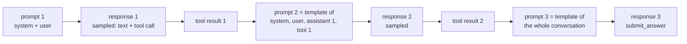

# Explainer: what a training example is, and why it must match what the model saw

Written for decision 3 of `SLICE2_PLAN.tressoir.md`. No training background assumed. The question you asked: is the point to make what is seen at training and what was seen by the model the same, and is the token-in token-out proposal overkill? Short answer: yes, that is the point, and it is crucial. Sections 1–6 were written when I still recommended the cheap fix (record what the engine saw). Section 7, added after your second look, is why the segments version you proposed is the right one once agents run long, and it is now the recommended option.

## 1. What the trainer consumes

A language model trainer does not consume messages. It consumes one flat list of token ids and, for each position, whether that position carries loss. For our objective it also needs, at each loss position, the probability the *sampling* model assigned to that token.

`AgentTrainer.train() · one training example`

```
tokens:   [ ...prefix the model read... | ...tokens the model wrote... ]
loss:     [  0   0   0   0   0   0   0   |  1   1   1   1   1   1   1   ]
pi_old:   [  -   -   -   -   -   -   -   | .61 .93 .12 .88 .99 .70 .95 ]   probability the engine gave each written token
weight:   A  (one number per example, from the selection function)
```

The loss at a written position is `min(s·A, clip(s)·A)` with `s = π_θ(token | everything before it) / π_old(token | everything before it)`. `π_θ` is what the trainer computes in its forward pass. `π_old` is what the engine reported when it sampled. The ratio only means something if both are probabilities of **the same token in the same context**.

## 2. A multi-turn rollout is several such examples

An agent rollout with three assistant turns looks like this to the engine (`Agent.run()` → `engine_submit()` per turn):



Each turn is a separate request. The engine receives a prompt (`P_t`, already tokenised), samples a response (`R_t`), and reports a log-probability per sampled token. So each turn gives exactly one training example: `(P_t, R_t, logprobs_t)`. "One example per assistant turn" means this: a three-turn rollout becomes three examples, each with its own prefix. That is the default in every multi-turn RL framework and needs no cleverness.

## 3. Where the mismatch risk comes from

Today the agent loop keeps the conversation as *messages* (dicts with role, content, tool_calls). Prompt 2 is built by running the chat template over those messages. The template does not paste the model's raw text back; it re-renders the assistant turn from the parsed structure: content, then `<tool_call>\n<function=python>\n<parameter=code>\n…` from the `tool_calls` dicts. Two consequences:

- **Bytes may differ.** If the model wrote a trailing space, an extra newline, arguments in a different order, or a slightly off tag, the re-rendered version is the canonical one, not what was sampled. The model then reads a cleaned-up copy of its own turn. Harmless for behaviour (that is what slice 1 does now and it works), but it means the sampled tokens of turn 1 are not literally present in prompt 2.
- **Tokens may differ even when bytes match.** Byte-pair tokenisers are not unique: the model may have sampled `` ``` `` and `python` as two tokens where the tokeniser, given the same text fresh, produces one merged token. Same string, different token ids.

Neither matters for *running* the agent. Both matter for *training*, if the trainer rebuilds the sequence from text: the trainer would compute `π_θ` for a token that is not the one `π_old` was reported for. The ratio becomes noise, the clip then clips noise, and those positions contribute a wrong or zero gradient. This is the "tokenisation mismatch" problem the RL frameworks (veRL, SkyRL, slime) all document, and the reason they moved to passing token ids around.

The diagnostic is simple and is in the plan: at the first gradient step of a round nothing has changed yet, so `π_θ = π_old` and the mean ratio must be 1.00 with clip fraction 0. If it is not, the sequences do not match what was sampled.

## 4. The three ways to get matching sequences

| option | what changes | training tokens per solved 4B trajectory | exact? |
| --- | --- | --- | --- |
| **A. Record what the engine saw** | `engine_submit` already tokenises the prompt; return those ids with the response and store them on the assistant step. One example per turn. Nothing about the agent loop or the model's view changes. | ≈ input + output tokens of the rollout ≈ 14k (3.5 turns, prefixes re-read each turn) | yes, by construction |
| **B. Token-in token-out** | The agent keeps the prompt as ids; after each turn it appends the sampled ids verbatim and only the templated *tool-result wrapper* as new tokens. Prompt 3 then literally contains responses 1 and 2, so the whole trajectory is one sequence with a loss mask. | ≈ final prompt + last response ≈ 5–6k | yes, and the prefix cache hits are exact too |
| C. Re-template at training time | Rebuild messages → text → tokens in the trainer and hope it matches. | ≈ 14k | no; silent drift |

Where "2.5×" comes from: with option A, turn 3's example re-reads the whole conversation as its prefix, turn 2's re-reads most of it, and so on. The sum over turns is what the probe reports as `num_input_tokens` (about 10k for a solved 4B trajectory) plus the outputs. Option B reads the conversation once. At 3.5 turns the ratio is 2–3×; at 10 turns it approaches 5×, which is where my earlier number came from, but failed rollouts with 10 turns are exactly the ones a group-mean rule mostly drops.

## 5. Is B overkill for slice 2?

Yes, for now. Two reasons.

- **Compute.** A 1024-rollout round on the 4B is ~60 min of generation. Training under A is ~30 min, under B ~12 min. B saves a quarter of the round, not a multiple of it. Generation dominates and stays the same.
- **Risk.** B changes the agent loop (ids instead of messages between turns) and relies on the chat template being prefix-stable (the rendering of the first k messages must be a prefix of the rendering of the first k+1). Qwen's templates are, but it is a new assumption with its own check, and a subtle failure there would show up as exactly the mismatch we are trying to avoid.

A gives exact fidelity with a five-line change and no new assumptions. B remains available as a later optimisation, and the step-1 ratio diagnostic is the same for both. The one genuine advantage of B beyond compute is that the model's second turn sees its own first turn byte-for-byte, which is arguably the more faithful harness; that is a co-design question worth an experiment one day, not a prerequisite for slice 2.

## 6. What this means for the interfaces

With option A, `TrajectoryStep` on assistant steps carries `prompt_token_ids`, `token_ids`, `logprobs`. The trainer builds `(prompt_token_ids + token_ids)` per turn, masks the prompt, uses `logprobs` as `π_old`. Storage is about 50 KB per assistant turn in the cache, dominated by the prompt ids; roughly 200 MB per 1024-rollout round, compressible later by storing prompt ids as a delta from the previous turn if it ever matters.


## 7. Update: segments in `agent_utils.py`, and why 20 turns make it a must

Your proposal from chat: the prompt is a token sequence the agent owns, and each turn appends `[sampled assistant tokens verbatim] + [dialect-rendered wrapper for the tool result or nudge]`, later also `[AC placeholder block + mask + rows]`. That is option B with the assembly in the dialect, which already owns the model-specific strings. Three things fall out.

**The training cost of option A is quadratic in turns.** Each per-turn example re-reads the whole prefix. With a 1k initial prompt and 1.5k tokens added per turn:

`AgentTrainer.train() · training tokens per trajectory`

| turns | A: one example per turn ≈ T·P₀ + L·T²/2 | B: one sequence ≈ P₀ + L·T | ratio |
| --- | --- | --- | --- |
| 3.5 | 13k | 6k | 2× |
| 10 | 85k | 16k | 5× |
| 20 | 320k | 31k | 10× |
| 40 | 1.2M | 61k | 20× |

Today's DAPO runs sit on the first row, which is why A looked fine. Long-horizon agents sit on the third and fourth, where A's trainer would spend ten to twenty times the tokens of generation.

**Correctness is easier under B, not harder.** My earlier worry was template prefix-stability. With the dialect rendering the wrappers explicitly there is no template after turn one, and the check becomes a unit test: for a text-only conversation, `prompt_tokens + sampled + tool_response_tokens` must equal `apply_chat_template(messages)` token for token. Two loop details: a turn that hit max tokens carries no end-of-turn token, so the dialect appends one; and the model's second turn now sees its own first turn byte-for-byte rather than a re-rendered copy, which is the more faithful harness anyway.

**AC becomes one more segment kind.** vLLM's mixed prompt is `(token ids, per-position mask, rows)`. The concatenation of segments is exactly that: ids from every segment, mask false on placeholder positions, rows from the AC segments. The one engine-side cost to remember for slice 3 or 4 is that the rows tensor is full length (zeros at token positions), so a 40k-token prompt ships a 40k × d_model tensor per request even for a few AC rows.

**The record gets smaller.** Each step stores only its own segment; the full sequence is the first prompt plus the steps in order. Nothing is stored twice.
