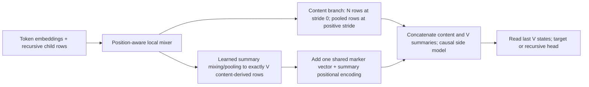

# Activation context · slice 3a1

Version 2 · interactions integrated, fresh review complete; follow-ups open.

Plan the 3a1 refinement on top of the applied 3a code and your prototype. The requested correctness, data-fit and performance reviews were performed before this plan; their findings determine the work below. M1–M6 and the approved autotuner extension are implemented, validated and staged. See completion reports and the exact source handoff. M7 remains deferred.

## Executive Summary

One `train()` call owns several complete epochs. The models stay resident through training and small reporting evaluations, the optimizer survives later `train()` calls, and checkpoints are written once per epoch. The page shows epoch and optimizer-step progress, exact held-out curves, training loss, useful timings and each epoch's sample completions.

| Area | Result of pre-planning | Planned behavior |
| --- | --- | --- |
| Continuation data | A boundary cut can omit a tool observation from the student | Both branches retain the same post-cut history; 25% immediate targets, otherwise a later real assistant turn within an 8,192-token suffix |
| Context conditioning | RAG already sees its question; trajectory QA also sees the later question | Keep RAG conditioned; trajectory memory retains its original task and excludes the later QA question |
| AC and adapters | Pooling/row gradients pass small checks; cache and checkpoint lifecycle have faults | Default stride 0 bypasses content pooling; V content-derived summary rows replace learned marker slots; validate the new architecture and cache lifecycle |
| Epochs and reports | The bench creates 50/50/25-update train calls to simulate one epoch | Trainer-owned 10% reporting; one checkpoint per epoch; persistent optimizer and global step |
| Extra evaluations | Decoded 100-item evaluations took about 19 minutes | Reuse forward-pass metrics; generate only four fixed inspection samples per epoch by default; larger decoding is an explicit bench option |
| Sync | A wedged rsync can block wrapper completion; the SSH root cause is unproven | 60-second incremental report and checkpoint pulls; stalled attempts retry with partial progress retained; final/manual recovery includes all artifacts |
| Subagent examples | Unrelated task-ID bundles mostly teach routing | Accepted: real exchanges in a later slice; no synthetic subagent source in 3a1 |

The source baseline is `/source` HEAD `302be2f` plus your six-file prototype. The 3a handoff is already applied. The existing staged bench remains under `IB/ARTIFACTS/AGENT_ROLLOUTS/slice3/`; it is absent from the source bench directory.

| Owner | Creates / consumes |
| --- | --- |
| Study generator | Typed training items, source provenance, conservative terminal-answer formatting and non-mutating reference variants |
| AC trainer | Epoch loop, optimizer/global-step clock, invocation-local teacher cache, evaluation results and epoch checkpoints |
| AC reporter | Consumes trainer progress/results; renders existing HtmlReporter widgets and retains selected completions |
| Bench / test caller | Chooses data splits, epoch count, reporting/validation sets and any large decoded benchmark |
| Sky wrapper | Runs the command, pulls live reports, cancels/reaps transfers, performs final artifact recovery |

**Chosen boundaries:** same target adapter for teacher and student; the user-requested summary-row architecture is a real change. Preserve the existing trainer/reporting approach, with no new prefill engine, generic reporting framework or sync root. The fresh review also examines agent training and datasets for avoidable learning limitations; it is not restricted to code changed by 3a1. Development models remain 0.8B side / 4B target; only the study generator changes to the requested 9B FP8 model. Larger AC models and 3b rollout integration remain separate work.

### Corrected AC data flow

One shared marker vector is added to all V summary rows, as confirmed in chat. It is not an extra sequence position. V stays the requested output count.

`activation/ac_model/ac_model.py · _encode_prepared_batch`



The current code instead creates each summary slot from `marker_kind + marker_index`, independently of its input content. It becomes content-dependent only inside the side decoder. The revised plan supplies content-derived summary rows before that decoder. This is achievable without generating tokens sequentially or changing the recursive part/placeholder contract.

Default stride 0 keeps all content rows; it does **not** disable the summary pooling needed to obtain V rows. Approximate side sequence length becomes N+V, versus N/2+V at stride 2. At ratios 1/10–1/20 that is about 1.8–1.9 times the backbone row count of stride 2, before attention effects and the new summary module. The old pooling-based timing/memory numbers therefore do not validate this new default.

**Fresh review complete:** concrete execution/data defects and AC initialization risks remain open. See [the prioritized findings and smallest proposed responses](SLICE3A1_LIMITS_REVIEW.tressoir.md). The review does not silently expand implementation scope.

### Scope after the review discussion

The broad review identified possible limitations across several slices. It did not establish that all thirteen are prerequisites for 3a1. Following the user's scope correction, **prioritize AC initialization and source-data fidelity in 3a1**.

| Issue from the chat summary | 3a1 disposition |
| --- | --- |
| (1) Fresh-agent compaction-tool constructor failure — A1 | Defer to 3b with compaction/agent integration. The AC training plan does not require a fresh agent rollout. |
| (2) AC input initialization/scale — C1 | Fix as part of M2: preserve content relative to PE and random residual updates, then align content/summary inputs, shared marker and PE to the side decoder. Final RMS normalization alone is insufficient. |
| (3) Dataset text/trajectory corruption — D1, D2 | Fix in M1: preserve original continuation whitespace/token boundaries and assemble trajectory windows from original spans once, preserving turns and calls. Regenerate affected item caches. |
| (4) Mixed missing policy log-probs — A2 | Defer as an ingestion edge-case guard. Expert/hinted records already use `ignore_logprobs=True`; wholly unrecorded records also request reference recomputation. No normal producer of mixed recorded/unrecorded policy turns was identified. |
| (5) Seen-context QA evaluation — D4 | Keep the current question-disjoint split and its honest label. The user considers unseen-context evaluation low priority; no corpus repartitioning in 3a1. |

Keep the small M6 item-cache settings compatibility check with the data corrections, so old data or changed generation settings cannot silently invalidate their verification. Include full recursive backward in the already-planned capacity check. Broader adapter/sampling/action-window experiments and other agent-training review items remain later work, rather than new 3a1 prerequisites.

**Clarification of (4):** `items_for()` marks non-policy records with `ignore_logprobs=True`; `build_example()` then requests `_fill_old_logprobs()` before the agent trainer's first update. Those are the **student's round-start reference probabilities**, not probabilities required from the expert generator. The reproduced bug requires a non-ignored policy record with at least one recorded assistant turn and another unrecorded turn. A normal rollout requests recording consistently through its run-level `record_sampling` setting. AC distillation obtains teacher distributions through its own forward passes and does not depend on stored rollout log-probs. The previous chat summary overstated this edge case's current priority.

The scope below was approved in chat; the completion reports record implementation and validation.

## Requested Decisions

**Accepted from your interactions and chat (2026-09-09):**

| Decision | Recorded direction |
| --- | --- |
| Content pooling | Add stride 0, make it the default, and bypass only content pooling when selected. Positive strides remain available. |
| Summary inputs | Learn V content-derived summary rows through their own mixing/pooling path; add one shared marker embedding to every row, with positional encoding on top. No per-index marker array and no extra separator token. |
| Subagent data | Defer new subagent sources to a later slice. Use real exchanges when that integration is ready. |
| Sync outcome | Epoch checkpoints must actually reach the user; transfer bounds must not silently discard them. Make checkpoints eligible for regular incremental pulls, retain partial transfer progress, retry stalled attempts, and report any remaining unsynced data. |
| Review scope | After this replan, launch a fresh review of AC design/training, datasets and agent training for avoidable limitations. Findings are identified and classified before product changes. |

The remaining earlier prototype directions are retained: trainer-owned epochs and 10% reporting, persistent optimizer, delayed continuations, typed APIs, sample retention and the requested study model. The earlier pooling-2 default and deferred marker-scale/coverage assumptions are superseded where they conflict with these instructions. The later explicit green light authorized this implementation.

**Approved:** “Ok go for it.” Implement the agreed M1–M6 scope; M7 remains deferred.

## Milestones

<details class="card" data-tressoir-markdown>
  <summary>
    <span class="card-title">M1 — Make training examples preserve the intended context</span>
    <span class="card-oneliner">Fix shared continuations, question conditioning and terminal-answer alignment.</span>
    <span class="card-badge">Completed</span>
  </summary>

#### Completion report

**What landed.** Exact source tokens/whitespace, visible observations, original-span windows, original tasks at all trajectory-QA depths, observed terminal answer calls and shared split/reference helpers.

**Drifts, challenges and unplanned steps.** Four review edge cases were corrected. Real compaction generation can report a shortfall when suitable delayed continuations are exhausted; it does not silently substitute immediate targets.

**Validation.** Model/data fixtures passed overlap/task/QA/terminal and exact cap checks; fresh CPU integration generated all three kinds.

**Focused actual diffs.** Excerpts below; the [handoff](SLICE3A1_ROUND.tressoir.md) contains the complete product delta. Omitted hunks are intentional.

`activation/ac_model/ac_model_study.py`

```diff
@@ -200,41 +216,101 @@
         if not segments:
             return None
         last_position, last_offset = cuts[-1]
+        visible: list[dict] = []
+        teacher_partial_ids: list[int] | None = None
         if last_offset is not None:
-            completion_text = message_text(body[last_position])[last_offset:]
-            in_context_tail = body[:last_position]
+            turn_text = message_text(body[last_position])
+            full_ids = self.tokenizer.encode(turn_text, add_special_tokens=False)
+            # The cut was selected at an exact target-token boundary above.
+            teacher_partial_ids = full_ids[:cut_tokens]
+            completion_ids = full_ids[cut_tokens:]
+            immediate_target = last_position
+            visible_after_cut = [{**body[last_position], "content": turn_text[last_offset:]}]
         else:
-            next_assistant = next((i for i in range(last_position, len(body)) if body[i]["role"] == "assistant"), None)
-            if next_assistant is None:
+            immediate_target = next((i for i in range(last_position, len(body)) if body[i]["role"] == "assistant"), None)
+            if immediate_target is None:
                 return None
-            completion_text = self.assistant_text(body[next_assistant])
-            in_context_tail = body[:next_assistant]
-        completion_text = completion_text.strip()
-        if not completion_text:
-            return None
-        completion_ids = self.tokenizer.encode(completion_text, add_special_tokens=False)
+            visible_after_cut = []
+        if immediate:
+            target_position = immediate_target
+            if last_offset is None:
```

86 further lines in this hunk omitted; other hunks are in the handoff.

`activation/dataset/dataset.py`

```diff
@@ -41,6 +41,7 @@
     chunk_start: int
     """Offset of chunk_text in the document text (for trajectories: in the rendering of the whole trajectory)."""
     chunk_messages: list[dict] | None = None
+    source_spans: list[tuple[int, int, int, bool]] | None = None  # (message index, text start/end, includes calls)
     """Trajectory chunks: the message slice chunk_text renders (an over-long message is split by characters)."""
 
 @dataclass
```

`activation/dataset/dataset_index.py`

```diff
@@ -77,23 +78,25 @@
                     slice_message = {"role": role, "content": text}
                     if slice_index == len(slices) - 1 and message.get("tool_calls"):
                         slice_message["tool_calls"] = message["tool_calls"]
-                    pieces.append((render_message(slice_message), offset + len(prefix) + start, [slice_message]))
+                    pieces.append((render_message(slice_message), offset + len(prefix) + start, [slice_message],
+                                   [(message_index, start, start + len(text), slice_index == len(slices) - 1)]))
             else:
                 joined = rendered if not current else current_text + MESSAGE_SEPARATOR + rendered
                 if current and len(joined) > self.chunk_size_chars:
-                    pieces.append((current_text, current_start, current))
-                    current, current_text = [], ""
+                    pieces.append((current_text, current_start, current, current_spans))
+                    current, current_text, current_spans = [], "", []
                     joined = rendered
                 if not current:
                     current_start = offset
                 current.append(message)
+                current_spans.append((message_index, 0, len(message_text(message)), True))
                 current_text = joined
             offset += len(rendered) + len(MESSAGE_SEPARATOR)
         if current:
-            pieces.append((current_text, current_start, current))
+            pieces.append((current_text, current_start, current, current_spans))
         return pieces
 
-    def _chunk_documents(self):
+    def _chunk_documents(self) -> None:
         """
         Chunk the documents.
         """
```

`activation/dataset/loaders/nemotron_math.py`

```diff
@@ -46,7 +48,15 @@
                                "tool_calls": structured_calls(message.get("tool_calls"))})
         else:
             normalized.append({"role": role, "content": message.get("content") or ""})
-    return normalized, parse_tool_definitions(row.get("tools"))
+    tools = parse_tool_definitions(row.get("tools"))
+    if normalized and normalized[-1]["role"] == "assistant" and not normalized[-1].get("tool_calls"):
+        final = normalized[-1]
+        answer = final.get("content", "").strip()
+        if answer:
+            final["content"] = ""
+            final["tool_calls"] = [{"name": "submit_answer", "arguments": {"answer": answer}}]
+            tools = [tool for tool in tools if tool.get("function", tool).get("name") != "submit_answer"] + [submit_answer_definition()]
+    return normalized, tools
 
 
 class NemotronMathDataset:
```

`activation/dataset/loaders/s1_deep_research.py`

```diff
@@ -46,6 +48,14 @@
             normalized.append({"role": role, "content": text.strip(), "reasoning": reasoning, "tool_calls": calls})
         else:
             normalized.append({"role": role, "content": content})
+    if normalized and normalized[-1]["role"] == "assistant" and not normalized[-1].get("tool_calls"):
+        final = normalized[-1]
+        matches = list(ANSWER_BLOCK.finditer(final.get("content", "")))
+        if len(matches) == 1 and not final["content"][matches[0].end():].strip():
+            match = matches[0]
+            final["content"] = final["content"][:match.start()].rstrip()
+            final["tool_calls"] = [{"name": "submit_answer", "arguments": {"answer": match.group(1)}}]
+            tools = [tool for tool in tools if tool.get("function", tool).get("name") != "submit_answer"] + [submit_answer_definition()]
     return normalized, tools
 
 
```

`activation/dataset/loaders/trajectory_utils.py`

```diff
@@ -233,6 +233,22 @@
     return messages, {"tools": list(definitions.values()), "system_prompt": ""}
 
 
+def submit_answer_definition() -> dict:
+    """Use the actual runtime answer schema in representation-training data."""
+    from ...agent.agent_tools import SubmitAnswerTool
+    return {"type": "function", "function": {"name": SubmitAnswerTool.name,
+            "description": SubmitAnswerTool.description, "parameters": SubmitAnswerTool.parameters}}
+
+
+def observed_terminal_answer(messages: list[dict]) -> str | None:
+    if messages and messages[-1].get("role") == "assistant":
+        for call in messages[-1].get("tool_calls") or []:
+            function = call.get("function", call)
+            if function.get("name") == "submit_answer":
+                return function["arguments"]["answer"]
+    return None
+
+
 def trajectory_chars(messages: list[dict]) -> int:
     """Characters of content and arguments, the cheap size measure loaders filter on."""
     total = 0
```

**Original forward plan, retained for context.**

#### Planning Overview

`ac_model_study.py` partitions one real trajectory into compressed history, visible post-cut history and the supervised assistant continuation. A cut before a tool result must preserve that result in the student. For delayed targets, the same intervening real messages reach both branches; the supervised target and later information never appear in either prefix.

Use `max_post_compaction_tokens: int = 8192` and `immediate_continuation_ratio: float = 0.25`. Keep 512-token supervision. Select delayed targets at real assistant-turn starts, preserving the existing immediate mid-turn case. After a mid-turn cut, a delayed student's suffix starts with only the uncompressed remainder of that old turn; the teacher retains the original whole turn. Reserve space for task, suffix and completion under the 72k cap. Record realized delay, immediate/delayed selection, depth and any shortfall; resample unavailable delayed targets rather than silently erasing the requested mixture.

RAG's query is already inside both AC levels. Preserve it. For trajectory QA, each part carries its own source task even when the selected window omitted the original first user message; exclude the future study question at every depth. That question stays outside the parts in the reader request. Preserve each distractor's own task.

Promote `transform_for_eval_reference` as an **instance method**: exact recent-text budgets need the bound AC model and target tokenizer. Both variants retain visible suffixes, teacher inputs and completion fields without mutating originals. Preserve the old reference semantics for comparability: compaction uses a tail; QA uses gold-passage text and is labeled **oracle gold text**, not ordinary recent retrieval. Recursively flatten nested source messages when constructing a text tail, so the generic renderer's `[activation context]` marker does not replace the underlying history. Exact budgets come from `part_view_rows`; no target-token approximation to V.

Use `submit_answer(answer=...)` for explicit QA answers and unambiguous observed terminal answers in the source trajectories. Reuse the runtime tool schema and existing dialect renderer. Keep the literal answer in item metadata for scoring. S1's recorded terminal answer block and Nemotron's recorded final visible answer are candidates; retain reasoning. Do not replace a wrong recorded answer with dataset gold. Preserve ambiguous Open-SWE shell submission commands and unknown research tools. External stateful Python histories remain representation-training examples; this pass does not make them executable local rollouts.

The follow-up review adds two source-fidelity corrections in this milestone: preserve original whitespace and a consistent target-token boundary at immediate mid-turn cuts; build trajectory windows from original source spans without duplicate overlap or invented turns. Treat an indivisible oversized call explicitly instead of silently claiming the window budget was met. Regenerate affected item caches. These fixes preserve the existing 512-token prefix objective; action/end-window sampling remains a later experiment.

#### Planned Changes

`activation/ac_model/ac_model_study.py · generate_compaction_samples, _compaction_item, reference transform`

```diff
- max_post_compaction_steps: tuple[float, float] = 8192
+ max_post_compaction_tokens: int = 8192
  immediate_continuation_ratio: float = 0.25
@@ partition and select a real target; unchanged cut construction omitted @@
- ac_prefix=system + [task, ac_user],
+ ac_prefix=system + [task, ac_user] + visible_suffix,
@@ typed instance method; transform body omitted @@
- @staticmethod
- def transform_for_eval_reference(items, kind):
+ def transform_for_eval_reference(
+     self, items: t.Sequence[ActivationContextTrainingItem],
+     kind: t.Literal["no_context", "recent_text"],
+ ) -> list[ActivationContextTrainingItem]:
```

`activation/ac_model/ac_model_study.py · generate_trajectory_qa_samples, generate_rag_qa_samples`

```diff
@@ trajectory parts; surrounding construction omitted @@
- part = ac_part([task_message] + messages, self.ac_name, ratio)
+ part = ac_part(with_original_task(document, messages), self.ac_name, ratio)
@@ QA completion; shared helper uses SubmitAnswerTool and ModelDialect @@
- completion_text=example.gold_answers[0].strip(),
+ completion_text=self.dialect.preferred_format.render("submit_answer", {"answer": answer}),
+ tools=answer_tools,
@@ info also retains gold_answer for scoring; RAG conditioning remains as written @@
```

`activation/dataset/loaders/trajectory_utils.py · reformat_trajectory`

```diff
@@ optional observed terminal answer, supplied only by a source-aware loader @@
  reasoning: str = "keep",
  tool_map: dict | None = None,
+ terminal_answer: str | None = None,
@@ normalization body omitted @@
+ # Attach a structured submit_answer call to an eligible terminal assistant turn;
+ # preserve recorded reasoning and derive its schema from SubmitAnswerTool.
```

`activation/dataset/loaders/s1_deep_research.py · load`

```diff
- messages, kwargs = reformat_trajectory(normalized, tools)
+ observed_answer = terminal_answer_from_recorded_answer_block(normalized)
+ messages, kwargs = reformat_trajectory(normalized, tools, terminal_answer=observed_answer)
@@ use submit_answer instruction only when that terminal answer was converted; other loader fields omitted @@
```

`activation/dataset/loaders/nemotron_math.py · load`

```diff
- messages, kwargs = reformat_trajectory(normalized, tools)
+ observed_answer = terminal_answer_from_recorded_visible_reply(normalized)
+ messages, kwargs = reformat_trajectory(normalized, tools, terminal_answer=observed_answer)
@@ expected_answer remains a label; condition the terminal instruction as above; other loader fields omitted @@
```

All named new helpers above are planning sketches, not existing functions. Keep them private and small. Type every added or edited callable; reuse project message dictionaries and concrete dataset/item classes rather than introducing a repository-wide schema migration.

**Validation:** deterministic boundary/tool-result and delayed/mid-turn fixtures; depth 2 and cap accounting; seeded mixture with shortfall counts; nested-part question inspection; original-item immutability and exact reference budgets; submit-answer render/parse round trip; ambiguous Open-SWE ending unchanged. The pre-planning probe already reproduces the missing-observation bug; it is not evidence that the fix is implemented.

`activation/ac_model/ac_model_study.py · _compaction_item and _chunk_window`

```diff
- completion_text = completion_text.strip()
- if not completion_text:
+ if not completion_text.strip():
      return None
@@ retain original target-token split for the partial turn and capped completion; details omitted @@
- return [message for chunk in chunks[low:high + 1] for message in chunk.chunk_messages or [{"role": "user", "content": chunk.chunk_text}]]
+ return self._source_window_messages(document, chunks[low:high + 1])
+ # Helper uses chunk provenance to select original spans once, preserving turns and calls.
@@ source-span selection and indivisible-call budget accounting omitted @@
```

Validate exact text/token reconstruction across space, newline, within-word and multibyte cuts, plus one long assistant message/tool result spanning overlapping retrieval chunks. Retrieval overlap itself remains useful; do not disable it globally to repair window reconstruction.


</details>

<details class="card" data-tressoir-markdown>
  <summary>
    <span class="card-title">M2 — Build content-derived summary rows and preserve model state</span>
    <span class="card-oneliner">Default to unpooled content; pool V summaries separately, then add the shared marker and positions.</span>
    <span class="card-badge">Completed</span>
  </summary>

#### Completion report

**What landed.** Stride 0 content path; independent content summaries, one shared marker, calibrated input/residual scales, versioned row-cache invalidation and checked checkpoint recovery.

**Drifts, challenges and unplanned steps.** Added explicit eval mode after fresh PEFT injection when the actual reload probe exposed active dropout. Old architecture checkpoints are rejected rather than reinterpreted.

**Validation.** Stride 0/2/4, V>N, padding, input-scale and gradient fixtures passed; CPU and GPU paired reloads became bitwise identical. Exact 8/16/32k and full recursive 71,999-token optimizer cases passed.

**Focused actual diffs.** Excerpts below; the [handoff](SLICE3A1_ROUND.tressoir.md) contains the complete product delta. Omitted hunks are intentional.

`activation/ac_model/ac_model.py`

```diff
@@ -411,13 +460,53 @@
         if not folder.is_absolute():
             folder = resolve_path(checkpoint_path, create=False)
         state = torch.load(folder / MODULES_FILE, map_location="cpu", weights_only=False)
-        assert state["d_side"] == self.d_side and state["d_target"] == self.d_target, "checkpoint widths differ from the loaded bases"
+        if state.get("architecture_version") != ARCHITECTURE_VERSION:
+            raise ValueError("Checkpoint uses an incompatible AC architecture (legacy learned-marker checkpoints cannot load as content summaries)")
+        expected_ids = [self.side.model_config.model_id, self.target.model_config.model_id]
+        if state.get("model_ids") != expected_ids or state["d_side"] != self.d_side or state["d_target"] != self.d_target:
+            raise ValueError("Checkpoint model identities or widths differ from the loaded bases")
+        structural = ("input_pooling_stride", "input_pooling_window", "mixer_layers", "mixer_window", "mixer_heads", "min_view_rows", "max_view_rows", "side_lora_rank", "default_compression_ratio")
+        differences = [name for name in structural if state["config"].get(name) != getattr(self.config, name)]
+        targets = list(self.harness.module_manager.get_lora_config(self.config.base_side_model_lora_name).target_modules)
+        if differences or state.get("side_lora_targets") != targets:
+            raise ValueError(f"Checkpoint AC configuration differs: {differences or ['side_lora_targets']}")
+        side_lora = folder / SIDE_LORA_FOLDER
+        self._validate_adapter(side_lora, self.config.base_side_model_lora_name)
         self.modules.load_state_dict(state["modules"])
-        self.version = int(state.get("version", 0))
-        side_lora = folder / SIDE_LORA_FOLDER
-        if (side_lora / "adapter_config.json").exists():
-            module_manager = self.harness.module_manager
-            module_manager.free_lora(self.config.base_side_model_name, self.config.base_side_model_lora_name)
-            module_manager.get_lora_config(self.config.base_side_model_lora_name).checkpoint_path = str(side_lora)
+        self.version = max(self.version, int(state.get("version", 0)))
+        self.epoch_number = int(state.get("epoch_number", 0))
+        self.invalidate_encoded_rows()
+        module_manager = self.harness.module_manager
+        module_manager.free_lora(self.config.base_side_model_name, self.config.base_side_model_lora_name)
+        module_manager.get_lora_config(self.config.base_side_model_lora_name).checkpoint_path = str(side_lora)
         self.cache.clear()
         print(f"{self.name} - Loaded checkpoint (version {self.version}) from {folder}")
```

29 further lines in this hunk omitted; other hunks are in the handoff.

`activation/ac_model/ac_model_utils.py`

```diff
@@ -220,17 +225,54 @@
         key_padding[~window_valid] = False                                                          # invalid windows attend harmlessly, masked downstream
         normed = self.norm(flat)
         attended, _ = self.attention(normed, normed, normed, key_padding_mask=key_padding, need_weights=False)
-        flat = flat + attended
+        flat = flat + self.residual_scale * attended
         weights = flat_masks.to(flat.dtype)[..., None]
         pooled = (flat * weights).sum(dim=1) / weights.sum(dim=1).clamp_min(1.0)
-        pooled = pooled + self.ffn(pooled)
+        pooled = pooled + self.residual_scale * self.ffn(pooled)
         return pooled.view(batch_size, num_windows, d), window_valid.view(batch_size, num_windows)
+
+
+def unit_rows(rows: torch.Tensor) -> torch.Tensor:
+    """Normalize fp32 rows without mixing content across positions."""
+    rows = rows.float()
+    return rows * rows.square().mean(dim=-1, keepdim=True).clamp_min(1e-8).rsqrt()
+
+
+class AdaptiveSummaryPooling(nn.Module):
+    """V content-derived mean queries, each attending its ordered adaptive bin; O(N + V) source rows."""
+
+    def __init__(self, d: int, num_heads: int) -> None:
+        super().__init__()
+        self.norm = nn.LayerNorm(d)
+        self.attention = nn.MultiheadAttention(d, num_heads, dropout=0.0, batch_first=True)
+        self.ffn = FeedForward(d, 4 * d, d)
+        self.residual_scale = nn.Parameter(torch.tensor(0.1))
+
+    def forward(self, rows: torch.Tensor, num_rows: int) -> torch.Tensor:
+        # floor/ceil bins cover the input; V>N repeats nonempty bins, never padding.
+        length = rows.shape[0]
```

26 further lines in this hunk omitted; other hunks are in the handoff.

`activation/harness/module_manager.py`

```diff
@@ -210,6 +210,7 @@
         """The trainable parameters of that adapter only (injecting it if needed)."""
         peft_model = self.ensure_lora(lora_name)
         adapter_name = self.get_lora_config(lora_name).adapter_name
+        peft_model.set_adapter(adapter_name)
         return [
             parameter
             for name, parameter in peft_model.named_parameters()
```

**Original forward plan, retained for context.**

#### Planning Overview

Implement the user's requested architecture: **content-derived summary rows before the side decoder**. The existing V-slot learned-marker array is not that design. The marker is one learned vector shared across all V summaries, not one vector per index or a separate token. Fixed positional encoding distinguishes their order. Output remains exactly V rows, so existing placeholder sizing and recursive consumers do not change.

The local mixer first processes the valid content/recursive rows. Split its result into two branches:

- **Content branch:** stride 0 returns every valid mixed content row, preserving its order. Positive strides use the existing windowed content pooler. Zero bypasses that module entirely; it is never passed to division/unfold logic. Keep window 8 as the positive-stride default and validate only applicable positive-stride settings.
- **Summary branch:** a separate learned attention-pooling module maps the full valid mixed content sequence to exactly V rows independently of the content stride. Use deterministic, ordered, adaptive bins covering the whole input; each bin's content-derived mean query attends to that bin's rows, then a small feed-forward mixer produces one summary. This gives a content signal from the first forward and avoids an N×V dense attention matrix. Handle unequal bin sizes and V>N by documented repeated/overlapping nonempty bins; padding is never source content.
- Add one shared summary-marker vector and positional encoding indexed by summary order, then concatenate `[content_rows, summary_rows]`. Run the side decoder once and read the final V states. Existing target/recursive heads provide the destination representation and scale.

This is a concrete proposed implementation of the accepted shape; binning versus a more expensive global summary resampler is not a claim of measured superiority. The content branch still gives every summary position access to the whole earlier content through the causal side model. Check that every input region can influence an output and that content changes affect summary inputs before the decoder. Do not feed summary rows back into their own source pool or apply the compression ratio twice.

Fix the initialization/scale path as part of M2. Preserve ordinary and recursive content relative to positional terms and newly initialized attention/FFN residual updates, then align both content and summary branches to the side decoder's intended input scale. Include the shared marker and summary PE in the same policy. A final RMS normalization cannot recover content already overwhelmed before it. Use a bounded initialization approach, such as small residual gains or near-identity output initialization; verify the exact choice through component RMS, content sensitivity and gradient checks before the short training run. Old output-head scale checks do not settle this path. Actual hybrid LoRA coverage is now documented by the fresh review; retain current families for 3a1, with expansion remaining a later experiment.

**Cost and capacity:** at stride 0 the decoder sees N+V rows; the summary branch adds its own local pooling work. Keep gradients/checkpointing over the actual content and summary path. Repeat focused 8k/16k/32k encode/train memory checks on the intended node after implementation before carrying over old length caps. Report capacity honestly; do not hide the new cost by silently changing compression ratio or dropping long examples. Positive stride remains an explicit supported tradeoff.

**Checkpoint compatibility:** persist an architecture version for content-derived summaries, actual model IDs, pooling and summary-module configuration. Old learned-marker checkpoints are a different architecture: retain them but reject direct loading into this model with the differing architecture stated. Do not silently fill missing new modules randomly or add a legacy architecture mode merely to preserve old-checkpoint execution. Metadata inspection of old checkpoints remains possible; it cannot prove original model identity because old records contain aliases/widths only. Same-architecture new epoch checkpoints must round-trip exactly.

Keep the earlier lifecycle fixes: row-cache invalidation/version changes after actual updates independently of saving, including partial training failure; invocation-local teacher caching by prepared teacher-token digest, completion count and k; current-policy refresh on each new call; exact evaluation. Activate LoRAs before parameter enumeration. Require separate side/target LoadedModel objects, including two separately named instances when their model IDs happen to match.

#### Planned Changes

`activation/ac_model/ac_model.py · config, modules and encode`

```diff
- input_pooling_stride: int = 2
+ input_pooling_stride: int = 0   # bypass content pooling; summary pooling still runs
  input_pooling_window: int = 8
@@ module construction; small configuration/initialization details omitted @@
- self.marker_kind = nn.Embedding(2, d_side)
- self.marker_index = nn.Embedding(config.max_view_rows, d_side)
+ self.summary_pooling = AdaptiveSummaryPooling(d_side, config.mixer_heads)
+ self.summary_marker = nn.Parameter(torch.empty(d_side))
@@ per-example valid rows; batching and dtype handling omitted @@
+ content_rows = mixed_rows if stride == 0 else pooled_content_rows
+ summary_rows = self.modules.summary_pooling(mixed_rows, num_rows)
+ summary_rows = summary_rows + self.modules.summary_marker + summary_positions
- sequences.append(torch.cat([pooled[row][window_valid[row]], markers], dim=0))
+ sequences.append(torch.cat([content_rows, summary_rows], dim=0))
@@ final V states still go through the existing destination head @@
```

`activation/ac_model/ac_model_utils.py · AdaptiveSummaryPooling`

```python
class AdaptiveSummaryPooling(nn.Module):
    def __init__(self, d: int, num_heads: int):
        ...  # own attention projections and feed-forward mixer

    def forward(self, rows: torch.Tensor, num_rows: int) -> torch.Tensor:
        # rows [N,d] contains valid content only; return exactly [V,d].
        # Deterministic adaptive bins cover N; queries are content-derived.
        ...  # local bin attention and padding-safe pooling omitted
```

`activation/ac_model/ac_model.py · load and cache lifecycle`

```diff
@@ before loading weights; metadata comparison body omitted @@
+ self._validate_checkpoint_architecture(state)
  self.modules.load_state_dict(state["modules"])
@@ independent of saving @@
+ def invalidate_encoded_rows(self) -> None:
+     self.version += 1
+     self.cache.clear()
```

`activation/ac_model/ac_model_training.py · prepared examples and train lifecycle`

```diff
@@ one current-policy teacher cache per train invocation @@
+ self.teacher_cache.clear()
+ teacher_cache_key = (ac_model.name, teacher_token_digest, num_completion, config.teacher_cache_top_k)
- cached = self.teacher_cache.get(example.item.item_id) if top_k else None
+ cached = self.teacher_cache.get(example.teacher_cache_key) if top_k else None
@@ after any successful weight update, including interrupted training @@
+ if updated_encoder:
+     ac_model.invalidate_encoded_rows()
```

`activation/harness/module_manager.py · lora_parameters and AC registration`

```diff
  adapter_name = self.get_lora_config(lora_name).adapter_name
+ peft_model.set_adapter(adapter_name)
@@ existing parameter filter and registration details omitted @@
+ assert side_loaded_model is not target_loaded_model, "AC side and target need separate loaded model objects"
```

**Validation:** zero truly bypasses content pooling; strides 2/4 still work; V matches part sizing at all strides/ratios/depths; unequal/tiny lengths and V>N; summary inputs change with content; every source bin receives gradient; padded/batched and individual outputs agree; one shared marker and ordered PE; new checkpoint round-trip and legacy-architecture rejection; teacher-cache identity and new-call reset; cache invalidation with saving off/failure; two adapters and separate loaded instances. Old marker-model timing and isolated row-head checks are historical evidence only. No product implementation occurs in this replan.

</details>

<details class="card" data-tressoir-markdown>
  <summary>
    <span class="card-title">M3 — Put epochs and periodic evaluation inside the trainer</span>
    <span class="card-oneliner">One residency interval and optimizer clock, with explicit reporting and checkpoint ownership.</span>
    <span class="card-badge">Completed</span>
  </summary>

#### Completion report

**What landed.** One trainer-owned epoch loop with persistent Adam/global steps, invocation-local teacher cache, exact report/validation, paired numbered saves, phase timing and typed records. eval() also owns reference registration.

**Drifts, challenges and unplanned steps.** Checkpoint numbering scans existing folders to avoid overwrites. Cross-process optimizer resume remains outside scope. Four prior capacity updates account for the original synthetic report’s offset.

**Validation.** Tiny CPU integration passed 20+2 steps,10 cached-teacher hits, persistent optimizer and fresh paired reload. GPU smoke passed 20 steps/two epochs/all boundaries/four 64-token sample pairs and delivered both checkpoint weights.

**Focused actual diffs.** Excerpts below; the [handoff](SLICE3A1_ROUND.tressoir.md) contains the complete product delta. Omitted hunks are intentional.

`activation/ac_model/__init__.py`

```diff
@@ -5,6 +5,11 @@
     ActivationContextTrainingConfig,
     ActivationContextTrainingItem,
     ActivationContextTrainingStats,
+    ActivationContextTrainingProgress,
+    ActivationContextEvalSummary,
+    ActivationContextEpochStats,
+    CompletionSample,
 )
 from .ac_model_study import ActivationContextStudyGenerator, COMPACTION_INSTRUCTIONS, ac_part
 from .ac_model_reporter import ActivationContextTrainingReporter
+
```

`activation/ac_model/ac_model_training.py`

```diff
@@ -218,134 +337,309 @@
         stats.completion_tokens = sum(example.num_completion for example in examples)
         stats.teacher_tokens = sum(len(example.teacher_ids) for example in examples)
         stats.student_tokens = sum(len(example.student_ids) for example in examples)
+        per_step = config.examples_per_update or -(-len(examples) // min(config.updates_per_epoch, len(examples)))
+        steps = -(-len(examples) // per_step)
+        boundaries = set(reporting_boundaries(steps, config.reporting_interval))
+        fixed_items = []
+        if config.completion_samples:
+            for item in reporting_data:
+                example = self.build_example(ac_model, item)
+                if max(len(example.teacher_ids), len(example.student_ids)) <= config.max_example_tokens:
+                    fixed_items.append(item)
+                if len(fixed_items) == config.completion_samples:
+                    break
+        kernel_scope = ExitStack()
+        optimizer = None
+        device = None
+        bases = []
         if reporter is not None:
-            reporter.initialize_round(round_index, config, stats)
-
-        # Placement: engine asleep, both bases with their adapters resident and training, dropout off.
-        if target.vllm_model is not None:
-            target.engine_to_device(SOURCE_DEVICE)
-        module_manager.ensure_lora(target_lora)
-        device = ac_model.prepare()
-        self._configure_kernels(device)
-        ac_model.set_mode(TRAINING)
-        target_base, side_base = target.model, ac_model.side.model
-        for base in (target_base, side_base):
-            base.train()
```

371 further lines in this hunk omitted; other hunks are in the handoff.

**Original forward plan, retained for context.**

#### Planning Overview

One invocation prepares examples once, places models once, and runs `num_epochs` full seeded/shuffled passes. Keep optimizer moments and `updates_done` across calls; park moments and release bases only on exit. Introduce `epochs_done` for the AC training lifecycle, separate from global optimizer steps. An epoch completes only after its final step and required reporting/checkpoint actions succeed. Count already performed updates honestly on interruption.

Use `reporting_interval: float = 0.1`, validated in `(0,1]`. Determine reporting steps from distinct `ceil(fraction * steps_per_epoch)` boundaries through 100%, always including the final step and deduplicating short epochs. With 125 updates this gives 13,25,38,50,63,75,88,100,113,125. Compute boundaries from the decimal fraction (for example `Fraction(str(reporting_interval))`), avoiding floating-point rounding that would turn 60% of 125 into step 76. With fewer than ten steps it never evaluates twice at the same step. Empty reporting data skips these forwards.

Keep `reporting_data` caller-selected and small. Add optional `validation_data` for a larger epoch-end evaluation; the bench uses a fixed 32-item source-balanced subset and its 200-item held split respectively. If the sets are the same, reuse the final reporting result rather than evaluate twice. Evaluations run without gradients while models remain resident, then restore training mode and disabled dropout. No save, release or warm-up reset at a 10% boundary.

`eval` accepts the reporter explicitly alongside the requested `reporting_name`; that name alone cannot identify where to report. It returns a typed summary and reports through the same path used by `train`. Standalone eval may create a step-zero point; in-training eval receives the trainer's progress. Reference transforms are the study generator's responsibility.

Use typed progress, evaluation, epoch and sample records in `ac_model_training.py`, exported where callers need them. The trainer owns counters. The reporter consumes them. `ActivationContextTrainingStats` aggregates all epochs and keeps the existing convenient final `reporting` and checkpoint fields plus an epoch history. Report the actual optimized per-item weighted training loss, while naming any token-weighted diagnostic separately; exact held KL remains a per-item mean. Side-token counters use per-phase deltas, not the lifetime AC counter.

Checkpoint names are `epoch_NNN` for AC training and its target adapter, with matching epoch metadata and refreshed `latest`. Epoch numbers continue across calls and are recovered from AC checkpoint metadata or allocated past existing epoch folders, never silently overwritten after a reload. New-architecture checkpoints remain loadable from their explicit paths; the old learned-marker architecture is incompatible as explained in M2. Loading weights is not claimed to restore optimizer moments across processes. Use existing explicit-path saves for AC modules+side LoRA and target LoRA; these do not refresh latest. Only after both numbered saves succeed, refresh their latest aliases and atomically publish the small completed-epoch record containing both numbered paths. Downstream paired loading/recovery uses that record, not independently chosen latest directories. A failed or interrupted publication leaves the previous completed record authoritative; partial numbered files are not a completed pair. Preserve the agent trainer's default round save/exchange behavior. This is a small epoch manifest and ordered publication, not general transactional checkpoint storage.

#### Planned Changes

`activation/ac_model/ac_model_training.py · config and public lifecycle`

```diff
- updates_per_round: int = 4
+ updates_per_epoch: int = 4
  examples_per_update: int | None = None
- num_epochs: int = 1
- reporting_interval: int = 0.1
+ num_epochs: int = 2
+ reporting_interval: float = 0.1
  checkpoint_every_epoch: bool = True
+ completion_samples: int = 4
+ completion_max_new_tokens: int = 64
@@ signatures; typed record fields and unchanged arguments omitted @@
  def train(self, ac_model_name: str, training_data: list[ActivationContextTrainingItem],
            reporting_data: t.Sequence[ActivationContextTrainingItem] = (),
-           reporter: ActivationContextTrainingReporter | None = None) -> ActivationContextTrainingStats:
+           reporter: ActivationContextTrainingReporter | None = None, *,
+           validation_data: t.Sequence[ActivationContextTrainingItem] = ()) -> ActivationContextTrainingStats:
@@ inside one placement/cleanup scope @@
+ for epoch in range(config.num_epochs):
+     # Shuffle a complete pass; preserve the optimizer and global step.
+     # On scheduled steps: exact reporting; final step: optional validation.
+     # At epoch end: bounded sample generation, epoch checkpoint, epoch record.
@@ eval owns optional reporting; unchanged placement omitted @@
  def eval(self, ac_model_name: str, items: list[ActivationContextTrainingItem], release: bool = True, *,
+          reporter: ActivationContextTrainingReporter | None = None,
+          reporting_name: str = "reporting", progress: ActivationContextTrainingProgress | None = None,
+          is_reference: bool = False) -> ActivationContextEvalSummary:
```

`activation/ac_model/ac_model.py · save, checkpoint metadata`

```diff
- def save(self, checkpoint_path: str | None = None) -> str:
+ def save(self, checkpoint_path: str | None = None, *, epoch_number: int | None = None) -> str:
@@ trainer supplies the explicit epoch destination; serialization details omitted @@
+ # Save structural configuration, model IDs and the candidate epoch identity.
+ # An explicit destination does not publish latest or declare the pair complete.
```

`activation/ac_model/ac_model_training.py · _save_epoch`

```diff
@@ the trainer owns paired publication; path allocation/copy bodies omitted @@
+ ac_path = ac_model.save(str(ac_epoch_path), epoch_number=epoch_number)
+ target_path = module_manager.save_lora(target_name, target_lora, str(target_epoch_path))
+ # Both numbered saves are valid: refresh their latest aliases, then publish
+ # one small completed-epoch record with both numbered paths atomically.
+ # A failure before that record leaves the previous completed pair authoritative.
```

The existing manager's explicit-path save API suffices; M2's adapter enumeration is its only planned behavioral change.

`activation/ac_model/ac_model_training.py · progress and result contracts`

```python
@dataclass(frozen=True)
class ActivationContextTrainingProgress:
    epoch: int          # 1..E in this call; 0 for its baseline
    epochs: int
    epoch_number: int   # persistent checkpoint/history identity
    step: int           # step within the epoch
    steps: int
    global_step: int    # trainer-owned optimizer clock
    epoch_elapsed_s: float
    elapsed_s: float

class ActivationContextEvalSummary(t.TypedDict):
    items: int
    dropped_too_long: int
    kl: float
    agreement: float
    by_kind: dict[str, EvalKindSummary]
    per_item: list[EvalItemSummary]
```

The per-kind/item record field lists are omitted here; they type the existing JSON keys. Epoch records own progress, reporting/validation summaries, timing breakdowns, matching checkpoint paths and selected completion records. Training stats additionally retain baseline samples. These records are created by the trainer, returned to the caller and consumed by the reporter; there is no callback/event framework.

`activation/ac_model/__init__.py · public types`

```diff
@@ existing exports omitted @@
+ from .ac_model_training import ActivationContextTrainingProgress, ActivationContextEvalSummary
```

**Validation:** exact boundary fixture for 125, 9 and 1 steps; two epochs with no per-report placement/save; empty and identical report/validation sets; learning-rate/global-step and optimizer identity across two calls; failure after a successful update; epoch/latest path matching, new-architecture reload and legacy rejection; training mode/dropout restored; typed stats agree with the optimized loss and exclude eval from train throughput. This was recorded before implementation approval.

</details>

<details class="card" data-tressoir-markdown>
  <summary>
    <span class="card-title">M4 — Restore the epoch report and retain useful samples</span>
    <span class="card-oneliner">Promote cheap diagnostics and make progress and reference comparisons legible.</span>
    <span class="card-badge">Completed</span>
  </summary>

#### Completion report

**What landed.** Report-local epoch origin, persistent progress within a report, separate exact held/coarsened train charts, full sample history, reference provenance and phase times.

**Drifts, challenges and unplanned steps.** A fresh report starts at 0 even if existing checkpoint folders have higher numbers; checkpoint IDs remain cumulative. The already-recorded synthetic offset report is retained as evidence.

**Validation.** Real reporter fixtures cover repeated calls and nonzero initial checkpoint IDs; live report/epoch checkpoint updates were observed during the real-data GPU test.

**Focused actual diffs.** Excerpts below; the [handoff](SLICE3A1_ROUND.tressoir.md) contains the complete product delta. Omitted hunks are intentional.

`activation/ac_model/ac_model_reporter.py`

```diff
@@ -1,77 +1,114 @@
-"""HTML report of AC training rounds: KL and agreement per step, throughput, per-kind table, reference points, sample completions."""
+"""AC epoch progress, exact evaluation, training diagnostics and retained greedy samples."""
 from __future__ import annotations
 
 import json
 import typing as t
+from dataclasses import asdict
 
 from ..common.reporting import HtmlReporter
 
 if t.TYPE_CHECKING:
-    from .ac_model_training import ActivationContextTrainingConfig, ActivationContextTrainingStats
+    from .ac_model_training import (ActivationContextTrainingConfig, ActivationContextTrainingStats,
+        ActivationContextTrainingProgress, ActivationContextEvalSummary, ActivationContextEpochStats, CompletionSample, ReferenceName)
 
 REFERENCE_SERIES = ("no_context", "recent_text", "untrained_ac", "in_context")
 
 
-# @AI: Rewrite into epochs and reporting intervals. Should look similar to the old retrieval reporting.
-# So in the header, there is the epoch progress (epoch e/E), step within epoch (s/S), etc, elapsed time in epoch, total elapsed time, and other good metrics.
-# Then, the graph belows should show both reporting (with references) and training loss progress.
-# 
 class ActivationContextTrainingReporter(HtmlReporter):
-    def __init__(self, folder: str, title: str = "AC training", description: str = "", **kwargs):
+    def __init__(self, folder: str, title: str = "AC training", description: str = "", **kwargs: t.Any) -> None:
         super().__init__(folder, title, description, eyebrow="AC training", **kwargs)
+        self.references: dict[str, float] = {}
         self.global_step = 0
-        self.initialize_line_plot("kl", "KL(teacher || student)", "Per optimizer step, mean over the completion positions; flat lines are the reference points.",
-                                  "step", "kl", ["train"] + list(REFERENCE_SERIES), log_y=True, smoothing_window=5)
-        self.initialize_line_plot("agreement", "Top-1 agreement", "Teacher and student argmax agree on the next token.", "step", "fraction", ["train"], smoothing_window=5)
```

132 further lines in this hunk omitted; other hunks are in the handoff.

**Original forward plan, retained for context.**

#### Planning Overview

Reuse the old retrieval report's arrangement through existing `HtmlReporter` widgets. Header: epoch e/E, step s/S within epoch, global optimizer step, reporting interval progress, phase, epoch elapsed time and total elapsed time. A later `train()` call may start a new run display; its global optimizer step and persistent epoch number remain explicit in saved history.

Use a reporting/validation plot against fractional epoch progress, plus a separate training-loss plot against global optimizer step. Draw reference values across the actual plotted span. Label references as measured at the initial adapter and name the evaluation subset. The exact-zero in-context reference belongs in the reference table if the KL axis is logarithmic; do not replace zero with an invented positive floor. Label cached/coarsened training KL separately from exact held KL. Fresh final matched-reference evaluation in the bench uses the final adapter and final held split, so improvement over an initial horizontal line is not the only quality comparison.

Promote metrics already produced by the intended forwards: KL, top-1 agreement, per-kind counts/means, dropped items, learning rates, gradient norm, peak memory and elapsed times. Separate train, reporting/validation, sample-generation, checkpoint and total seconds. Show original-context tokens/s as **token-equivalent throughput** on cached-teacher steps, and retain live/cached example-rate breakdowns. Large decoded QA/tool metrics remain opt-in in the bench.

For inspection, take four fixed reporting items, generate teacher/student continuations with KV caching up to 64 new tokens at baseline and each epoch end, and time this phase. Reuse the already-working bench generation path with explicit no-grad/eval mode, then restore training/dropout/checkpointing settings. These are real greedy continuations, not teacher-forced argmax text. Permit `completion_samples=0` to disable them. Persist complete selected outputs, item IDs, literal reference answers, epoch/global step and adapter-version context. Baseline samples live on the training result separately from its epoch records; an empty reporting set or completion_samples=0 skips this generation. The trainer creates the baseline before its first update in the same residency scope. Bound generation before rendering; do not truncate every sample to 200 characters or overwrite prior epochs. A tiny sample is inspection, not a numerical accuracy benchmark.

The existing `report_data.json` and epoch summaries can carry this bounded history; no new storage service is needed. Each epoch gets its own completion widget/key, and the reporter never increments an independent global-step clock.

#### Planned Changes

`activation/ac_model/ac_model_reporter.py · layout and report methods`

```diff
- self.global_step += 1
+ # Use progress.global_step supplied by the trainer.
@@ replace round widgets; unchanged HtmlReporter calls omitted @@
- self.initialize_table("rounds", "Rounds", "One row per train() call.", ...)
+ self.initialize_table("epochs", "Epochs", "Training, evaluation and checkpoint timings.", ...)
+ self.initialize_line_plot("reporting", "Held-out KL", "Exact reporting and validation; initial references labeled.",
+                           "epochs", "KL", ["reporting", "validation", *REFERENCE_SERIES])
@@ completions method accepts typed epoch/sample records @@
- self.set_text("completions", "Completions", text)
+ self.set_text(f"completions_epoch_{epoch_number:03d}", f"Epoch {epoch_number} completions", text)
@@ reference endpoints, per-kind tables and status field bodies omitted @@
```

`activation/ac_model/ac_model_training.py · evaluation/sample records and epoch metrics`

```diff
@@ aggregate typed epoch records; record declarations and loop bodies omitted @@
+ epoch_stats.reporting_seconds = reporting_seconds
+ epoch_stats.validation_seconds = validation_seconds
+ epoch_stats.sample_seconds = sample_seconds
+ epoch_stats.samples = self._sample_completions(ac_model, fixed_items, config.completion_max_new_tokens)
+ reporter.report_epoch(epoch_stats)
@@ helper is a focused adaptation of the IB bench's existing greedy_text @@
+ # Generate teacher/student only, in eval/inference mode, with KV caching.
+ # Restore training state and keep every selected sample in epoch stats.
```

**Validation:** deterministic two-epoch report fixture with distinct report/validation points, monotonic global steps, reference endpoints, zero reference treatment, phase times and retained sample text. Run the same serialization through `HtmlReporter`; inspect the live page when the changed report is first exercised on a node. Static tests cover absence of 10%-boundary generation and scalar metrics' reuse of existing forward results. Full custom-editor rendering remains a manual check when that UI is available.

</details>

<details class="card" data-tressoir-markdown>
  <summary>
    <span class="card-title">M5 — Bound sync failures and prioritize live reports</span>
    <span class="card-oneliner">Keep the existing paths while making transfers and wrapper exit predictable.</span>
    <span class="card-badge">Completed</span>
  </summary>

#### Completion report

**What landed.** Live 60s report/checkpoint pulls, AC_ITEMS final-only default, resumable partials, connect/inactivity bounds, cancellation/reaping and three final retries with failure propagation.

**Drifts, challenges and unplanned steps.** No evidence justified attributing stalls to checkpoint volume; healthy transfers have no default total wall-time cap.

**Validation.** Process probes passed timeout/cancellation/child reaping/healthy progress/retry/filter/failure cases. A full epoch pair arrived locally while GPU training continued.

**Focused actual diffs.** Excerpts below; the [handoff](SLICE3A1_ROUND.tressoir.md) contains the complete product delta. Omitted hunks are intentional.

`activation/cloud/sky.py`

```diff
@@ -632,47 +635,133 @@
 
 
 def _sync_rsync_args() -> list[str]:
-    return ["-azu", "--itemize-changes", "--protect-args", "--no-owner", "--no-group", "--chmod=D755,F644"]
+    return ["-azu", "--itemize-changes", "--protect-args", "--no-owner", "--no-group", "--chmod=D755,F644",
+            "--timeout=60", "--partial-dir=.rsync-partial", "--exclude=.rsync-partial/",
+            "-e", "ssh -o ConnectTimeout=15 -o ServerAliveInterval=15 -o ServerAliveCountMax=3"]
+
+
+def _transfer(command: list[str], *, stop: threading.Event | None = None,
+              deadline_seconds: float | None = None) -> subprocess.CompletedProcess[str]:
+    """Reap rsync and its SSH process on cancellation; healthy transfers have no default deadline."""
+    if deadline_seconds is None:
+        configured = os.environ.get("ACTIVATION_SYNC_TIMEOUT_SECONDS")
+        deadline_seconds = float(configured) if configured else None
+    if stop is not None and stop.is_set():
+        return subprocess.CompletedProcess(command, 130, "", "transfer cancelled")
+    started = time.monotonic()
+    process = subprocess.Popen(command, text=True, stdout=subprocess.PIPE, stderr=subprocess.PIPE, start_new_session=True)
+    def reap() -> None:
+        try:
+            os.killpg(process.pid, signal.SIGTERM)
+        except ProcessLookupError:
+            pass
+        try:
+            return process.communicate(timeout=3)
+        except subprocess.TimeoutExpired:
+            try:
+                os.killpg(process.pid, signal.SIGKILL)
+            except ProcessLookupError:
+                pass
```

120 further lines in this hunk omitted; other hunks are in the handoff.

`activation/common/data_syncing.py`

```diff
@@ -15,8 +15,9 @@
 SYNC_ROOT_ENV = "ACTIVATION_SYNC_ROOT"
 """Set by the Sky wrapper on the node; unset here."""
 
-# @AI: If the observed stalls are legit due to naive high-frequency data transfers, then split have a SYNC_HEAVY under a different schedule or something like that.
-# That should generally not be the case though: model checkpoints are per epoch and reporting data should be light points at each 10% boundary.
+# The Sky wrapper pulls reports and epoch checkpoints incrementally every 60 seconds.
+# AC_ITEMS defaults to final/manual pulls; all paths still share this one root.
+
 PROJECT_ROOT = Path(__file__).resolve().parents[2]
 LOCAL_SYNC_ROOT = PROJECT_ROOT / "IB" / "TMP" / "SYNC"
 REMOTE_SYNC_ROOT = "/root/activation_artifacts/SYNC"
```

**Original forward plan, retained for context.**

#### Planning Overview

The evidence proves an unbounded wait: subprocess calls have no timeout and wrapper cleanup joins the pull thread indefinitely. It does not establish that bandwidth or checkpoint frequency caused sshd to stop answering. Existing rsync is incremental; one wrapper's pulls already serialize. Fix failure handling independently of the transfer policy.

Use one bounded rsync runner for initial/manual pushes and the live, final, manual and watch pulls with SSH connection/keepalive bounds and an rsync inactivity timeout. Initial proposed bounds are 15-second SSH connect and 60-second inactivity; healthy bulk transfer has no default total wall-time cutoff. A user may explicitly set a total deadline. Retain rsync partial progress in a dedicated partial directory and resume it on retry, without in-place writes to published checkpoint files. Stop/cancel must terminate and reap the transfer's process group (rsync and its SSH child), not merely abandon a daemon thread. The periodic loop logs a transient failure and retries at its next normal interval. Cleanup cancels/reaps the active periodic transfer, then resumes a full final pull with up to three attempts for transient transport failures. An inactivity timeout fails that attempt, never deletes the remote artifacts, and never marks them synced. After exhausted retries the wrapper reports the pending paths and a nonzero sync result; manual sync resumes recovery. Remote teardown remains separate. An existing remote-command failure retains priority; a failed final pull must not be reported as a successful sync. Manual `sky sync` also returns a failed pull as failure.

Retain `ACTIVATION_SYNC_ROOT` and every existing artifact path. Raise the configurable live interval from 15 to 60 seconds. In response to the checkpoint-delivery concern, `AC_MODELS` and `LORAS` remain eligible for the same 60-second incremental pulls as reports; checkpoints change at epoch boundaries, not every reporting point. Defer only `AC_ITEMS` to final/manual sync by default. Initial push, final pull and explicit manual sync include all artifacts. A completed local checkpoint pair is recognized only when its recorded numbered paths/files are present after successful transfer; seeing a small epoch record alone is not proof that its weights arrived. Explicit watch paths retain their requested behavior. Manual full sync remains available during a run as well. This policy keeps the live report responsive; it is not presented as an SSH root-cause fix. No second root or second worker is needed.

Log transfer phase, elapsed time, outcome and changed-file count. Preserve non-deleting, update-only behavior and restricted download destinations. Local failure recovery must not pause, resume or terminate a remote compute job beyond the existing command contract.

#### Planned Changes

`activation/common/data_syncing.py · live-versus-final artifact policy`

```diff
@@ existing root constants remain @@
+ SYNC_FINAL_ONLY_DIRS = ("AC_ITEMS",)
```

`activation/cloud/sky.py · _push_sync, _pull_once, _pull_loop, exec_cmd, sync and watch`

```diff
@@ live default and parser default change together @@
- interval_seconds: float = 15.0,
+ interval_seconds: float = 60.0,
@@ live SYNC pull only; other explicit watch pairs retain their policy @@
+ # Exclude SYNC_FINAL_ONLY_DIRS in periodic root pulls.
@@ transfer execution; process-group and timeout code omitted @@
- result = subprocess.run(["rsync", ...], text=True, capture_output=True)
+ result = run_bounded_sync_transfer(args, stop=stop, inactivity_seconds=60)
@@ wrapper cleanup @@
  stop.set()
- puller.join()
+ cancel_and_reap_active_transfer()
+ puller.join(timeout=cleanup_timeout)
+ # Full final pull without live exclusions; retry/resume failures and surface remaining unsynced paths.
@@ return codes, timing logs and shared watch helper use omitted @@
```

The helper names are planning sketches. Consolidate only the affected transfer paths; do not rewrite unrelated Sky provisioning code.

**Validation:** fake transfers for success, nonzero exit, an initial-push timeout, inactivity timeout, explicit optional deadline, healthy slow progress, cancellation with a child process, remote command failure plus final-pull failure, and successful recovery. Verify periodic filters versus full initial/final/manual sync, explicit watch behavior, no overlapping periodic/final subprocess, and no local deletion. Verify an epoch checkpoint larger than one pull interval completes, cancellation retains resumable partials, exhausted retries stay visible, and local completion is not inferred from a manifest whose weights are missing. A later bounded end-to-end sync smoke uses an already scheduled validation job; no node was started to write this plan.

</details>

<details class="card" data-tressoir-markdown>
  <summary>
    <span class="card-title">M6 — Update callers and validate the complete 3a1 flow</span>
    <span class="card-oneliner">Keep the smoke test small and the bench free of trainer orchestration.</span>
    <span class="card-badge">Completed</span>
  </summary>

#### Completion report

**What landed.** Typed existing three-kind tests, 9B study engine/chat alias, one-call bench orchestration, shared references/splits, settings+payload-validated item caches and measured recursive profile lengths.

**Drifts, challenges and unplanned steps.** The real compaction run failed the matched-adapter quality assertion. Independent review found no indicated implementation defect; the staged smoke test gates finite/count-matched mechanics and persists the quality diagnostic. Original failures remain recorded; the revised test/report layer received a focused check, without repeating full GPU training. Bench/profile remain IB-only; secondary metrics score submit_answer arguments, and FLOPs are approximate. No 3b agent-runtime changes.

**Validation.** All three real-data kinds completed two epochs / ten updates with finite/count-matched evaluation, bounded samples and delivered pairs. Original strict quality assertions: compaction and trajectory-QA failed; RAG-QA passed. The revised diagnostic smoke gate passed a focused test/report fixture and independent review; full GPU training was not repeated for that change. CPU caller/cache checks and GPU capacity/reload checks pass. Node paused after verified final sync.

**Focused actual diffs.** Excerpts below; the [handoff](SLICE3A1_ROUND.tressoir.md) contains the complete product delta. Omitted hunks are intentional.

`activation/harness/vllm_wrapper.py`

```diff
@@ -124,6 +124,7 @@
             "Qwen/Qwen3.6-35B-A3B-FP8": base,
             # Agent rollouts: 50k of trajectory plus a buffer (the trainer's max_example_tokens matches).
             "Qwen/Qwen3.5-9B": base | {"max_model_len": 52_000},
+            "RedHatAI/Qwen3.5-9B-FP8-dynamic": base | {"max_model_len": 52_000},
             "Qwen/Qwen3.5-4B": base | {"max_model_len": 52_000},
         }
         if model_id not in known:
```

`activation/tests/test_basic_agent_ac_training.py`

```diff
@@ -42,50 +45,40 @@
     return harness
 
 
-# @AI: Strongly type. Applies to everything else.
-def _trainer(harness) -> ActivationContextTrainer:
-    return ActivationContextTrainer(harness, ActivationContextTrainingConfig(examples_per_update=8))
+def _trainer(harness: HarnessRuntime) -> ActivationContextTrainer:
+    return ActivationContextTrainer(harness, ActivationContextTrainingConfig(examples_per_update=8, num_epochs=2))
 
 
-# @AI: move this into the study class.
-def _no_context(items):
-    """Reference items: the student sees the question / instructions only (every part dropped)."""
-    from dataclasses import replace
-    out = []
-    for item in items:
-        prefix = []
-        for message in item.ac_prefix:
-            content = message.get("content")
-            if isinstance(content, list):
-                message = dict(message, content="".join(part.get("text", "") for part in content if isinstance(part, dict) and part.get("type") == "text"))
-            prefix.append(message)
-        out.append(replace(item, item_id=item.item_id + ":no_context", ac_prefix=prefix))
-    return out
-
-
-def _run(harness, items, name):
-    """Round on the training items, KL of the held items before/after against the no-context reference; asserts and prints."""
+def _run(harness: HarnessRuntime, items: list[ActivationContextTrainingItem], name: str) -> None:
+    """Two epochs, exact held/reference comparisons with matched adapters, and paired saves."""
     assert len(items) > HELD + 8, f"only {len(items)} items"
```

40 further lines in this hunk omitted; other hunks are in the handoff.

IB-only tools: `slice3a1/activation/bench/agent_probes/ac_training_bench.py` and `ac_training_profile.py`; their complete sources are staged without product diff cards.

**Original forward plan, retained for context.**

#### Planning Overview

Update the user-annotated main-tree AC test and the existing IB-only bench to the final API. Inspect the existing profile for compatibility; it directly profiles forwards and uses no removed round configuration fields, but its AC FLOP estimate and supported input shape now need updating for stride 0 and the new summary branch. The old estimate divides by stride and would be invalid at zero. The bench makes one `train()` call with its requested epochs, small fixed reporting set and optional full held set; it no longer slices an epoch into train calls. Promote the small source-balanced, origin-disjoint split into a typed study helper so test and bench use the same policy. Namespace origins by dataset; all delayed samples from one trajectory remain on the same side of the split. Retain QA grouping by source study-question ID and describe that narrower guarantee honestly. The user explicitly considers unseen-context evaluation low priority now; no new source-pool split is required for 3a1.

Use `RedHatAI/Qwen3.5-9B-FP8-dynamic` for the study engine in the test and the AC bench. Add the exact ID to the existing 9B engine/chat recommendation mappings, including thinking disabled; do not let an alias silently fall through to defaults. Its [publisher model card](https://huggingface.co/RedHatAI/Qwen3.5-9B-FP8-dynamic) exists and documents vLLM deployment. Compatibility and speed on this project's node have not been measured. The existing study-question cache already keys by model ID. Start changed AC item generation in a fresh `3a1` cache namespace so old immediate-only/question-conditioned items are not silently reused; preserve old caches and record generator settings beside the new cache. No second global cache system is needed.

The bench defaults large decoded secondary metrics off. Cheap exact reporting is in the trainer; optional final or epoch-checkpoint decoding stays an explicit benchmark action and saves every selected epoch sample. Reuse the existing parsing/scoring helpers, scoring QA's literal answer or `submit_answer` argument, not tool syntax. Name approximate normalized tool-argument agreement honestly. Full current-adapter `no_context` and oracle-text references on the final held set are a deliberate final comparison; they are outside the 10% loop and their duration is reported.

Strengthen annotations in the touched helpers and all new interfaces. The main-tree test remains the explicitly requested `test_basic_agent_ac_training.py`; additional fixtures and one-off probes stay in IB. Source `/source` remains read-only during implementation as well: the handoff uses staged files and per-file diffs against the user's then-current source.

#### Planned Changes

`activation/ac_model/ac_model_study.py · split helper`

```diff
@@ body promoted from the existing IB bench, with dataset-qualified origins; omitted @@
+ @staticmethod
+ def split_samples(items: t.Sequence[ActivationContextTrainingItem], held: int, train: int,
+                   seed: int = 0) -> tuple[list[ActivationContextTrainingItem], list[ActivationContextTrainingItem], int]:
+     # Return held items, train items, and the count excluded for shared origins.
```

`activation/tests/test_basic_agent_ac_training.py · model, helpers and _run`

```diff
- QA_MODEL_NAME = "unsloth/Qwen3.8-27B-NVFP4" if SUPPORTS_FP4 else "Qwen/Qwen3.8-27B-FP8"
+ QA_MODEL_NAME = "RedHatAI/Qwen3.5-9B-FP8-dynamic"
@@ helper bodies and annotations omitted @@
- def _no_context(items):
+ # Use generator.transform_for_eval_reference(held, "no_context").
@@ reference reporting is now part of eval @@
- reporter.report_eval(0, "untrained_ac", before)
- reporter.report_reference("untrained_ac", before["kl"])
+ before = trainer.eval(AC_NAME, held, release=False, reporter=reporter,
+                       reporting_name="untrained_ac", is_reference=True)
@@ the small smoke explicitly requests its intended epoch count @@
+ ActivationContextTrainingConfig(num_epochs=1, examples_per_update=8)
```

`activation/harness/vllm_wrapper.py · recommended_engine_kwargs, recommended_chat_kwargs`

```diff
@@ exact-ID alias; surrounding mapping unchanged @@
+ "RedHatAI/Qwen3.5-9B-FP8-dynamic": base | {"max_model_len": 52_000},
@@ chat mapping @@
+ "RedHatAI/Qwen3.5-9B-FP8-dynamic": qwen_non_thinking | {"chat_template_kwargs": {"enable_thinking": False}},
```

`IB/ARTIFACTS/AGENT_ROLLOUTS/slice3/activation/bench/agent_probes/ac_training_bench.py · main`

```diff
@@ old chunk loop and caller-side reporting removed; setup omitted @@
- for epoch in range(args.epochs):
-     for start in range(0, len(train_items), chunk):
-         stats = trainer.train(AC_NAME, train_items[start:start + chunk], ...)
+ config.num_epochs = args.epochs
+ config.reporting_interval = args.reporting_interval
+ stats = trainer.train(AC_NAME, train_items, reporting_data=reporting_items,
+                       validation_data=held_items, reporter=reporter)
@@ persist typed epoch records including samples; large decoding explicitly requested @@
```

`IB/ARTIFACTS/AGENT_ROLLOUTS/slice3/activation/bench/agent_probes/ac_training_profile.py · AC cost and shape accounting`

```diff
- side_sequence = side_tokens // ac_model.modules.pooling.stride + view_rows
+ # Count actual valid content rows and summary rows; stride 0 retains all content.
+ side_sequence = content_rows + view_rows
+ # Include the separate summary mixer/pooler work in reported AC FLOPs.
@@ counts and per-phase measurements omitted @@
```

**Validation gate after implementation:** compile/type-check affected code; deterministic fixtures from M1–M5; one tiny CPU training lifecycle with separate loaded objects; existing small three-kind GPU test on a node when implementation reaches validation; focused 8k/16k/32k capacity checks for the new default, then a short two-epoch compaction smoke exercising 10% reporting, cached second epoch, samples, checkpoints and final sync. Use the smallest data shape that actually exercises those boundaries. Verify both adapters and AC modules update, frozen bases do not, output is finite, and checkpoint reload preserves behavior. A single observation that beats no-context is a mechanics/learning smoke, not validity of the full idea. No repeat of the 2,000-item multi-hour validity runs or model sweep is needed to validate this refinement. Inspect the final report in the custom editor when available, and review the handoff for incidental churn.

The subagent source is explicitly deferred by the user. Remove the unfinished declaration from the delivered 3a1 module and retain the requirement in the later-slice plan; do not expose an unusable public generator.
Enforce the item-cache settings sidecar (or a settings digest in this cache filename) before the cache-existence check decides whether study generation is needed. Compare generator revision, source selection, tokenizer/model and ratio/depth/cut/suffix/completion settings; preserve incompatible old files and choose a fresh path or fail clearly. One capacity fixture must include the full depth-2 student loss, backward and optimizer step at the intended retained shape, rather than only standalone encodes.


</details>

<details class="card" data-tressoir-markdown>
  <summary>
    <span class="card-title">M7 — Real subagent exchanges in a later slice</span>
    <span class="card-oneliner">Accepted deferral; no new synthetic source in 3a1.</span>
    <span class="card-badge">TBD</span>
  </summary>

**Original forward plan, retained for context.**

#### Planning Overview

**Accepted:** the user's interaction selects real subagent exchanges in a later slice. Keep corrected trajectory QA in 3a1. Once 3b supports parts-based parent/child exchange, collect actual delegation, child history/answer and parent resumption, grouping all derived records by their parent origin. No unrelated task-ID puzzle or synthetic handoff generator is planned for 3a1. The later implementation remains TBD, with its scope decision resolved.

</details>

## Pre-planning review and disposition

The draft-review verdict is **incorrect-or-missing**: there are concrete inherited faults and deliberately unfinished requested changes. The unfinished method declaration, placeholder bodies and partial round→epoch renames are treated as prototype intent, not surprising defects. Those initial domain reviews preceded version 1. This version integrates the new interactions first and is then submitted to a fresh review across AC design/training, datasets and agent training.

| Finding | Solver classification | Disposition |
| --- | --- | --- |
| Missing shared tool observation / delayed targets unused | genuine | M1, with a reproduced structural fixture |
| Later trajectory-QA question inside AC | genuine | M1; original source tasks retained; RAG already correct |
| Terminal answer normalization and reference dependencies | genuine | M1, conservative observed-answer conversion and bound instance method |
| Structural checkpoint mismatch and epoch identity | genuine | M2–M3; explicit compatibility and non-colliding epoch saves |
| Row cache stale without save; teacher cache aliases across calls/items | genuine | M2; weight-change invalidation and invocation-local prepared-token identity |
| Inactive adapter produces no parameter group | genuine | M2; actual PEFT reproduction, plus shared-object boundary |
| Epoch scheduling, reference extent and sample loss | genuine | M3–M4; trainer counters, maintained curves, persisted per-epoch outputs |
| Loss aggregation and lifetime side-token stats mislabel work | genuine | M3–M4; match optimized objective and use phase deltas |
| Unbounded transfer/join and hidden final-pull failure | genuine | M5; bounded/reaped subprocess lifecycle and honest return status |
| Exact 9B alias absent; duplicated split/reference helpers | genuine | M1/M6; narrow existing-map integration and shared typed helpers |
| Full secondary decoding at every reporting interval | reviewer-overkill if proposed | Explicitly excluded; observed 19-minute passes justify a small inspection budget |
| Second sync root, teacher-engine rewrite, marginal kernel tuning | reviewer-overkill for 3a1 | No such additions; preserve measured optimizations |
| Input/PE scale, content-derived summaries and hybrid LoRA coverage | reopened by explicit user request | Fresh review must identify avoidable limitations, distinguishing evidence from hypotheses; earlier deferral is not a veto |

**Evidence actually gathered:** read-only source and diff inspection at HEAD `302be2f`; a CPU fixture reproduced teacher-only access to a post-cut observation; a tiny actual-PEFT check reproduced inactive-adapter parameter omission; a strict state-dict load reproduced the undetected pooling configuration change. The same small checks found padded/single pooling agreement (max difference 0), nonzero carrier gradients and row RMS near 0.019. Logs measured decoded secondary passes at 1,117 and 1,131 seconds and showed transient rsync errors before the first bench checkpoint. None of this is a GPU test of 3a1.

**Quality baseline retained:** compaction run A finished at held KL 0.4248 after two epochs; the earlier oracle/recent-text reference was 0.371, so the earlier readout was tentative and did not establish compression superiority. Runs B/C and the queued agent-training GPU check were cancelled. Same-adapter self-distillation, exact-eval/coarsened-train distinction and tuned kernels remain the starting point; the fresh review can identify concrete faults in the surrounding AC, dataset and agent-training paths, including previously deferred concerns.

Review reports and small reproduction evidence are in `IB/TMP/SLICE3A1/`. They are disposable support; the findings, caveats and proposed corrections that matter to a reviewer are included above.

## Validation and delivery status

- Autotuners: independent plan/code reviews and CPU cache, native-bridge, concurrency and watchdog checks pass. Actual CPU Agent and AC lifecycles pass. On RTX PRO 6000, both kernel geometries pass numerical/gradient, padded/batched/packed and prefill-state checks; final validated profiles are staged for version control.
- Cache and cold behavior: initial fresh-GPU compilation/tuning for both geometries took 60.8 seconds on the preceding recipe. The final revision adds another long check and separately passes rebuilt profiles and public trainers. Fresh-process shared and committed-preset getters took 0.551s / 0.557s, with zero worker starts or native runtime benchmarks; covered execution includes 65,539-token backward. These are lookup timings, not trainer speedups.
- Public GPU callers: Qwen4B Agent dense/packed training and side0.8B/target4B AC eval-before-train, recursive/batched optimization, generated samples and eval-after all pass. Automatic checkpoint/logits values remain conservative heuristics, with explicit settings preserved. [Autotuner validation record](slice3a1/autotuner_validation_summary.json) contains revisions, coverage, evidence and limits. The temporary GPU was torn down after scoped synchronization.
- CPU: focused model/data/sync fixtures passed; real tiny-model integration passed two epochs plus another call (22 total steps), 10 teacher-cache hits, persistent optimizer and fresh paired reload. Two existing dataset tests passed. Report-origin/reference/annotation and revised smoke-gate probes passed.
- GPU: exact 8,192/16,384/32,768-token parts and full depth-2 backward/optimizer at 71,999 teacher tokens / 512 targets passed. Two-epoch synthetic smoke completed 20 steps, all ten reporting boundaries per epoch and four bounded teacher/student sample pairs at baseline and each epoch end. Initial reload failed due to fresh PEFT dropout; corrected GPU reload is bitwise exact, including target-adapter weights.
- Real data: all three kinds completed two epochs / ten updates, matching eight held items, zero dropped training/evaluation items, finite losses, four sample pairs at each boundary and delivered epoch checkpoint pairs. Compaction trained on 33 items, trajectory-QA on 40, RAG-QA on 34. Fresh QA studies used the 9B model. Source-faithful generation reported its compaction candidate shortfall (42/48 items generated).
- Quality and actual pytest outcomes: compaction and trajectory-QA failed the preceding strict matched-adapter KL assertion; RAG-QA passed. All are small smoke tests, not the larger 2,000/200 experiments. The staged test now persists quality comparisons and gates finite/count-matched mechanics. That test/report-only change passed a focused fixture and independent review; the full three-test GPU suite was not repeated afterward. Original failures remain recorded.
- Sync: live epoch weights arrived locally while training continued. Final reports, JUnit and every expected AC/side/target checkpoint file were verified locally; final sync completed. ac-fp4-probe is paused with disk retained.
- Limits: small and synthetic checks do not establish general AC quality. QA evaluates disjoint questions on familiar source contexts. Custom-editor visual inspection is unavailable. Independent exact patch/card/source/projection checks and both Markdown checkers pass; source application remains pending.

Implementation and exact source deltas: [SLICE3A1_ROUND](SLICE3A1_ROUND.tressoir.md). Source application remains a separate workspace handoff; the source snapshot was preserved.


## Historical pre-planning review after the replan

**Original broad-review verdict: `incorrect-or-missing`.** Three fresh domain reviewers inspected version 2 and the actual source. All 13 primary findings were independently classified as genuine defects, boundary requirements or consequential design/validation questions. No product implementation was performed or silently added to the plan.

| Area | Main findings | Proposed disposition |
| --- | --- | --- |
| AC | Mixed inputs overwhelm token-scale content at initialization; hybrid token-mixing LoRA families omitted; standalone capacity checks do not prove recursive training fit | Resolve bounded scale policy, make adapter coverage explicit, and include one full depth-2 backward/step |
| Datasets | Mid-turn whitespace loss; duplicated trajectory windows; item-cache settings not enforced | Small fidelity and experiment-integrity corrections |
| Data objectives/evaluation | 512-token prefixes miss late actions; 135/200 held QA gold trajectories also provide train gold questions | Decide action-window coverage and name seen-context evaluation or split source pools before generation |
| Agent execution/training | Default compaction-tool constructor fails; mixed missing log-probs distort gradients; invalid execution/scoring receives negative credit; length stops lose their cause; external-tokenizer compatibility unvalidated | Propose narrow boundary repairs before relying on live agent-learning results; defer cross-tokenizer conversion |

The accepted shared-marker architecture, stride-0 default, later subagent slice and checkpoint-sync direction stand. Wider LoRA coverage and different sampling settings remain experiments, not accepted quality improvements. See [the complete prioritized review](SLICE3A1_LIMITS_REVIEW.tressoir.md) for evidence, conditional limits, smallest corrections and solver classifications. The scope disposition below selected the implementation work; completion reports above record what actually landed.

**Actual verification:** three CPU evidence probes passed; both artifact checkers and seven-milestone body agreement passed; six source prototype hashes are unchanged. No GPU training/capacity result or custom-editor rendering check is claimed. Evidence: `IB/TMP/SLICE3A1/review2/`.

**Current scope disposition:** the user places the compaction tool in 3b and considers unseen-context QA evaluation low priority. Prioritize C1 input initialization and D1/D2 source fidelity in 3a1, plus the small D5 cache-compatibility check and existing full-recursive capacity validation. A2 is an unobserved mixed-record policy-input edge case; expert records already use the intended student-reference fallback. Other agent repairs and quality experiments remain later work. These dispositions supersede the original broad priority ordering above.

## Autotuner extension

The later user-approved extension is recorded in [AUTOTUNERS_PLAN](AUTOTUNERS_PLAN.tressoir.md), including independent plan/implementation review, task getters, shared hardware configs, bounded cold tuning, caller changes and validation. Its full product delta is included in the same slice3a1 handoff. M7 remains deferred.
