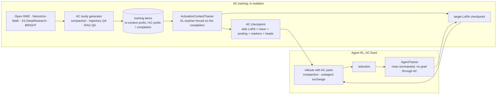
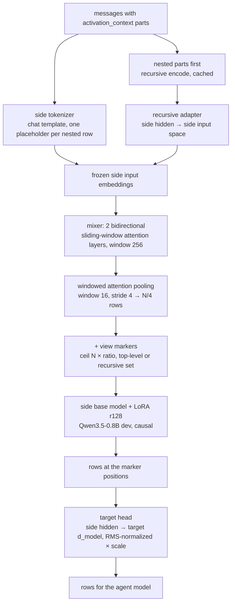

# Activation context, slice 3: the AC model, its training, and compaction

Version 2.2 (2026-09-09). Your eight answers are integrated below as accepted records, your three follow-up questions are answered, and the three datasets you named were inspected (schemas, formats, decontamination statements). Slice 3a (data, study, AC model, AC training, the three tests, and the validity runs of M9 that answer your check-in question) is now planned and waits for your green light; slice 3b (agent loop, compaction, fixed-AC agent training) stays an overview until 3a passes on a node. Nothing in the source tree has changed.

## Executive Summary

### Goal

An activation-context (AC) model that turns long context (a compacted trajectory, a subagent's trajectory, retrieved documents) into a few hundred embedding rows the agent model reads in place of tens of thousands of tokens, trained by self-distillation so the agent behaves as if the full context were present; the agent loop gains compaction and subagent exchange through that channel; agent RL continues with the AC model held fixed. Compression target 16–32×.

### The two loops

`activation/ac_model · training loops`



Train the AC model alone, roll out with it, train the target LoRA by RL with the AC fixed, then continue AC training from that checkpoint. The teacher is the target model with its **current** adapter (no branch, as you asked): the same adapter later rollouts use after `exchange_lora`. The AC model is never served by the engine, so it needs no exchange.

### The AC model, end to end

`activation/ac_model/ac_model.py · ActivationContextModel forward`



The side model reads about 0.3 N rows for an N-token input, so a 0.8B side model spends about 5% of the FLOPs the 4B target would spend reading the same N tokens. This diagram stands in for your "give me an html visualization" for now; a standalone `.tressoir.html` explainer with the tensor shapes at every stage follows with the M3 handoff. Deferred on evidence: removing causality is not a flag on Qwen3.5 (three of every four layers are gated-delta recurrences); the SSM mixer is a later ablation.

### Where things land

| piece | file | role |
| --- | --- | --- |
| dataset model: origin as string, `DataModality`, trajectory documents, `DatasetQAExample`, smaller stats | `dataset/dataset.py`, `dataset_utils.py` | one document type for text and trajectories |
| turn-aware chunking, bm25 only, dense/faiss archived | `dataset/dataset_index.py`, `dataset_manager.py` | index for text and trajectory chunks |
| reformatter + three loaders (+ AIME statements for decontamination) | `dataset/loaders/trajectory_utils.py`, `open_swe_traces.py`, `nemotron_math.py`, `s1_deep_research.py`, `aime.py` | trajectories in our dialect |
| study generator: cache, junk filter, trajectory QA, explicit inputs, no write-back | `dataset/dataset_study.py`, `dataset_caching.py` | questions for AC training |
| the AC model, cache, encode queue, registry, memory knob | `ac_model/ac_model.py`, `ac_model_utils.py`, `harness/module_manager.py`, `runtime_config.py` | rows from messages |
| AC study generators and the KL trainer with its report | `ac_model/ac_model_study.py`, `ac_model_training.py` | items and the self-distillation loop |
| three key tests; probes in IB | `tests/test_basic_agent_ac_training.py` | compaction, trajectory QA, RAG QA |
| validity runs: profile probe, bench driver, three node runs, reference points, task metrics | `bench/agent_probes/ac_training_bench.py` | the evidence before 3b |
| AC parts in segments, mixed-prompt submission, compaction, subagent exchange, fixed-AC agent training | `agent/*`, `harness/loaded_model.py`, `agent_training/*` | slice 3b |

### Sizing and risks

| fact | consequence |
| --- | --- |
| vLLM 0.28 mixed prompts carry a full-length `[prompt_len, d_model]` bf16 tensor per request; the worker embeds the token-id positions itself on the GPU and keeps the shipped rows only at placeholder positions | ~5 KB per prompt token on the 4B, IPC only; the GPU lookup is not bypassed; shipping rows for ordinary tokens would add bytes and save nothing (your question under decision 4). The probe opens 3b |
| block hashes add a row-bytes key only for requests that carry rows | AC agents share prefix blocks among themselves, never with token-only agents (a shared system prompt is cached twice) |
| vLLM pre-allocates `gpu_memory_utilization` at engine build | `ac_engine_memory_reservation = 0.1` lowers it to 0.8 when an AC model is registered before the engine is built |
| Qwen3.5-0.8B d_model 1024, 24 layers; 4B 2560, 32 layers; both cached; no 2B cached | side 0.8B + target 4B on nodes; 0.8B/0.8B on CPU (decision 7) |
| Open-SWE v1.2 minisweagent: 107k traces, 23–401 messages, `bash(command)` tool, JSON tool results; Nemotron-Math-v4: 545k rows, `cot` (25k-token solutions in `reasoning_content`) and `tir` (`stateful_python_code_exec`); S1-DeepResearch-15k: 15k proper system/user/assistant/tool traces with `search`/`visit` and the results in tool messages | three loaders on one reformatter (M1); lengths cover the 8k–32k compaction range |
| DeepResearch-9K rows repeat the user question where the tool results should be; the assistant refers to results that are not in the row | not usable for a channel that must carry observations; S1 is the general-search source |
| Nemotron-Math v4, v3 and the source Nemotron-Math-v2 cards say only "decontaminated to avoid overlap with public benchmarks", naming no benchmark | the math loader runs a local 13-word-window check against the AIME 2024/2025 statements and counts the drops; an earlier version is a loader parameter if the count is large |

### Boundaries

- The AC model is fixed during agent training; no joint gradient through rollouts.
- No dense retrieval, no multi-vector index; the retrieval trainer and byte-level AC are archived in IB, `faiss-cpu` leaves the dependencies.
- No bidirectional side model, no SSM mixer, no engine patch in this slice.
- `VLDB_NOTES.md` datasets (LAkeQA, OTT-QA, Hybrid-QA) are later task sources.
- Real model memory runs on Sky nodes; this container validates shapes, caches, chunking, reformatting and one toy training step on CPU.

## Requested Decisions

All eight are settled from your answers of 2026-09-08. The block below is the record; the next decision surface is the green light at the end of this section.

### Accepted decisions

| # | question | accepted | consequence |
| --- | --- | --- | --- |
| 1 | teacher and trainable set | **snapshot of the current policy**, and your note: "need not necessarily be branched (generally not branch, since some later rollout should probably use it)" | teacher = the target base with the **same** adapter under no-grad, computed just in time per micro-batch; no `branch_lora`, no second adapter. AC training updates side LoRA, mixer, pooling, markers, heads and the target LoRA; that adapter is what later rollouts use. Within-round co-drift is bounded by one pass at the LoRA rate; an in-memory frozen copy of the adapter becomes a flag only if the report shows the teacher moving. Drift term: flag, off. |
| 2 | pooler | **attention mixer** | two bidirectional sliding-window attention layers (window 256) → windowed pooling (16/4) → markers; side base causal |
| 3 | slice shape | **two halves** | 3a = M0–M5 + the three tests of M8 + the validity runs of M9; 3b = M6–M7 + the 3b probes |
| 4 | payload | **accept and measure** | probe at the start of 3b; your question answered in the sizing table and below |
| 5 | trajectory sources | **public agentic sets**: Open-SWE-Traces v1.2, Nemotron-SFT-Math-v4 (with the AIME check and a version fallback), and S1-DeepResearch-15k over DeepResearch-9K; "reformatted so the compression bias is in our favor" | M1: one reformatter into our dialect, three loaders, a local decontamination check |
| 6 | archive | **IB, drop faiss-cpu** | M0 |
| 7 | models | **side 0.8B, target 4B on nodes; 0.8B/0.8B on CPU** | M3, M8 |
| 8 | assumptions | **adjust one** (the completion row); the other twelve accepted | answered below |

### Your questions, answered

- **"These are on CPU and help bypass the embedding vLLM would have to do anyway, right? Or should we ship the full embeddings of even non-AC inputs?"** No on both counts. The rows travel as CPU tensors with the request, and the worker still runs its own GPU embedding lookup for every token-id position (the ids with placeholders zeroed), then keeps the shipped rows only where the mask says so. The lookup is a gather and costs nothing; what the rows add is the transfer of a full-length tensor and one SHA-256 per 16 rows. Shipping rows for ordinary tokens would add bytes and remove no work.
- **"In the presence of trajectory truncation, do we have to fake a next assistant turn?"** No. When the cut lands inside an assistant turn, the completion is the remainder of that turn as one assistant message; both prefixes end at the cut with the generation prompt open, and the AC prefix carries the compaction instruction before it. When the cut lands at a turn boundary, the completion is the next assistant turn. The completion is capped at 512 tokens, and the teacher-forced tokens are byte-identical in both branches.
- **"I hope 512 tokens don't require custom rollouts, just some encode-only pass?"** The trainer is encode-only, always. The teacher-sampled fallback is produced once, at item-generation time, by one batched engine call on the in-context prefix (greedy, 512 max tokens), and stored on the item as its completion. In this slice the fallback is not even needed: compaction items use the trajectory's continuation, the QA items use the study gold answer.

### Your check-in question (2026-09-09)

**"By the end of 3a, we'll have mini-sample KL losses from the tests?"** Yes, and only that from the tests: each of the three tests trains two rounds of four updates on about 96 items of its kind and prints held-out KL and agreement before and after, plus the real per-item timings. That is a smoke signal. The evidence for the idea is M9 below: one bench driver, three node runs of two epochs (compaction, trajectory QA, RAG QA independently; the mix is deferred until they show a signal), each with three forward-only reference points that make the KL numbers readable, and a secondary task metric per kind.

**"Are the smokes enough for low-level optimization signals?"** Not for the 2–5× kind. The tests reuse the agent trainer's step reporting (step time, slowest micro-batches), which catches a stall or an out-of-memory at the cap, but eight updates on 96 short items never reach the long buckets or the steady state where slice 2 found its gains. M9 therefore opens with an IB-only profile probe (about 30 minutes on a node) that buckets the cached compaction items by length and prints per phase: teacher forward, AC encode, student forward and backward, head chunks, peak memory, and whether the side model triggers kernel autotuning. The levers it ranks, in the order I expect them to matter: caching the teacher's top-k log-probs across epochs (the teacher forward is about half the FLOPs of an item and identical every epoch), the mixer's attention as blocked local attention rather than a materialized N×N mask (now an M3 requirement), head chunk size and checkpointing threshold as in slice 2, batching a depth-2 item's child encodes, and kernel configs for the 0.8B if it autotunes.

**Your formatting note** ("you might need dataset-specific reformattings … maybe there is a shared universal"): both. Each loader owns a small normalization step for its source's quirks (Open-SWE: structured calls, JSON tool results, tool definitions as JSON strings; Nemotron-Math: structured calls, reasoning in a separate field; S1: Hermes `<tool_call>` blocks in the text, `<think>` blocks, tool definitions inside the system prompt) and yields one shared intermediate; the common reformatter then maps tools, drops the source system prompt and renders reasoning as text. M1's overview says so now.

### Green light

<article class="decision" data-tressoir-decision data-decision-state="unresolved"
  aria-labelledby="slice3-go-question">
  <header class="decision-header">
    <div>
      <h3 class="decision-title" id="slice3-go-question">Start implementing slice 3a as planned in M0–M5, the 3a tests of M8, and the validity runs of M9?</h3>
      <p class="decision-context">Milestones move to Implementing on your tick; the M3 handoff includes the standalone HTML explainer of the AC model; the M9 profile probe and runs A, B, C are kicked off after the three tests pass on a node; D is deferred. Anything you want changed first goes in the Free Response.</p>
    </div>
    <span class="decision-state" data-decision-indicator role="status" aria-live="polite">Unresolved</span>
  </header>
  <fieldset class="decision-options">
    <legend class="visually-hidden">Decision answers</legend>
    <label class="decision-option">
      <input type="checkbox" data-tressoir-input="slice3.go.start">
      <span><strong>Go: implement 3a</strong><small>M0 → M1 → M2 → M3 → M4 → M5 → the three tests, CPU-validated here, then a node run.</small></span>
    </label>
    <label class="decision-option">
      <input type="checkbox" data-tressoir-input="slice3.go.revise">
      <span><strong>Revise first</strong><small>Describe the change below.</small></span>
    </label>
  </fieldset>
  <div class="field decision-feedback">
    <label for="slice3-go-response">Free Response</label>
    <textarea id="slice3-go-response" rows="2" data-tressoir-input="slice3.go.feedback"
      data-tressoir-autogrow="2:6" placeholder="Add anything the choices miss…"></textarea>
  </div>
</article>

## Milestones

Slice 3a is M0–M5, the three tests of M8 and the validity runs of M9, planned at the Moderate level (meaningful hunks, omissions marked). Slice 3b is M6–M7 plus the 3b probes, overview only.

<details class="card" data-tressoir-markdown open>
  <summary>
    <span class="card-title">M0 — Dataset model cleanup and the retrieval archive</span>
    <span class="card-oneliner">Origin as string, modality, trajectory documents, the rename, smaller stats; dense/faiss and the retrieval package archived; faiss-cpu dropped.</span>
    <span class="card-badge">Review</span>
  </summary>

#### Completion report (2026-09-09)

**What landed.** `dataset.py`: `origin` is a string (`NATIVE` / `EXTERNAL` / `SYNTHETIC` constants), `DatasetDocument.trajectory` + `trajectory_kwargs` + `modality`, `DatasetDocumentChunk.chunk_messages`, `LabeledRetrievalQAExample` → `DatasetQAExample` (`labeled_qa_examples`), `DatasetStats` reduced to load / chunk / bm25 / study counters (`num_decontaminated`, `study_num_junk_skipped`, `study_num_cached`, `study_num_labels_cached` added). `dataset_index.py` is bm25-only (dense paths, faiss and the embedding knobs gone; `HarnessRuntimeConfig.doc_embedding_*` removed). `dataset_utils.py` renders messages for the index (`render_message`: `role: text` plus `[call name(args)]` lines). `dataset_manager.py` keeps `register_dataset`, `build_bm25_indexes` and the two study wrappers. Five loaders follow the rename. `retrieval/`, `retrieval_training_bench.py`, `test_basic_retrieval_training.py` and the pre-slice-3 `dataset_index.py` / `module_manager.py` are archived under `IB/ARTIFACTS/RETRIEVAL_TRAINING/archive_slice3/` (README records the HEAD); `faiss-cpu` left `pyproject.toml` and `uv.lock` (`uv lock`: 215 packages resolved, faiss-cpu 1.15.0 removed).

**Drifts.** The bm25 loading test lost its dense variant as planned and gained `test_trajectory_chunking_bm25` and a live `test_trajectory_dataset_loading` (M1); `DatasetStats.summarize()` was rewritten rather than trimmed (the old one referenced the removed fields). `README.md` in the workspace was already modified before this slice and is not part of the handoff.

**Validation.** `uv run pytest activation/tests/test_basic_dataset_loading.py` (CPU, network): 4 passed (bm25 basics, trajectory chunking, five public datasets at 20 examples / 100 documents, the three trajectory loaders at 2 rows).

The complete per-file diffs are the cards of `SLICE3_ROUND.tressoir.md`; the staged tree is `slice3/`. The planned changes below are kept as the reference.


#### Planning Overview

The dataclasses change once; every consumer follows the rename (five loaders, the study generator, the search tool, two tests). The dense paths leave `dataset_index.py` with their harness knobs; `retrieval/`, the retrieval bench and test move to `IB/ARTIFACTS/RETRIEVAL_TRAINING/archive_slice3/` with a README that records the HEAD they came from. `faiss-cpu` leaves `pyproject.toml` and the lock. The loading test loses its dense variant. Stats keep load, chunk, bm25 and study counters only.

#### Planned Changes

`activation/dataset/dataset.py · document and example types`

```diff-python
-# @AI: Remove me. Make origin a raw string to allow more runtime variation.
-class DataOrigin(StrEnum):
-    """Who authored one registerd labeled example"""
-    NATIVE = auto()
-    EXTERNAL = auto()
-    SYNTHETIC = auto()
+NATIVE, EXTERNAL, SYNTHETIC = "native", "external", "synthetic"
+"""Conventional `origin` values; loaders may use others, e.g. "rollout:<caching_id>"."""


 class DataModality(StrEnum):
     TEXT = auto()
-    TRAJECTORY = auto() # Should have a different chunking strategy (e.g., prefer turn-boundaries, unless turn very long or something)
+    TRAJECTORY = auto()   # chunked at message boundaries (dataset_index)
⋯ unchanged lines omitted ⋯
 @dataclass
 class DatasetDocumentChunk:
     chunk_id: str
     doc_id: str
     dataset_id: str
     chunk_text: str
     chunk_start: int
+    chunk_messages: list[dict] | None = None   # trajectory chunks: the message slice chunk_text renders

 @dataclass
 class DatasetDocument:
⋯ unchanged lines omitted ⋯
-    origin: DataOrigin = DataOrigin.NATIVE
+    origin: str = NATIVE
⋯ unchanged lines omitted ⋯
-# @AI: Changed name.
 @dataclass
 class DatasetQAExample:
     example_id: str
     dataset_id: str
     query: str
     gold_answers: list[str] | None = None
-    origin: str | None = None
+    origin: str = NATIVE
⋯ unchanged lines omitted ⋯
 @dataclass
 class DatasetStats:
-    # @AI: Simplify these statistics.
-    # Computed at load time.
     initial_load_latency: float = 0.0
     total_document_chars: int = 0
     total_num_documents: int = 0
     avg_document_chars: int = 0
-    # Computed at index build time.
-    dense_index_size_mb: float = 0.0
+    num_chunks: int = 0
     bm25_build_latency: float = 0.0
-    dense_build_embedding_latencies: list[float] = field(default_factory=list)
-    ⋯ every dense_* field removed ⋯
     bm25_query_search_latencies: list[float] = field(default_factory=list)
     query_batch_sizes: list[int] = field(default_factory=list)
-    # Study statistics
     study_prompt_tokens: list[int] = field(default_factory=list)
     study_output_tokens: list[int] = field(default_factory=list)
     study_batch_latencies: list[float] = field(default_factory=list)
     study_num_parse_failures: int = 0
+    study_num_junk_skipped: int = 0
+    study_num_cached: int = 0
     ⋯ label counters unchanged ⋯
-    # Training data selection.
-    training_select_num_dropped_no_positive: int = 0
+    num_decontaminated: int = 0
⋯ summarize() loses the dense and selection keys, gains num_chunks, study_num_junk_skipped, study_num_cached, num_decontaminated ⋯
 @dataclass
 class LoadedDataset:
⋯ unchanged lines omitted ⋯
-    labeled_qa_examples: dict[str, LabeledRetrievalQAExample] = field(default_factory=dict)
+    labeled_qa_examples: dict[str, DatasetQAExample] = field(default_factory=dict)
```

`activation/dataset/dataset_utils.py · initialize_dataset_stats(), render_message()`

```diff-python
+def render_message(message: dict) -> str:
+    """One line per message for chunking, bm25 and prompts: role, text, and calls as name(arguments)."""
+    role, content = message.get("role", ""), message.get("content") or ""
+    if isinstance(content, list):
+        content = "".join(part.get("text", "") for part in content if isinstance(part, dict) and part.get("type") == "text")
+    calls = "".join(f"\n[call {c['name']}({json.dumps(c.get('arguments', {}), ensure_ascii=False)})]" for c in message.get("tool_calls") or [])
+    return f"{role}: {content}{calls}"
+
+
+def render_messages(messages: list[dict]) -> str:
+    return "\n\n".join(render_message(message) for message in messages)
+
+
+def document_chars(document: "DatasetDocument") -> int:
+    return len(document.text) if document.text is not None else len(render_messages(document.trajectory or []))
+
+
 def initialize_dataset_stats(loaded_dataset: LoadedDataset, load_time: float) -> DatasetStats:
-    total_chars = sum(len(document.text) for document in loaded_dataset.documents.values())
+    total_chars = sum(document_chars(document) for document in loaded_dataset.documents.values())
```

`activation/dataset/dataset_index.py · imports and the dense paths`

```diff-python
-import torch
-import faiss
 import numpy as np
⋯ unchanged lines omitted ⋯
-        self.embedding_model_name = harness.harness_config.doc_embedding_model_name
-        self.batch_size = harness.harness_config.doc_embedding_batch_size
-        self.embedding_input_limit = harness.harness_config.doc_embedding_input_limit_chars
⋯ unchanged lines omitted ⋯
-        self.dense_faiss_index: faiss.IndexFlatIP | None = None
         self.bm25_index: BM25Index|None = None
⋯ build_dense_index, dense_query_many_frozen, dense_query_docs_many_frozen removed; _build_excluded_sets, _collect_chunk_results, bm25_* unchanged ⋯
```

`activation/dataset/dataset_manager.py · removed methods`

```diff-python
-from .dataset import LoadedDataset, LabeledRetrievalQAExample, DataOrigin, DataSplit
+from .dataset import LoadedDataset
⋯ build_dense_indexes and select_training_data removed; the study wrappers change in M2 ⋯
```

`activation/harness/module_manager.py · the retrieval AC registry`

```diff-python
-    from ..retrieval.retrieval_ac import StandardRetrievalACModel
⋯ unchanged lines omitted ⋯
-        self.retrieval_acs: dict[str, "StandardRetrievalACModel"] = dict()
⋯ register_retrieval_ac and get_retrieval_ac removed; register_ac_model / get_ac_model arrive in M3 ⋯
```

`activation/harness/runtime_config.py · dense knobs`

```diff-python
     doc_chunk_enable_extension: bool = False
-    doc_embedding_model_name: str|None = None
-    doc_embedding_batch_size: int = 32
-    doc_embedding_input_limit_chars: int|None = None # Absolute limit on embedding inputs. Used for fast testing.
```

`activation/dataset/loaders/bright.py · the rename (same shape in msmarco, nq, scifact, sciq)`

```diff-python
-from ..dataset import DatasetDocument, DataOrigin, DataSplit, LabeledRetrievalQAExample, LoadedDataset
+from ..dataset import NATIVE, DatasetDocument, DataSplit, DatasetQAExample, LoadedDataset
⋯ unchanged lines omitted ⋯
-            example = LabeledRetrievalQAExample(
+            example = DatasetQAExample(
⋯ unchanged lines omitted ⋯
-                origin=DataOrigin.NATIVE,
+                origin=NATIVE,
⋯ unchanged lines omitted ⋯
-            labeled_retrieval_examples=examples,
+            labeled_qa_examples=examples,
```

`pyproject.toml · dependencies`

```diff-toml
-    "faiss-cpu",
```

Archive (moves, no edits): `activation/retrieval/` → `IB/ARTIFACTS/RETRIEVAL_TRAINING/archive_slice3/activation/retrieval/`; `activation/bench/agent_probes/retrieval_training_bench.py` and `activation/tests/test_basic_retrieval_training.py` alongside; `archive_slice3/README.md` records the source HEAD and the removed `dataset_index.py` dense hunks. `activation/tests/test_basic_dataset_loading.py` drops the dense variant and follows the rename; `test_basic_dataset_study.py` follows M2.

</details>

<details class="card" data-tressoir-markdown open>
  <summary>
    <span class="card-title">M1 — Trajectory documents: reformatter, three loaders, turn-aware chunking</span>
    <span class="card-oneliner">Open-SWE-Traces, Nemotron-Math, S1-DeepResearch in our dialect; chunks that keep their message slices.</span>
    <span class="card-badge">Review</span>
  </summary>

#### Completion report (2026-09-09)

**What landed.** `loaders/trajectory_utils.py`: the shared intermediate (`{role, content, reasoning, tool_calls:[{name, arguments}]}` + tool definitions) and `reformat_trajectory` into our dialect (source system prompt dropped, `bash(command)` → `shell(script)`, `stateful_python_code_exec(code)` → `python(code)`, reasoning kept as text ahead of the reply, structured `tool_calls` with `call_NNNN` ids, one `tool` message per result, JSON `{"returncode","output"}` flattened with an `[exit code N]` line, definitions for every mapped tool the trajectory calls); `parity_split` (one document in ten is TEST by hash); `ngram_windows` for decontamination. Three loaders on it: `OpenSweTracesDataset.load(harness, max_examples, config="v1.2", split="minisweagent", resolved_only=False, min_chars=0)`, `NemotronMathDataset.load(harness, max_examples, subset="tir", excluded_problems=None, min_chars=0, min_tool_calls=0, hf_dataset=..., data_files=None)` with the 13-word-window check (`stats.num_decontaminated`), `S1DeepResearchDataset.load(harness, max_examples, language="en", min_chars=0)`; `loaders/aime.py` (`load_aime_problems`, `aime_problem_statements`; `math-ai/aime24` stores the answer as `solution` = `\boxed{...}`, `aime25` as `answer`; 30 + 30 rows confirmed). Trajectory chunking in `dataset_index._trajectory_pieces`: whole messages packed to the chunk size, no overlap, an over-long message split by its own text into one-message slices (the calls ride on the last slice), chunk text = the rendering.

**Drifts.** (1) Nemotron's single `train` split is ordered cot-then-tir and the boundary (row 285,516) lies inside shard 7 of 12 (row counts read from the parquet footers), so each subset streams only its shards (`cot` 0–7, `tir` 7–11); a `min_tool_calls` filter was added because some `tir` rows never call the tool. (2) S1's system prompt mentions a literal empty `<tools></tools>` before the real block; the parser takes the first non-empty block (five tools: `search`, `visit`, `PythonInterpreter`, `google_scholar`, `parse_file`; they keep their names). (3) Open-SWE trajectories end with a call whose result never arrives (the submit call); the reformatter keeps it. (4) HF ids for AIME confirmed from the datasets-server, not on a node.

**Validation.** Fixture rows saved under `IB/TMP/SLICE3_FIXTURES/` (three Open-SWE, four Nemotron cot, two tir, three S1, two AIME each) and checked by `IB/TMP/SLICE3_CHECKS/check_fixtures.py`: every row reformats with dict arguments, mapped tool names, one tool message per call (minus the trailing submit), no system role; AIME self-hit true, Nemotron sample no hit. Live: `test_trajectory_dataset_loading` streams two rows of each source (Open-SWE 17 s, Nemotron tir 19 s, S1 19 s cold) and checks modality, origin, tools, calls, chunk round trip.

The complete per-file diffs are the cards of `SLICE3_ROUND.tressoir.md`; the staged tree is `slice3/`. The planned changes below are kept as the reference.


#### Planning Overview

Each loader normalizes its source's quirks into one shared intermediate (messages with role, content, reasoning, structured calls, tool results; plus the tool definitions), and one reformatter turns that intermediate into our shape ("compression bias in our favor"): the source system prompt is dropped and a short domain prompt rides in `trajectory_kwargs`; assistant turns keep their reasoning as plain text (a loader flag, `reasoning="keep"` by default, since the math `cot` rows are nothing but reasoning) and carry structured `tool_calls` parsed from either the structured field or Hermes `<tool_call>` blocks (the existing `parse_tool_calls`); tool results become one `tool` message per call, Open-SWE's JSON `{"returncode", "output"}` flattened to the output text plus an exit-code line when non-zero; `bash(command)` becomes our `shell(script)` and `stateful_python_code_exec(code)` our `python(code)`; `search`/`visit` keep their names and definitions in `trajectory_kwargs["tools"]`. Final answers stay in the text (`\boxed{}`, `<answer>`), and `trajectory_kwargs["answer"]` records the reference.

The math loader checks every problem against the AIME 2024/2025 statements with 13-word windows and counts drops in `stats.num_decontaminated`; `hf_dataset` is a parameter so an earlier version can be substituted if the count is large. The AIME statements come from a small `aime.py` loader (HF ids `math-ai/aime24` and `math-ai/aime25`, to be confirmed on the node; the slice-2 DeepScaleR loader is the alternative source).

The chunker packs whole messages up to `doc_chunk_size_chars`; a single over-long message splits by characters; each chunk keeps its `chunk_messages` so it can become an AC part; `chunk_start` is the offset in the full rendering.

#### Planned Changes

`activation/dataset/loaders/trajectory_utils.py · reformat_trajectory()`

```python
TOOL_MAP = {                                   # source tool -> (our tool, {source argument: our argument})
    "bash": ("shell", {"command": "script"}),
    "stateful_python_code_exec": ("python", {"code": "code"}),
}

def reformat_trajectory(messages: list[dict], tools: list[dict], *, reasoning: str = "keep",
                        tool_map: dict = TOOL_MAP) -> tuple[list[dict], dict]:
    """Messages in our dialect and the trajectory kwargs. Source system prompts are dropped."""
    out, kwargs = [], {"tools": [], "system_prompt": ""}
    for message in messages:
        role = message["role"]
        if role == "system":
            continue
        if role == "assistant":
            text, inline_calls = parse_tool_calls(message.get("content") or "")       # Hermes blocks, if any
            think, text = split_think(text)                                            # <think>…</think> -> plain text
            reasoning_text = message.get("reasoning_content") or think
            content = "\n\n".join(part for part in ([reasoning_text] if reasoning == "keep" and reasoning_text else []) + [text] if part)
            calls = [structured_call(c, tool_map) for c in message.get("tool_calls") or []] or [mapped(c, tool_map) for c in inline_calls]
            out.append({"role": "assistant", "content": content, "tool_calls": calls})
        elif role == "tool":
            out.append({"role": "tool", "content": flatten_tool_output(message.get("content") or "")})
        else:
            out.append({"role": "user", "content": message.get("content") or ""})
    kwargs["tools"] = [mapped_definition(t, tool_map) for t in tools]
    return out, kwargs
```

`activation/dataset/loaders/nemotron_math.py · NemotronMathDataset.load()`

```python
class NemotronMathDataset:
    @classmethod
    def load(cls, harness, max_examples: int | None, subset: str | None = "tir", excluded_problems: list[str] | None = None,
             min_chars: int = 0, hf_dataset: str = "nvidia/Nemotron-SFT-Math-v4") -> LoadedDataset:
        windows = ngram_windows(excluded_problems or [], n=13)
        rows = load_dataset(hf_dataset, split="train", streaming=True)
        documents, dropped = {}, 0
        for row in rows:
            if subset is not None and row["subset"] != subset:
                continue
            if windows and ngram_windows([row["problem"]], n=13) & windows:
                dropped += 1
                continue
            messages, kwargs = reformat_trajectory(row["messages"], row["tools"] or [])
            kwargs |= {"answer": row["expected_answer"], "source": row["source"], "system_prompt": MATH_SYSTEM_PROMPT}
            if len(render_messages(messages)) < min_chars:
                continue
            documents[row["uuid"]] = DatasetDocument(doc_id=row["uuid"], dataset_id=dataset_id, trajectory=messages,
                                                     trajectory_kwargs=kwargs, modality=DataModality.TRAJECTORY, origin=EXTERNAL,
                                                     split=DataSplit.TRAIN if len(documents) % 10 else DataSplit.VAL, source_datum={"uuid": row["uuid"]})
            if max_examples is not None and len(documents) >= max_examples:
                break
        loaded = LoadedDataset(dataset_id=dataset_id, documents=documents)
        loaded.stats = initialize_dataset_stats(loaded, time.time() - start)
        loaded.stats.num_decontaminated = dropped
        harness.dataset_manager.register_dataset(loaded)
        return loaded
```

`OpenSweTracesDataset.load(harness, max_examples, config="v1.2", split="minisweagent", resolved_only=False, min_chars=0)` and `S1DeepResearchDataset.load(harness, max_examples, language="en", min_chars=0)` follow the same shape (Open-SWE: `tools` are JSON strings, `resolved` filters; S1: the tool definitions are parsed out of the system prompt's `<tools>` block).

`activation/dataset/dataset_index.py · _chunk_documents()`

```diff-python
         for document in self.loaded_dataset.documents.values():
-            step_size = self.chunk_size_chars - self.chunk_overlap_chars
-            pieces = [
-                (document.text[start:start + self.chunk_size_chars], start)
-                for start in range(0, len(document.text), step_size)
-            ]
-            pieces = [x for x in pieces if x[0]] # filter our empty strings
-            if len(pieces) > 1 and pieces[-1][1] + len(pieces[-1][0]) <= pieces[-2][1] + len(pieces[-2][0]):
-                pieces.pop() # last piece is a subset of previous one.
-            for chunk_num, (chunk_text, chunk_start) in enumerate(pieces):
+            pieces = self._text_pieces(document.text) if document.modality == DataModality.TEXT else self._trajectory_pieces(document.trajectory)
+            for chunk_num, (chunk_text, chunk_start, chunk_messages) in enumerate(pieces):
                 chunk_id = f"{document.doc_id}:{chunk_num}"
-                chunks_list.append((chunk_id, chunk_text, chunk_start, document))
+                chunks_list.append((chunk_id, chunk_text, chunk_start, chunk_messages, document))
⋯ unchanged lines omitted ⋯
+    def _trajectory_pieces(self, messages: list[dict]) -> list[tuple[str, int, list[dict]]]:
+        """Whole messages packed to the chunk size; an over-long message is split by characters; offsets are in the full rendering."""
+        pieces, current, current_start, offset = [], [], 0, 0
+        for message in messages:
+            rendered = render_message(message)
+            if current and len(render_messages(current)) + len(rendered) + 2 > self.chunk_size_chars:
+                pieces.append((render_messages(current), current_start, current)); current, current_start = [], offset
+            if len(rendered) > self.chunk_size_chars:
+                for text, start, _ in self._text_pieces(rendered):
+                    pieces.append((text, offset + start, [message | {"content": text}]))
+                current, current_start = [], offset + len(rendered) + 2
+            else:
+                current.append(message)
+            offset += len(rendered) + 2
+        if current:
+            pieces.append((render_messages(current), current_start, current))
+        return pieces
```

</details>

<details class="card" data-tressoir-markdown open>
  <summary>
    <span class="card-title">M2 — Study generator refactor</span>
    <span class="card-oneliner">Cache, junk filter, trajectory QA, explicit inputs and outputs.</span>
    <span class="card-badge">Review</span>
  </summary>

#### Completion report (2026-09-09)

**What landed.** `dataset_caching.py`: `StudyCacheKey(caching_id, dataset_id, model_id, kind, seed, label_model_id)` → one JSONL per key under `STUDY/`, `StudyCache.read / append / read_by_id` (a torn last line is dropped). `dataset_study.py` rewritten: `has_valuable_question` schema (junk chunks skipped and cached as junk rows), a trajectory prompt variant, `generate_examples_qa(num_samples, base_seed=0, study_context=None, caching_id=None, modality=None)` with cached rows served first (checked by chunk id against the seeded sampler), engine seed `base_seed + batch index`, examples returned (origin SYNTHETIC, positive chunk = the source chunk) and nothing written into the dataset; `generate_examples_labels(examples, caching_id=None)` labels exactly the given examples, cached by example id. `dataset_manager.synthesize_study_examples_qa(dataset_id, num_samples, base_seed=None, study_context=None, caching_id=None, modality=None)` and `label_study_examples(dataset_id, examples, caching_id=None)`. `test_basic_dataset_study.py` follows the API (synthetic examples labeled first, then the native ones; count assertions allow junk).

**Drifts.** The label cache is keyed by the label model id with seed 0 (labels do not depend on the sampling seed). Parse failures are not cached (a later pass retries). The `study_context` argument of the old dataset object is gone (it was never set).

**Validation.** `IB/TMP/SLICE3_CHECKS/study_cache_smoke.py` (fake engine on a fabricated dataset): 6 questions cost 6 engine calls, the second identical request costs none, a request for 9 reuses the 6 and generates 3, the trajectory variant samples trajectory chunks only, labels are cached and served by example id (3 label calls, 3 cached on the rerun). The node test (`--gpu`) is not rerun here.

The complete per-file diffs are the cards of `SLICE3_ROUND.tressoir.md`; the staged tree is `slice3/`. The planned changes below are kept as the reference.


#### Planning Overview

`dataset_caching.py` is the staged `StudyCache` with the kind set `{qa, traj_qa, labels}`. `generate_examples_qa` samples chunks of the requested modality with `Random(base_seed)`, serves the cached prefix, generates the tail with engine seed `base_seed + batch_index`, skips junk (`has_valuable_question` false), and returns `DatasetQAExample`s without touching the dataset. `generate_examples_labels` labels exactly the examples it is given. The trajectory prompt asks for a question whose answer is a specific fact in the shown turns and rejects questions answerable from the task statement alone. The manager wrappers forward the new signatures; the study test selects synthetic examples by `origin` before labeling.

#### Planned Changes

`activation/dataset/dataset_study.py · schema and prompt`

```diff-python
 STUDY_JSON_SCHEMA = {
     "type": "object",
     "properties": {
-        "question": {"type": "string"},
-        "answer": {"type": "string"},
+        "has_valuable_question": {"type": "boolean"},
+        "question": {"type": ["string", "null"]},
+        "answer": {"type": ["string", "null"]},
     },
-    "required": ["question", "answer"],
+    "required": ["has_valuable_question", "question", "answer"],
     "additionalProperties": False,
 }
⋯ unchanged lines omitted ⋯
-def make_study_prompt(study_context: str | None) -> tuple[str, str, dict]:
+def make_study_prompt(study_context: str | None, modality: DataModality) -> tuple[str, str, dict]:
⋯ the text-snippet guidelines unchanged; the trajectory variant adds: ⋯
+- The snippet is part of an agent's conversation (its reasoning, tool calls and tool results).
+- Ask about a specific fact that appears in these turns (a value a tool returned, a decision taken, an error seen),
+  never something answerable from the task statement alone.
+- When the snippet holds nothing worth asking about (boilerplate, an empty listing), set has_valuable_question to false.
```

`activation/dataset/dataset_study.py · generate_examples_qa()`

```diff-python
-    # @AI: base_seed updated with batch to 
     def generate_examples_qa(
         self,
         num_samples: int,
-        base_seed: int = 0, # @AI: changes per batch; simple. assumes num chunks > batch size.
-        study_context: str|None = None, # Custom addition to the prompt here.
-        caching_id: str|None = None, 
-    ) -> list[LabeledRetrievalQAExample]:
+        base_seed: int = 0,
+        study_context: str | None = None,
+        caching_id: str | None = None,
+        modality: DataModality | None = None,          # None: every chunk; the trajectory prompt variant for TRAJECTORY
+    ) -> list[DatasetQAExample]:
+        """Returns the examples; nothing is written into the dataset. Cached rows (StudyCache) are served first."""
         loaded_model = self.harness.loaded_models[self.qa_model_name]
-        loaded_model.ensure_engine_loaded() # Keep the cold load out of the batch timings.
-        study_samples = self._sample_study_chunks(num_samples)
-        system_prompt, instructions, json_schema = make_study_prompt(self.study_context)
+        kind = "traj_qa" if modality == DataModality.TRAJECTORY else "qa"
+        key = StudyCacheKey(caching_id, self.dataset_id, loaded_model.model_config.model_id, kind, base_seed) if caching_id else None
+        cached = self.cache.read(key) if key else []
+        study_samples = self._sample_study_chunks(num_samples, base_seed, modality)
+        examples = [self._example_from_row(row) for row in cached[:num_samples]]
+        study_samples = study_samples[len(examples):]
+        stats.study_num_cached += len(examples)
+        if study_samples:
+            loaded_model.ensure_engine_loaded()
+        system_prompt, instructions, json_schema = make_study_prompt(study_context, modality or DataModality.TEXT)
⋯ per batch: chat_kwargs with seed = base_seed + batch_index; parse; ⋯
+                if not qa_pair.get("has_valuable_question") or not qa_pair.get("question"):
+                    stats.study_num_junk_skipped += 1
+                    continue
⋯ unchanged lines omitted ⋯
-                self.loaded_dataset.labeled_retrieval_examples[example.example_id] = example
                 examples.append(example)
+                new_rows.append(self._row_from_example(example, chunk))
+            if key:
+                self.cache.append(key, new_rows)
```

`activation/dataset/dataset_study.py · generate_examples_labels()`

```diff-python
-    # @AI: Changed.
     def generate_examples_labels(
         self,
-        examples: LabelQAExample,
-        synthetic_only: bool
-    ) -> list[LabeledRetrievalQAExample]:
+        examples: list[DatasetQAExample],
+        caching_id: str | None = None,
+    ) -> list[DatasetQAExample]:
         """
-        Oracle-label up to num_samples examples that were not labeled yet.
-        When synthetic_only is true, only synthetically generated questions are considered.
-        Returns the examples that ended up labeled in this pass.
+        Oracle-label exactly these examples (the caller selects them, e.g. by origin) and return the labeled ones.
+        Labels are cached by example id under caching_id.
         """
-        examples = self._select_examples_to_label(num_samples, synthetic_only)
+        examples = [example for example in examples if not example.oracle_labeled and example.gold_answers and example.gold_answers[0]]
```

`activation/dataset/dataset_manager.py · wrappers`

```diff-python
-    def synthesize_study_examples_qa(self, dataset_id: str, num_samples: int):
-        """Synthesize study examples"""
-        study_generator = self._get_or_create_study_generator(dataset_id)
-        return study_generator.generate_examples_qa(num_samples)
+    def synthesize_study_examples_qa(self, dataset_id: str, num_samples: int, base_seed: int | None = None,
+                                     study_context: str | None = None, caching_id: str | None = None, modality=None):
+        generator = self._get_or_create_study_generator(dataset_id)
+        seed = self.harness.harness_config.dataset_study_seed if base_seed is None else base_seed
+        return generator.generate_examples_qa(num_samples, seed, study_context, caching_id, modality)

-    def label_study_examples(self, dataset_id: str, num_samples: int, synthetic_only: bool = False):
-        study_generator = self._get_or_create_study_generator(dataset_id)
-        return study_generator.generate_examples_labels(num_samples, synthetic_only)
+    def label_study_examples(self, dataset_id: str, examples, caching_id: str | None = None):
+        return self._get_or_create_study_generator(dataset_id).generate_examples_labels(examples, caching_id)
```

</details>

<details class="card" data-tressoir-markdown open>
  <summary>
    <span class="card-title">M3 — The AC model</span>
    <span class="card-oneliner">Config, message parsing, recursion, mixer, pooling, markers, side LoRA, heads, cache, encode queue, checkpoints, registry, memory knob.</span>
    <span class="card-badge">Review</span>
  </summary>

#### Completion report (2026-09-09)

**What landed.** `ac_model/ac_model_utils.py`: `tokenize_with_parts` (sentinel per part in the chat template, split, tokenize the pieces, pad-id runs, spans; a part without a user message gets an empty one because Qwen's template refuses a conversation without a user query), `BlockedLocalAttentionLayer` (blocks of `mixer_window` rows attending to themselves and both neighbours through SDPA on the reshaped tensor; padded queries attend everything in their window so no row is fully masked), `WindowedPooling` (the retrieval byte pooling on rows, window/stride from the config), `RowHead` (FFN ×4, RMS-normalized × learned scale), `RowCache` (CPU bf16, LRU by bytes), `EncodeQueue` (one worker, 5 ms drain, length-sorted batches, futures). `ac_model/ac_model.py`: `ActivationContextModelConfig` (the planned fields plus `mixer_heads=8`, `side_lora_rank=128`, `encode_batch_max_tokens=65_536`, `side_gradient_checkpointing=True`), `ActivationContextModules` (fp32: mixer, pooling, marker kind/index, recursive adapter, target head, a `scales_initialized` buffer), `ActivationContextModel` with `encode / encode_batch / encode_async / part_view_rows / num_view_rows / set_mode / prepare / release / save / load / trainable_parameters` and `ActivationContextModelStats`. `ModuleManager.register_ac_model / get_ac_model / ac_models`; `LoadedModel.engine_to_device` subtracts `ac_engine_memory_reservation` (0.1) from `gpu_memory_utilization` when an AC model is registered before the engine builds; `HarnessRuntimeConfig.ac_row_cache_bytes` (4 GB).

**Drifts.** (1) The side model's own input embedding table is used directly (the side base is resident whenever the AC model runs), so no `embedding_layer_to_device` copy for the side; the target's copy is used only to initialize the head scale when the target is not loaded. (2) The head scales initialize lazily (first `prepare`) from the destination embedding RMS and are saved in the checkpoint. (3) `part_view_rows` was added so the trainer can size placeholder runs before encoding (V depends on the side tokenization, not the target's). (4) Routing a part to a different AC model is asserted against, not implemented. (5) `load` re-injects the side adapter from the checkpoint folder through `free_lora` + `checkpoint_path`.

**Validation.** `IB/TMP/SLICE3_CHECKS/ac_smoke.py` on CPU (Qwen3.5-0.8B as side and target): a 1,095-token part → [64, 1024] rows in 5.8 s; cache hit on the second call; a nested part costs three network passes (child, parent, and the earlier top-level); batched vs single rows differ by ≤ 0.009 at RMS 0.019 (bf16 decoder noise; the mixer runs fp32 on CPU); four queued requests form one batch; in training mode gradients reach all 46 module tensors and 96 of 192 side-LoRA tensors (the B matrices; A's gradient is zero at B = 0); save → `AC_MODELS/ac_dev/round_000/{ac_modules.pt (219 MB), side_lora/}` + `latest`, load restores a mutated scale, version 1. CPU runs need `sys.modules["fla"] = None` before importing transformers (see the round document).

The complete per-file diffs are the cards of `SLICE3_ROUND.tressoir.md`; the staged tree is `slice3/`. The planned changes below are kept as the reference.


#### Planning Overview

`ac_model.py` owns the model; `ac_model_utils.py` the row cache, the encode queue, placeholder tokenization and the banded attention layer (blocked local attention: blocks of `mixer_window` rows attending to themselves and their neighbours through SDPA on the reshaped tensor, never a materialized N×N mask). Children are encoded first (cached), pass through the recursive adapter, and are written over placeholder tokens in the side tokenizer's rendering of the part; then mixer → pooling → markers → side decoder with the side LoRA → rows at the marker positions → target head. Rollout mode is no-grad, cached and queued; training mode is grad, uncached, caller-batched. Checkpoints hold the AC modules and the side LoRA folder; `version` counts saves and is part of the cache key. `register_ac_model` registers the side LoRA (rank 128) when absent and lowers the engine's memory share by `ac_engine_memory_reservation`. All new code except the two small registry/config hunks.

#### Planned Changes

`activation/ac_model/ac_model.py · config and model`

```python
@dataclass
class ActivationContextModelConfig:
    ac_model_name: str
    base_side_model_name: str
    base_side_model_lora_name: str
    target_model_name: str
    target_model_lora_name: str
    default_compression_ratio: float = 1.0 / 16.0
    input_pooling_stride: int = 4
    input_pooling_window: int = 16
    mixer_layers: int = 2                    # decision 2: bidirectional sliding-window attention before the pooling
    mixer_window: int = 256
    min_view_rows: int = 4
    max_view_rows: int = 4096
    checkpoint_path: str | None = None       # AC_MODELS/<name>/round_NNN under the synced folder; None: fresh


class ActivationContextModel(nn.Module):
    """
    Messages with {"type": "activation_context", "ac_name", "compression_target", "messages"} parts in, rows in the target
    model's input space out. A plain string is one user message. Children are encoded first and recursively.
    """
    def __init__(self, harness, config: ActivationContextModelConfig):
        side, target = harness.loaded_models[config.base_side_model_name], harness.loaded_models[config.target_model_name]
        d_s, d_t = side.model_config.model_description.d_model, target.model_config.model_description.d_model
        heads = max(1, d_s // 64)
        self.mixer = nn.ModuleList([BandedAttentionLayer(d_s, heads, config.mixer_window) for _ in range(config.mixer_layers)])
        self.pooling = WindowedPooling(d_s, heads, config.input_pooling_window, config.input_pooling_stride)
        self.marker_kind = nn.Embedding(2, d_s)                     # 0 top-level, 1 recursive
        self.marker_index = nn.Embedding(config.max_view_rows, d_s)
        self.recursive_adapter = RowHead(d_s, d_s)                  # FFN x4, RMS-normalized x learned scale (side input space)
        self.target_head = RowHead(d_s, d_t)                        # FFN x4, RMS-normalized x learned scale (target input space)
        self.cache = RowCache(max_bytes=4 << 30)
        self.queue = EncodeQueue(self._encode_parts_no_grad)
        self.version = 0

    # ---------------------------------------------------------------- public
    def encode(self, messages: list[dict] | str, compression_ratio: float | None = None) -> torch.Tensor:
        """Rollout mode: [V, d_target] for one top-level part, from the cache or through the queue."""
        part = as_part(messages, compression_ratio or self.config.default_compression_ratio)
        return self.queue.submit(part, is_recursive=False).result()

    def encode_batch(self, parts: list[dict], is_recursive: bool, for_training: bool) -> list[torch.Tensor]:
        """Training mode (grad, no cache) when for_training, else the no-grad cached path in one batch."""
        return self._encode_parts(parts, is_recursive, cache=not for_training, grad=for_training)

    def num_view_rows(self, part: dict) -> int:
        tokens = len(tokenize_with_parts(self.side_tokenizer, part["messages"], self.num_view_rows)[0])
        return max(self.config.min_view_rows, min(self.config.max_view_rows, math.ceil(tokens * part["compression_target"])))

    # ---------------------------------------------------------------- forward
    def _encode_parts(self, parts, is_recursive, cache, grad):
        rows_out = [self.cache.get(key(p, is_recursive, self.version)) if cache else None for p in parts]
        pending = [i for i, r in enumerate(rows_out) if r is None]
        if pending:
            child_rows = [self._encode_parts(children(parts[i]), True, cache, grad) for i in pending]     # recursion, children first
            ids, spans, masks = collate_parts([parts[i] for i in pending], child_rows, self.side_tokenizer)  # right-padded, pad ids at child spans
            x = self.side_embedding(ids)                                                                    # frozen copy on the GPU
            x = write_rows(x, spans, [self.recursive_adapter(r) for r in child_rows])
            for layer in self.mixer:
                x = layer(x, masks)
            x, masks = self.pooling(x, masks)                                                              # [B, N/4, d_s]
            x, masks, marker_slices = append_markers(x, masks, [self.num_view_rows(parts[i]) for i in pending],
                                                     self.marker_kind.weight[int(is_recursive)], self.marker_index.weight)
            hidden = self.side.decoder_forward(x, masks, position_ids(masks), lora_name=self.config.base_side_model_lora_name)
            views = [hidden[b, s] for b, s in enumerate(marker_slices)]                                      # [V_b, d_s]
            head = self.recursive_adapter if is_recursive else self.target_head
            for i, v in zip(pending, views):
                rows_out[i] = head(v) if grad else head(v).detach().to("cpu", torch.bfloat16)
                if cache:
                    self.cache.put(key(parts[i], is_recursive, self.version), rows_out[i])
        return rows_out
```

`activation/ac_model/ac_model_utils.py · pieces`

```python
def tokenize_with_parts(tokenizer, messages, num_rows_of) -> tuple[list[int], list[tuple[int, int, dict]]]:
    """Template the messages with one sentinel string per activation_context part, tokenize the text between sentinels,
    put num_rows_of(part) pad ids where each sentinel was; returns ids and (start, length, part) spans."""

class BandedAttentionLayer(nn.Module):     # pre-norm MHA, blocked local attention (block = window; keys = own + neighbour blocks), then FFN x4
class WindowedPooling(nn.Module):          # WindowedBytePooling from the archived retrieval AC, on rows: window w, stride s
class RowHead(nn.Module):                  # Linear(d, 4d) GELU Linear(4d, d_out), RMS-normalize, x learned scale
class RowCache:                            # sha256(canonical part JSON, ratio, is_recursive, version) -> CPU bf16 rows; LRU by bytes
class EncodeQueue:                         # threads submit (part, is_recursive) -> Future; one worker drains every 5 ms into
                                           # length-sorted no-grad batches under a token budget
```

`activation/harness/module_manager.py · registry`

```diff-python
+    def register_ac_model(self, config: "ActivationContextModelConfig") -> "ActivationContextModel":
+        """Builds the model, registers its side LoRA (rank 128) when absent, and reserves engine memory (runtime config)."""
+        assert config.ac_model_name not in self.ac_models, f"AC model {config.ac_model_name!r} is already registered."
+        if config.base_side_model_lora_name not in self.lora_configs:
+            self.register_lora(config.base_side_model_lora_name, config.base_side_model_name, rank=128)
+        model = ActivationContextModel(self.harness, config)
+        if config.checkpoint_path is not None:
+            model.load(config.checkpoint_path)
+        self.ac_models[config.ac_model_name] = model
+        return model
+
+    def get_ac_model(self, ac_model_name: str) -> "ActivationContextModel":
+        assert ac_model_name in self.ac_models, f"Unknown AC model {ac_model_name!r}."
+        return self.ac_models[ac_model_name]
```

`activation/harness/runtime_config.py · memory reservation` and `loaded_model.py · engine_to_device()`

```diff-python
+    # Activation context
+    ac_engine_memory_reservation: float = 0.1   # taken off gpu_memory_utilization when an AC model is registered before the engine builds
⋯ engine_to_device, after the recommended kwargs merge: ⋯
+            if self.harness.module_manager.ac_models:
+                engine_kwargs["gpu_memory_utilization"] = engine_kwargs.get("gpu_memory_utilization", 0.9) - self.harness.harness_config.ac_engine_memory_reservation
```

Checkpoints: `save(checkpoint_path=None)` writes `AC_MODELS/<name>/round_NNN/ac_modules.pt` and calls `save_lora` for the side LoRA into the same folder, refreshes `latest`, bumps `version`; `load(path)` restores both.

</details>

<details class="card" data-tressoir-markdown open>
  <summary>
    <span class="card-title">M4 — AC study generators</span>
    <span class="card-oneliner">Compaction, trajectory QA and RAG QA items from the datasets, in the note's shapes, completions filled at generation time.</span>
    <span class="card-badge">Review</span>
  </summary>

#### Completion report (2026-09-09)

**What landed.** `ac_model/ac_model_study.py`: `ActivationContextStudyGenerator(harness, ac_model_name)` with `generate_compaction_samples(dataset_id, num_samples, seed=0, depth_range=(1, 2), threshold_range_tokens=(8192, 32768), ratios_range=(1/8, 1/16), completion_max_tokens=512, max_total_tokens=72_000, min_trajectory_tokens=1024)`, `generate_trajectory_qa_samples(dataset_id, num_samples, depth_range, trajectory_tokens_range, distractors_range, ratios_range, seed, caching_id)`, `generate_rag_qa_samples(dataset_id, num_samples, depth_range, distractors_token_range, ratios_range, seed, caching_id)`; `ac_part(messages, ac_name, ratio)`; the compaction instructions constant; items carry `info` (depth, thresholds, ratio, gold position, `gold_chunk_text`).

**Drifts.** No teacher-sampled fallback: every item's completion is real text (the plan's fallback was for cuts without a continuation; the generator moves or drops such cuts instead). Items carry `completion_text` / `completion_complete` / `teacher_partial_text` / `tools` / `info` instead of a `completion` message list. Round 2: the total bound of a compaction item moved from 48k to 72k tokens so a depth-2 item at the default 32k threshold is no longer cut short; the threshold range itself is unchanged (the bench generates at 8k–24k per level).

**Validation.** `IB/TMP/SLICE3_CHECKS/ac_train_smoke.py` on fabricated trajectories and passages (3 compaction items at depths 1–2, 2 traj_qa, 2 rag_qa, every item with parts, spans and a completion). Node: 2,200 compaction items generated from Open-SWE v1.2 and Nemotron tir (≥ 40k chars) in about 4 minutes, cached at `AC_ITEMS/compaction_0.jsonl` (300 MB); the test generators produced 48 items per kind with real 27B study questions for the QA kinds.

The complete per-file diffs are the cards of `SLICE3_ROUND.tressoir.md`; the staged tree is `slice3/`. The planned changes below are kept as the reference.


#### Planning Overview

Items always carry a completion: the trajectory's own continuation for compaction items (the remainder of a cut turn, or the next assistant turn), the study gold answer for the QA items. The teacher-sampled fallback (one batched engine call, greedy, 512 tokens) exists for items without a natural continuation and is not exercised by the tests. Token budgets are measured with the target tokenizer on the rendered messages; the task text is the first thing inside every AC part. Distractors come from bm25 with the source document excluded.

| generator | in-context prefix | AC prefix | completion |
| --- | --- | --- | --- |
| `generate_compaction_samples(dataset_id, num_samples, seed=0, depth_range=(1, 2), threshold_range_tokens=(8192, 32768), ratios_range=(1/8, 1/16), completion_max_tokens=512)` | system, user, the trajectory up to the last cut | system, user, one user message holding the nested chain `AC_d{ AC_{d-1}{…}, segment d }` then `COMPACTION_INSTRUCTIONS` | the rest of the cut turn, or the next assistant turn |
| `generate_trajectory_qa_samples(dataset_id, num_samples, depth_range=(1, 2), trajectory_tokens_range=(8192, 32768), distractors_range=(0, 2), ratios_range=(1/16, 1/32), seed=0)` | the window around the source chunk, the question | AC(distractor 1) … AC(window), the question | the gold answer |
| `generate_rag_qa_samples(dataset_id, num_samples, depth_range=(1, 2), distractors_token_range=(8192, 32768), ratios_range=(1/16, 1/32), seed=0)` | the gold chunk(s), the question | one AC(gold + shuffled bm25 distractors to the budget), the question | the gold answer |

#### Planned Changes

`activation/ac_model/ac_model_training.py · ActivationContextTrainingItem`

```python
@dataclass
class ActivationContextTrainingItem:
    item_id: str
    kind: str                          # "compaction" | "traj_qa" | "rag_qa"
    in_context_prefix: list[dict]      # what the teacher reads
    ac_prefix: list[dict]              # the same, with activation_context parts in place of the compressed spans
    completion: list[dict]             # one assistant message, teacher-forced in both branches
    weight: float = 1.0
    dataset_id: str = ""
    doc_ids: list[str] = field(default_factory=list)
```

`activation/ac_model/ac_model_study.py · generate_compaction_samples()`

```python
COMPACTION_INSTRUCTIONS = ("The earlier part of this conversation was compacted into the activation context above. "
                           "Continue solving from exactly where it left off.")

def generate_compaction_samples(self, dataset_id, num_samples, seed=0, depth_range=(1, 2), threshold_range_tokens=(8192, 32768),
                                ratios_range=(1.0 / 8.0, 1.0 / 16.0), completion_max_tokens=512) -> list[ActivationContextTrainingItem]:
    rng, items = random.Random(seed), []
    documents = [d for d in self.dataset(dataset_id).documents.values() if d.modality == DataModality.TRAJECTORY]
    for index in range(num_samples):
        document = rng.choice(documents)
        depth = rng.randint(*depth_range)
        offsets = message_token_offsets(self.target_tokenizer, document)               # cumulative tokens per rendered message
        cuts = cumulative_cuts(offsets, [rng.randint(*threshold_range_tokens) for _ in range(depth)])   # (message index, char offset) per level
        if cuts is None:                                                                # the trajectory is shorter than the thresholds
            continue
        segments = split_at(document.trajectory, cuts)                                  # depth message lists, the last cut may be mid-turn
        completion = continuation_after(document.trajectory, cuts[-1], self.target_tokenizer, completion_max_tokens)
        if completion is None:
            continue
        chain = None
        for segment in segments:
            ratio = rng.uniform(*ratios_range)
            chain = ac_part(([chain] if chain else []) + task_first(document, segment), ratio)
        system, user = system_and_user(document)
        items.append(ActivationContextTrainingItem(
            item_id=f"{dataset_id}:compaction:{seed}:{index}", kind="compaction",
            in_context_prefix=[system, user] + sum(segments, []),
            ac_prefix=[system, user, {"role": "user", "content": [chain, {"type": "text", "text": COMPACTION_INSTRUCTIONS}]}],
            completion=[completion], dataset_id=dataset_id, doc_ids=[document.doc_id]))
    return items
```

The two QA generators share `question_items(examples, ...)`: for every study example the source chunk's document, the window or gold chunks, the bm25 distractors (`bm25_query_docs_many_frozen([query], excluded_doc_ids=[[doc_id]])`), and `completion = [{"role": "assistant", "content": gold_answers[0]}]`.

</details>

<details class="card" data-tressoir-markdown open>
  <summary>
    <span class="card-title">M5 — The AC trainer and its report</span>
    <span class="card-oneliner">Teacher-forced KL between the in-context policy and the AC policy; the same adapter on both sides; rounds, checkpoints, eval.</span>
    <span class="card-badge">Review</span>
  </summary>

#### Completion report (2026-09-09)

**What landed.** `ac_model/ac_model_training.py`: `ActivationContextTrainingItem`, `ActivationContextTrainingConfig` (the planned fields plus `examples_per_update`, `fp32_head_matmul`, `teacher_cache_top_k`), `ActivationContextTrainingStats` (per-step KL / agreement / drift / grad norm / seconds / tokens, per-kind lists, per-example records with `seconds_by_bucket()`, teacher-cache counters), `ActivationContextTrainer.build_example / train / eval`. Teacher ids = template(in-context prefix, generation prompt) + partial text + completion (+ eot when complete); student ids = `tokenize_with_parts(target tokenizer, ac_prefix, [V per part])` + the same completion; the rows come from `encode_batch` in training mode; loss = mean full-vocabulary KL(teacher ‖ student) over the completion positions, the head one chunk at a time under `torch.utils.checkpoint`; AdamW in two groups (5e-4 for the AC modules and the side LoRA, 2e-5 for the target adapter); `examples_per_update` or `updates_per_round`; the drift term when `drift_term_weight > 0`; checkpoints (`AC_MODELS/<name>/round_<n>` + the target LoRA) per round; models back to host RAM after the round. Round 2 additions: (1) `configure_fla_cache(device)` at placement, as the agent trainer does, so fla's Triton kernels load the checked-in configs instead of re-tuning per length bucket; (2) `max_example_tokens` 52k → 72k; (3) `teacher_cache_top_k` (default 0 = exact teacher every pass): after an item's first pass its teacher top-k log-probs and the log of the remainder mass are kept per completion position on the CPU (`_teacher_top_k`), and later passes skip the teacher forward and minimize the KL of the k+1-way coarsened distributions (`_chunked_kl(..., cached=...)`: a lower bound of the exact KL, the same loss in every epoch; `eval` is always exact); (4) per-example records (kind, teacher / student tokens, seconds, cached) for the throughput read-out. Review pass (during run A): (5) the optimizer persists across rounds (one AdamW per AC model, `persistent_optimizer`; moments parked on the host between rounds) instead of a fresh AdamW per `train()` call, which reset Adam's moments and bias correction at every chunk boundary; (6) `warmup_updates` (linear, on a cross-round update clock); (7) a mid-round `_evaluate` no longer re-enables dropout modules when it restores training mode, and it counts the items it drops for length.

**Drifts.** The reporting items are evaluated with `eval` after the round (not inside the step loop). Placeholder runs are sized by `part_view_rows` and asserted against the encoded rows. The cached teacher is stale by design (the adapter as of the item's last exact pass); with the target adapter at 2e-5 that is the approximation the user accepted, measured below.

**Validation.** CPU (`IB/TMP/SLICE3_CHECKS/ac_train_smoke.py`, `ac_perf_smoke.py`): 7 fabricated items, two rounds, held KL 3.20 → 2.19; on a toy head the coarsened KL is ≤ the exact one for k = 1, 5 and equal at k = vocabulary; two rounds with `teacher_cache_top_k=32` on 4 items: 0 then 4 cache hits, finite losses, exact `eval` afterwards. Node: the three tests (M8) and the profile (M9) below; the cached-teacher gap is 0.1–1.0% of the KL at k = 64 on real items.

The complete per-file diffs are the cards of `SLICE3_ROUND.tressoir.md`; the staged tree is `slice3/`. The planned changes below are kept as the reference.


#### Planning Overview

The engine sleeps; the target base with its adapter, the side base with the side LoRA and the AC modules share the GPU. Per item the teacher forward runs under no-grad on the in-context prefix plus the completion tokens (same adapter, decision 1); the student forward runs on the AC prefix with rows written over the placeholders plus the same completion tokens, with gradients through the AC modules, the side LoRA and the target LoRA. The loss is the mean KL(teacher ‖ student) over the completion positions, computed over the full vocabulary in fp32 chunks (the agent trainer's chunked head, checkpointed). Two AdamW groups, grad clip 1.0, one example per micro-batch, `updates_per_round` steps over one pass. Checkpoints: the AC model (`save`) and the target adapter (`save_lora`). The report shows KL and top-1 agreement per step and per kind, throughput, memory, and a few teacher-vs-student completions.

#### Planned Changes

`activation/ac_model/ac_model_training.py · config and trainer`

```python
@dataclass
class ActivationContextTrainingConfig:
    learning_rate_ac: float = 5e-4               # mixer, pooling, markers, heads, side LoRA
    learning_rate_target_lora: float = 2e-5      # the adapter the agent trainer also updates
    weight_decay: float = 0.0
    adam_betas: tuple[float, float] = (0.9, 0.95)
    adam_eps: float = 1e-8
    max_grad_norm: float = 1.0
    updates_per_round: int = 4
    max_example_tokens: int = 52_000             # the teacher's in-context sequence is the long one
    drift_term_weight: float = 0.0               # > 0 adds KL(teacher || student in-context) on the same completion
    logits_chunk_tokens: int = 2_048
    gradient_checkpointing: bool = True
    gradient_checkpointing_min_tokens: int | None = None
    seed: int = 0
    checkpoint_every_round: bool = True


class ActivationContextTrainer:
    def train(self, ac_model_name, training_data, reporting_data=(), reporter=None) -> ActivationContextTrainingStats:
        ac = module_manager.get_ac_model(ac_model_name); config = ac.config
        target, side = loaded_models[config.target_model_name], loaded_models[config.base_side_model_name]
        target.engine_to_device(SOURCE_DEVICE)                                   # sleep; the trainer holds the GPU
        module_manager.ensure_lora(config.target_model_lora_name); module_manager.ensure_lora(config.base_side_model_lora_name)
        ac.to(device).train(); disable_dropout(target.model); disable_dropout(side.model)
        optimizer = torch.optim.AdamW([
            {"params": list(ac.parameters()) + module_manager.lora_parameters(config.base_side_model_lora_name), "lr": self.config.learning_rate_ac},
            {"params": module_manager.lora_parameters(config.target_model_lora_name), "lr": self.config.learning_rate_target_lora},
        ], betas=self.config.adam_betas, eps=self.config.adam_eps, weight_decay=self.config.weight_decay)
        for step, mini in enumerate(mini_batches(examples, self.config.updates_per_round, rng)):
            optimizer.zero_grad(set_to_none=True)
            for example in mini:                                                  # one example per micro-batch
                loss, batch_stats = self._objective(ac, target, example)
                (loss / len(mini)).backward()
            grad_norm = clip_grad_norm_(parameters, self.config.max_grad_norm); optimizer.step()
            ... stats, print, reporter.report_step(...)
        if self.config.checkpoint_every_round:
            stats.ac_checkpoint_path = ac.save(); stats.lora_checkpoint_path = module_manager.save_lora(config.target_model_name, config.target_model_lora_name)
        ac.to("cpu"); target.model_to_device(SOURCE_DEVICE); side.model_to_device(SOURCE_DEVICE)
        return stats

    def _objective(self, ac, target, example):
        """KL(teacher || student) averaged over the completion positions; both branches read the same completion tokens."""
        with torch.no_grad():
            teacher_hidden = target.decoder_forward(target.embedding_layer(example.teacher_ids), None, None, lora_name=example.target_lora)
            teacher_logprobs = chunked_log_softmax(teacher_hidden[example.teacher_positions - 1], target.head, self.config.logits_chunk_tokens)
        rows = ac.encode_batch([span.part for span in example.spans], is_recursive=False, for_training=True)
        inputs_embeds = write_rows(target.embedding_layer(example.student_ids), example.spans, rows)
        student_hidden = target.decoder_forward(inputs_embeds, None, None, lora_name=example.target_lora)
        student_logprobs = chunked_log_softmax(student_hidden[example.student_positions - 1], target.head, self.config.logits_chunk_tokens)
        kl = (teacher_logprobs.exp() * (teacher_logprobs - student_logprobs)).sum(-1)      # [T]
        agreement = (teacher_logprobs.argmax(-1) == student_logprobs.argmax(-1)).float().mean()
        loss = kl.mean()
        if self.config.drift_term_weight > 0:
            loss = loss + self.config.drift_term_weight * self._drift_term(target, example, teacher_logprobs)
        return loss, {"kl": float(kl.mean()), "agreement": float(agreement), "tokens": int(kl.numel())}
```

`build_ac_example(item, target_tokenizer, ac)`: `teacher_ids = template(in_context_prefix, generation prompt) + encode(completion text) + eot`; `student_ids, spans = tokenize_with_parts(target_tokenizer, ac_prefix, ac.num_view_rows)` plus the same completion tokens; positions = the completion token indices; items longer than `max_example_tokens` on the teacher side are dropped and counted. `eval(ac_model_name, items)` runs `_objective` under no-grad and returns mean KL and agreement. `ActivationContextTrainingReporter(HtmlReporter)`: plots `kl`, `agreement`, `throughput`, a per-kind table per round, and a text block with three teacher/student completions.

</details>

<details class="card" data-tressoir-markdown open>
  <summary>
    <span class="card-title">M6 — AC parts in the agent loop, compaction, subagent exchange (slice 3b)</span>
    <span class="card-oneliner">Mixed prompts to the engine, the compaction tool and thresholds, both directions of the subagent exchange.</span>
    <span class="card-badge">TBD</span>
  </summary>

#### Planning Overview

Opens with the payload probe (decision 4); its result may reshape where AC parts are allowed. Segments gain `ac_parts` (start, length, part) and the run `prompt_ac_parts`; rows are never stored. The dialect renders a part as a run of placeholder tokens; the agent encodes the parts through the AC model's queue, assembles the full-length tensor and calls `engine_submit_tokens(prefix, prompt_embeds=…, prompt_is_token_ids=…)`; `recommended_engine_kwargs` adds `enable_prompt_embeds=True` when an AC model is registered. `AgentConfig` gains `ac_model_name`, the soft `compaction_threshold_tokens` (a delta over the start length), `absolute_trajectory_cap` (`finish_reason="trajectory_cap"`), `ac_compaction_ratio`. `CompactionTool(summary: str)` moves the previous run fields into a child `AgentRunResult` (`agent_name="main"`, `finish_reason="compacted"`) under `subagent_results` and rebuilds the prefix as system + user + the nested chain + the summary; without an AC model the summary alone carries over; the loop nudges once past the soft threshold. `SubagentTool` sends `caller_trajectory` as an AC part in the child's prompt and returns the child's trajectory as an AC part in the tool result. `items_for` always includes main-named children regardless of `include_subagents`.

</details>

<details class="card" data-tressoir-markdown open>
  <summary>
    <span class="card-title">M7 — Agent training with fixed AC rows (slice 3b)</span>
    <span class="card-oneliner">The trainer recomputes rows from the recorded parts and overwrites the placeholder embeddings.</span>
    <span class="card-badge">TBD</span>
  </summary>

#### Planning Overview

`build_example` keeps each part's absolute positions; `_hidden_and_logprobs` computes `inputs_embeds`, encodes the parts with the registered AC model in eval mode (no grad, cached), writes the rows in, and continues unchanged. The step-1 ratio check keeps its meaning because rollout and trainer use the same fixed AC weights. A version mismatch between recorded parts and the registered AC model is an error.

</details>

<details class="card" data-tressoir-markdown open>
  <summary>
    <span class="card-title">M8 — Tests, probes and node validation</span>
    <span class="card-oneliner">The three key tests with HTML reports (3a); IB-only probes; the payload measurement (3b).</span>
    <span class="card-badge">Review</span>
  </summary>

#### Completion report (2026-09-09)

**What landed.** `activation/tests/test_basic_agent_ac_training.py`: `test_ac_compaction` (Open-SWE v1.2 ≥ 40k chars + Nemotron tir ≥ 40k chars with ≥ 1 call, 24 + 24 items), `test_ac_trajectory_qa` (S1 + Open-SWE, 48 study questions through the 27B QA engine, cached under `ac_training_test`), `test_ac_rag_qa` (BRIGHT biology, 48 questions); side `qwen3.5-0.8b`, target `qwen3.5-4b`, AC `ac_dev`, target LoRA `ac_target` rank 64, side LoRA `ac_side` rank 128; each test: held KL of the untrained model and of the no-context reference, one round of `examples_per_update=8` on 40 items, asserts finite KL, checkpoints, and held KL below the no-context reference; teardown frees the adapters before the bases.

**Drifts.** The `recent_text` reference and the secondary metrics live in the M9 driver, not in the tests. The first node run failed in teardown only (freeing a base with adapters still injected); fixed by `free_lora` on both adapters first.

**Validation.** Node `ac-fp4-probe` (RTX PRO 6000, 96 GB), 2026-09-09: `3 passed in 823 s`. Held KL untrained / no-context / after one round: compaction 0.579 / 0.574 / 0.525 (agreement 0.765 → 0.779); trajectory QA 1.055 / 0.936 / 0.917 (0.674 → 0.675); RAG QA 0.897 / 0.869 / 0.849 (0.747 → 0.733). Pages under `IB/TMP/SYNC/AC_TRAINING_TEST/{compaction,traj_qa,rag_qa}/`, log `IB/TMP/AGENT_ROLLOUTS/ac_tests_run3.log`. The compaction round ran at 9,714 tokens/s with the fla configs against 4,681 in the first run without them (steps 84 / 53 / 26 / 22 / 36 s → 19 / 25 / 19 / 22 / 22 s).

The complete per-file diffs are the cards of `SLICE3_ROUND.tressoir.md`; the staged tree is `slice3/`. The planned changes below are kept as the reference.


#### Planning Overview

`activation/tests/test_basic_agent_ac_training.py` is the one main-tree test file of this slice. Each test registers side `qwen3.5-0.8b` and target `qwen3.5-4b`, an AC model `ac_dev`, loads its data, builds items with M4, trains two rounds with M5, and asserts a KL decrease on held-out items and the report file; teacher and student completions are printed for a few items. Data: `test_ac_compaction` on Open-SWE v1.2 (64 traces, `min_chars` 40k) and Nemotron-Math `tir`; `test_ac_trajectory_qa` on S1-DeepResearch with M2 `traj_qa` questions; `test_ac_rag_qa` on BRIGHT biology with M2 `qa` questions. The study model is the FP8/NVFP4 27B as in the study test. IB-only: the AC forward profile (tokens/s by input length, cache hit rate, side-model memory next to the engine) and, in 3b, the payload probe. Reports under `IB/TMP/SYNC/AC_TRAINING_TEST/`.

#### Planned Changes

`activation/tests/test_basic_agent_ac_training.py · shape`

```python
SIDE, TARGET, AC = ("qwen3.5-0.8b", "Qwen/Qwen3.5-0.8B"), ("qwen3.5-4b", "Qwen/Qwen3.5-4B"), "ac_dev"

def _harness():
    harness = HarnessRuntime(HarnessRuntimeConfig(model_configs={SIDE[0]: ModelConfig(*SIDE), TARGET[0]: ModelConfig(*TARGET),
                                                                QA_MODEL_NAME: ModelConfig(QA_MODEL_NAME, QA_MODEL_NAME)},
                                                 dataset_study_qa_model_name=QA_MODEL_NAME))
    harness.module_manager.register_lora("ac_target", TARGET[0], rank=64)
    harness.module_manager.register_ac_model(ActivationContextModelConfig(AC, SIDE[0], "ac_side", TARGET[0], "ac_target"))
    return harness

@pytest.mark.gpu
@pytest.mark.slow
def test_ac_compaction():
    harness = _harness()
    swe = OpenSweTracesDataset.load(harness, max_examples=64, min_chars=40_000)
    generator = ActivationContextStudyGenerator(harness, AC)
    items = generator.generate_compaction_samples(swe.dataset_id, 96, seed=0)
    train, held = items[:80], items[80:]
    trainer = ActivationContextTrainer(harness, ActivationContextTrainingConfig(updates_per_round=4))
    before = trainer.eval(AC, held)
    for round_index in range(2):
        reporter = ActivationContextTrainingReporter(str(resolve_path(f"AC_TRAINING_TEST/compaction_round{round_index}")), "AC test: compaction")
        stats = trainer.train(AC, train, reporting_data=held, reporter=reporter)
    after = trainer.eval(AC, held)
    print(f"held-out KL {before['kl']:.3f} -> {after['kl']:.3f}, agreement {before['agreement']:.3f} -> {after['agreement']:.3f}")
    assert after["kl"] < before["kl"]
    assert os.path.isdir(stats.ac_checkpoint_path) and os.path.isdir(stats.lora_checkpoint_path)
```

</details>

<details class="card" data-tressoir-markdown open>
  <summary>
    <span class="card-title">M9 — Validity runs (closes slice 3a)</span>
    <span class="card-oneliner">A profile probe, one bench driver, three two-epoch node runs with reference points and a task metric per kind: the evidence for the idea before 3b.</span>
    <span class="card-badge">Review</span>
  </summary>

#### Completion report (2026-09-09)

**What landed.** `activation/bench/agent_probes/ac_training_bench.py` (`--kind {compaction,traj_qa,rag_qa,mixed} --items 2000 --held 200 --epochs 2 --examples-per-update 16 --eval-every 50 --side --target --qa-model --ratio-range --threshold-range 8192,24576 --max-total-tokens 72000 --max-example-tokens --teacher-cache-top-k 0 --side-lora-rank --target-lora-rank --lr-ac --lr-target --secondary-items 100 --secondary-tokens 64 --seed --tag --generate-only`): items generated once per kind and cached at `AC_ITEMS/<kind>_<seed>.jsonl`, references `no_context`, `recent_text`, `untrained_ac`, epochs with held evals, the greedy secondary metric, `summary.json` with a `throughput` block (examples and teacher tokens per hour, by length bucket, live vs cached teacher). Review pass: `split_items` holds out in exact proportion to the sources (the head slice used before was mixed only by the seeded shuffle) and drops training items that share their origin (trajectory, study question) with a held-out item; `--warmup-updates 10`. `activation/bench/agent_probes/ac_training_profile.py` (in the tree now): the card's bf16 GEMM ceiling, examples bucketed by teacher length up to 72k plus synthetic depth-2 compaction items at requested lengths (a real trajectory's messages cycled, measured and rescaled to within 5%), per phase time / peak memory / counted FLOPs / achieved TFLOPS, the exact-vs-cached-teacher KL gap, an fla kernel-cache counter and `--dump-fla-configs`.

**Drifts.** The secondary metric defaults to 100 held items. The `in_context` reference is not computed (it is the teacher). The probe is a tree file, not IB-only (the user asked for the performance work to be part of the 3a handoff). The plan's phase-0 lever list was reordered by measurement: loading the fla configs in the AC trainer and the teacher cache are the two that matter (the 0.8B needed no tuning of its own: fuzzy matching serves it from the 4B's entries); head chunks and the checkpointing threshold have nothing to give (the head is 0.01 s per example, the student sequence is below the card's recompute threshold); child batching would touch at most the 7–11% that the encode costs and was not done.

**Validation.** Node, 2026-09-09: the profile before and after the 0.8B's kernel configs, the cached-teacher gap, the caps, and the validity runs are reported in `SLICE3_ROUND.tressoir.md` under "Node results" and summarized in the M9 node results below.

#### Node results (2026-09-09)

**Node results (2026-09-09, `ac-fp4-probe`, RTX PRO 6000 96 GB).** Tests: 3 passed in 823 s (held KL untrained / no-context / after one round: compaction 0.579 / 0.574 / 0.525, trajectory QA 1.055 / 0.936 / 0.917, RAG QA 0.897 / 0.869 / 0.849). Profile (r2, with the kernel configs): GEMM ceiling 410 TFLOPS; the teacher forward is the largest phase (46–69% of an example, 34–45% of the ceiling), backward 20–23%, AC encode 17–22%, head chunks 0.01 s; the fla configs loaded by the AC trainer doubled the test round (4,681 → 9,714 tokens/s; the 0.8B's kernels resolve from the 4B's entries by fuzzy matching, no tuning needed); the cached teacher's gap is 0.1–1.0% of the KL at k = 64 and 0.1–0.6% (mean 0.3%) at k = 128, so it is on (k = 128) for the runs and a cached epoch costs 36% of a live one; 72k depth-2 items peak at 68.6 GB and 104k at 73.5 GB.

| teacher tokens (bucket) | n | mean teacher tokens | s / example r1 → r2 | examples / h (r2) | teacher tokens / h (r2) | achieved TFLOPS (r2) | of ceiling | peak GB | cached-teacher gap (k = 128) |
| --- | --- | --- | --- | --- | --- | --- | --- | --- | --- |
| 0k-8k | 3 | 4,901 | 0.98 → 0.97 | 3,694 | 18.1M | 73.1 | 18% | 26.6 | 0.1% |
| 8k-16k | 3 | 15,106 | 1.77 → 1.77 | 2,037 | 30.8M | 120.3 | 29% | 46.7 | 0.2% |
| 16k-32k | 3 | 23,140 | 2.50 → 2.50 | 1,441 | 33.4M | 124.5 | 30% | 46.8 | 0.4% |
| 32k-48k | 3 | 35,666 | 3.82 → 3.80 | 948 | 33.8M | 129.4 | 32% | 51.3 | 0.3% |
| 48k-64k | 2 | 50,038 | 5.60 → 5.56 | 647 | 32.4M | 133.7 | 33% | 60.7 | 0.3% |
| synthetic 72k depth 2 | 2 | 74,918 | 8.50 → 8.46 | 426 | 31.9M | 143.7 | 35% | 68.6 | 0.4% |
| synthetic 104k depth 2 | 2 | 107,814 | 12.67 → 12.65 | 285 | 30.7M | 156.5 | 38% | 73.5 | 0.4% |

Validity runs:

**compaction_r1** (compaction, 2000 training / 200 held items, 2 epochs, in progress when this document was built: 1 of 2 epochs done)

| reference / eval | held KL | agreement |
| --- | --- | --- |
| no_context | 0.6517 | 0.753 |
| recent_text | 0.3710 | 0.818 |
| untrained_ac | 0.6482 | 0.754 |
| epoch 1, after 50 updates | 0.4590 | 0.797 |
| epoch 1, after 100 updates | 0.4407 | 0.802 |
| epoch 1, after 125 updates | 0.4360 | 0.804 |

Secondary metric (greedy 64 tokens on 100 held items): agreement of the first tool call with the teacher's greedy continuation, over the items where the teacher calls a tool (share `teacher_calls`); `name` = same tool, `exact` = same tool and arguments, `args` = token overlap of the arguments when the tool matches:

| after epoch | teacher calls | student name / exact / args | no_context name / exact / args | recent_text name / exact / args |
| --- | --- | --- | --- | --- |
| 0 | 0.30 | 0.03 / 0.00 / 0.00 | 0.43 / 0.03 / 0.04 | 0.03 / 0.00 / 0.00 |
| 1 | 0.21 | 0.29 / 0.00 / 0.02 | 0.29 / 0.00 / 0.05 | 0.29 / 0.00 / 0.06 |

Read-out so far: below `recent_text` never; still descending at the end (the run continues; the final numbers land in the next update of this document).

**traj_qa_r1**: pending (the run had not started when this document was built).

**rag_qa_r1**: pending (the run had not started when this document was built).

The complete per-file diffs are the cards of `SLICE3_ROUND.tressoir.md`; the staged tree is `slice3/`. The planned changes below are kept as the reference.


#### Planning Overview

`activation/bench/agent_probes/ac_training_bench.py` follows the DAPO bench pattern: harness → data → items (generated once with the engine awake, cached under `AC_ITEMS/<kind>_<seed>.jsonl`) → reference points → epochs with a held-out eval after each (and every 50 updates in epoch 1) → save → report and summary JSON under `AC_BENCH/<tag>/`. The engine sleeps for the whole training phase. All runs share seed 0 and the item caches, so the held-out sets stay identical if the mixed run is added later.

Phase 0 is the profile probe (`activation/bench/agent_probes/ac_training_profile.py`): cached compaction items bucketed by teacher length up to 72k plus synthetic depth-2 items at 72k and 104k, per phase time / peak memory / counted FLOPs / achieved TFLOPS against the card's measured GEMM ceiling, the cached-teacher gap, an fla autotune counter and a config dump. Its results and the levers it ranked are in the M9 completion report.: cached compaction items bucketed by teacher length up to 72k plus synthetic depth-2 items at 72k and 104k, per phase time / peak memory / counted FLOPs / achieved TFLOPS against the card's measured GEMM ceiling, the cached-teacher gap, an fla autotune counter and a config dump. Its results and the levers it ranked are in the M9 completion report.: cached compaction items bucketed by teacher length up to 72k plus synthetic depth-2 items at 72k and 104k, per phase time / peak memory / counted FLOPs / achieved TFLOPS against the card's measured GEMM ceiling, the cached-teacher gap, an fla autotune counter and a config dump. Its results and the levers it ranked are in the M9 completion report.: cached compaction items bucketed by teacher length up to 72k plus synthetic depth-2 items at 72k and 104k, per phase time / peak memory / counted FLOPs / achieved TFLOPS against the card's measured GEMM ceiling, the cached-teacher gap, an fla autotune counter and a config dump. Its results and the levers it ranked are in the M9 completion report.: cached compaction items bucketed by teacher length up to 72k plus synthetic depth-2 items at 72k and 104k, per phase time / peak memory / counted FLOPs / achieved TFLOPS against the card's measured GEMM ceiling, the cached-teacher gap, an fla autotune counter and a config dump. Its results and the levers it ranked are in the M9 completion report.

Reference points, forward-only on the held-out set, drawn as horizontal lines on every chart:

| reference | student input | reads as |
| --- | --- | --- |
| `no_context` | the AC prefix with the AC part removed | the ceiling the channel must beat |
| `recent_text` | the AC part replaced by verbatim text of the same token budget as its rows (the last V tokens of the compacted span; the V tokens around the gold chunk for QA) | the same budget spent on text; the bar for "compression pays" |
| `untrained_ac` | the AC prefix through the untrained AC model | the start of the curve |
| `in_context` | the teacher itself | 0 by construction |

Secondary metric per kind, greedy decoding on the held-out set with plain HF forwards (no engine, 64 new tokens, at most 200 items): QA kinds report answer accuracy for the student, both references and the teacher; compaction reports next-action agreement, i.e. whether the student's first greedy tool call (name and arguments) equals the teacher's.

| run | train / held | data | item parameters | est. per item | est. run (2 epochs) |
| --- | --- | --- | --- | --- | --- |
| A `compaction` | 2,000 / 200 | Open-SWE v1.2 and Nemotron-Math `tir`, 50/50, traces ≥ 40k chars | depth 1–2, thresholds 8k–24k per level, ratio 1/8–1/16, completion ≤ 512 | ~3 s | ≈ 3.5 h |
| B `traj_qa` | 2,000 / 200 | S1-DeepResearch-15k and Open-SWE, 50/50; study questions on trajectory chunks | window 8k–32k, 0–2 distractor trajectories, ratio 1/16–1/32 | ~2.5 s | ≈ 3 h |
| C `rag_qa` | 2,000 / 200 | BRIGHT biology and economics; study questions on text chunks | distractors to 8k–32k, ratio 1/16–1/32, depth 1–2 | ~2.5 s | ≈ 3 h |

Times are estimates from the slice-2 throughput numbers (4B forward-only about 12k tokens/s, forward and backward about 4k tokens/s) and get replaced by the profile's numbers. Order: profile, then A, B, C independently for interpretable per-kind trends. The mixed run (the three item caches interleaved, 6,000 / 600) is deferred until A–C show a signal; the driver already accepts it. Study cost for B and C is about 4,400 questions and labels on the 27B, cached.

**Read-out.** The idea holds at this scale when, on every kind, the held-out KL drops below `recent_text` within epoch 1 and is still descending at the end of epoch 2, agreement rises with it, QA accuracy of the student sits above `recent_text` and approaches the teacher, and compaction next-action agreement is clearly above `no_context`. Beating `no_context` but not `recent_text` means the channel carries signal but the compression does not pay yet; the first ablations are then ratio 1/8 and the 2B side model, on the same driver. Whether the kinds share the channel is the deferred mixed run's question.

#### Planned Changes

`activation/bench/agent_probes/ac_training_bench.py · shape`

```python
KINDS = {"compaction": build_compaction_items, "traj_qa": build_traj_qa_items, "rag_qa": build_rag_qa_items}

def main():
    args = parse()            # --kind --items 2000 --held 200 --epochs 2 --examples-per-update 16 --side --target --ratio-range --seed 0 --tag
    harness = make_harness(args)                                   # side + target + the 27B study model; AC model "ac_bench"
    items, held = load_or_build_items(harness, args)               # AC_ITEMS/<kind>_<seed>.jsonl; the mixed run concatenates the three
    harness.loaded_models[args.target_name].engine_to_device(SOURCE_DEVICE)
    trainer = ActivationContextTrainer(harness, ActivationContextTrainingConfig(updates_per_round=len(items) // args.examples_per_update))
    references = {name: trainer.eval("ac_bench", variant(held, name)) for name in ("no_context", "recent_text", "untrained_ac")}
    reporter = ActivationContextTrainingReporter(str(resolve_path(f"AC_BENCH/{args.tag}")), f"AC bench: {args.kind}", references=references)
    for epoch in range(args.epochs):
        stats = trainer.train("ac_bench", items, reporting_data=held, reporter=reporter)      # one round = one epoch
        metrics = task_metrics(harness, held, args.kind)                                      # greedy HF decode, <= 200 items
        reporter.report_epoch(epoch, trainer.eval("ac_bench", held), metrics)
    write_summary(resolve_path(f"AC_BENCH/{args.tag}/summary.json"), references, reporter.history)
```

`variant(held, "recent_text")` rewrites each item's AC prefix: the part is replaced by the text of its last V tokens (compaction) or the V tokens around the gold chunk (QA), V = the part's row count; `"no_context"` drops the part; `"untrained_ac"` is the prefix itself before any update.

</details>

## Validation

- CPU, this container: chunking, rename and reformatting on saved sample rows of each dataset; study cache round trips against a fake engine; the AC model forward on 0.8B/0.8B (shapes, row counts, cache hits, queue batching, save/load, version bump); one trainer step on fabricated items (finite loss, adapter updated, KL decreasing on a toy item).
- Node, 3a: the three tests; the forward profile; the AIME decontamination count printed by the math loader; then M9: the profile probe and runs A, B, C (two epochs each) with the read-out above; the mixed run deferred.
- Node, 3b: the payload probe; a rollout with a subagent exchange and a forced compaction; one agent-training round with fixed rows.

## Noted for later

- Dense and multi-vector retrieval return as harness work (the archived trainer is the reference).
- A bidirectional side model and the SSM mixer are ablations once the channel carries signal.
- An in-memory frozen teacher copy of the adapter, if the report shows within-round teacher drift.
- Teacher top-k caching if the teacher's long forward dominates AC training time.
- A sparse-row engine path if the payload probe says so.
- Our own rollout caches as a fourth trajectory source (one small loader), and `VLDB_NOTES.md` datasets as task sources.
- Compaction policy for agent RL (when to nudge, what the summary should contain) is a harness experimental variable.
